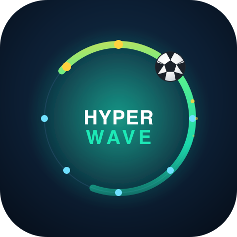

<p align="center">
  
</p>

# HyperWave

**The stadium Mexican wave, rebuilt as a global peer-to-peer network experience.**

HyperWave turns the stadium wave into a global P2P relay. Peers join a
match-specific [Hyperswarm](https://github.com/holepunchto/hyperswarm) topic; each peer's
public key deterministically maps to a fixed seat on a 256-bit ring — the ring _is_ the
stadium seating chart.

Anyone can **kick off a wave**: a signed ⚽ token races peer-to-peer clockwise around the
ring visible on every screen, each hop cryptographically receipted into a
constant-size chain. As the ball passes each participant it posts a selfie into a shared per-wave
[Autobase](https://github.com/holepunchto/autobase) gallery that converges on every peer, with the
newest selfie featured in the ring centre.

With a built-in self-custodial wallet via
[WDK](https://docs.wdk.tether.io/) (for demo purpouses using TRON Nile Testnet)

- **Participation fees are burned** — initiator and joiners each send 1 TRX to Tron's
  black-hole address with an on-chain memo naming the wave. Skin in the game with no
  beneficiary: it's the anti-spam gate (peers verify the kick-off burn on-chain before
  joining).
- **Gallery tips** — Tip a selfie 1 TRX straight to its owner's wallet.

Every peer runs the same code; the only asymmetry is per-wave (the initiator archives its own wave's gallery). Waves self-heal around dead peers.

Built for the [Tether Developers Cup](https://dorahacks.io/hackathon/tether-developers-cup) (theme: football / global tournament moment).

## Repo layout

| Path                                                       | What                                                                                                                                                                                                                              |
| ---------------------------------------------------------- | --------------------------------------------------------------------------------------------------------------------------------------------------------------------------------------------------------------------------------- |
| [`packages/hyperwave-engine/`](packages/hyperwave-engine/) | The reusable Bare engine: ring, token race, gossip/Chord topology, Autobase gallery, WDK wallet, fees. Unit + e2e tests.                                                                                                          |
| [`apps/desktop/`](apps/desktop/)                           | Electron shell (forked from hello-pear-electron): ring UI, webcam lobby, gallery, wallet chip.                                                                                                                                    |
| [`apps/mobile/`](apps/mobile/)                             | Expo + react-native-bare-kit host running the same engine as a worklet.                                                                                                                                                           |
| [`docs/`](docs/)                                           | [`architecture.md`](docs/architecture.md) · [`protocol.md`](docs/protocol.md) (on-wire spec) · [`scalable-topology.md`](docs/scalable-topology.md) (Chord over Hyperswarm) · [`idea.md`](docs/idea.md) (the idea, plain language) |

## Quickstart

```bash
# bare commandline
npm i -g bare-runtime

# postinstall auto-fixes dep engines ranges for Bare (scripts/fix-bare-engines.js)
npm install

# optional sanity: all suites should pass
npm test

# optional end to end integration test
npm run test:e2e:local

# run the desktop app
npm start
```

## Demo

Run a full HyperWave demo on one machine: several peer windows, a paid wave with lobby
selfies, the ⚽ racing the ring, a converging gallery, real testnet fee **burns**, and
gallery **tips** — all on the Tron **Nile testnet** with self-custodial wallets. No
servers.

Each instance needs its **own `--storage` dir** (own identity, Corestore, wallet).

Every wallet that **spends** needs TRX: peers pay a 1 TRX fee to start/join a wave, and a
little more to tip selfies.

### 1. Setup

```bash
# Run first instance
npm start -- --storage demo/one
```

Get the first instance's address from its : .

Fund the first instance wallet. Open the wallet view by clicking on **💰**.

Then click the "Copy" button next to the address. Click "Get test TRX" to visit the free token faucet page.

Paste the address in the "Account Address" field and click 'Obtain' button.

The Balances refresh in the wallet view every ~15s. `⚠ unfunded` means 0 TRX.

```bash
# Run additional instances in separate terminals
npm start -- --storage demo/two
npm start -- --storage demo/three
```

Now fund the other instances from the first one, right in the app: on each of instance
two and three, open **💰** and **Copy** its address. Back on the funded first instance,
open **💰**, click **Send ▸**, paste the recipient address, enter an amount (e.g. `100`),
and hit **Send**. Repeat for the other address. Each transfer shows up in that wallet's
**Transactions** list with a clickable Tronscan link, and balances refresh automatically.

### 2. Run the wave

In any window, hit **⚽ Kick off the wave**: Status shows **"🔥 paying the kick-off fee..."** — the initiator burns 1 TRX to Tron's black hole with an on-chain memo naming this wave, and only _then_ announces (the paid-wave anti-spam gate).

Other windows enter the **lobby**. The join button shows **"⏳ verifying payment..."**
until each peer has independently verified the initiator's burn on-chain, then
**"✋ Count me in"**. Joining burns that peer's own 1 TRX join fee.

Joined peers **frame their selfie during the lobby** (camera + countdown). At
kickoff the frame is captured automatically (or press 📸 early).

The **⚽ races the ring** on every screen. As it passes each
participant, their selfie posts and features in the ring centre — the gallery fills
in ring order on all windows.

**Tip**: when someone else's selfie is featured, press **💵 Tip 1 TRX** — to
transfer some tokens straight to that peer's wallet.

The wave **completes** back at the originator and every window returns to idle together.

## License

[Apache 2.0](LICENSE)
