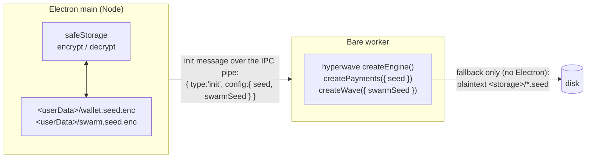

# HyperWave — Secure Seed Storage (design + as-built)

**Status: IMPLEMENTED (desktop, 2026-07-16).** Electron main owns the OS keychain via
`safeStorage`, encrypts both seeds at `<storage>/{wallet,swarm}.seed.enc`, and injects the decrypted
values into the Bare worker over the IPC pipe (`workers/hyperwave.js` is now init-message-driven,
like the mobile worklet). No engine change was needed — the injection seam already existed. The
plaintext-file path remains only as the **headless / dev / no-keychain fallback**.

**Bootstrapping chose option (B), not (A):** main generates the seeds itself. §6 recommended (A)
"worker generates, main persists" to avoid duplicating WDK's seed logic — but WDK's generator IS the
standard `bip39` lib (`bip39@3.1.0`, verified: `getRandomSeedPhrase` → `bip39.generateMnemonic`, and
`WalletAccountTron` validates with `bip39.validateMnemonic`). So main mints a fully WDK-compatible
mnemonic with the same `bip39` (proven end-to-end: a `generateMnemonic()` seed derives a valid Tron
address through WDK), plus a 32-byte hex swarm seed — no report-seed round-trip, and the engine stays
untouched. The rest of this note is the original design; §6/§9 annotated with what shipped.

Read [`hosting.md`](./hosting.md) and [`protocol.md`](../../packages/hyperwave-engine/docs/protocol.md) first.

## 1. Problem

HyperWave holds two long-lived secrets per instance:

| Secret          | File                    | Owns / derives                                                                    |
| --------------- | ----------------------- | --------------------------------------------------------------------------------- |
| **Wallet seed** | `<storage>/wallet.seed` | WDK Tron wallet — signs fee burns + tips (BIP39 mnemonic phrase)                  |
| **Swarm seed**  | `<storage>/swarm.seed`  | Noise/DHT keypair — the ring seat + signs receipts/wave-end/gallery (32-byte hex) |

Both are written by the **Bare worker** (`wallet.js` and `wave.js` via `bare-fs`) in cleartext.
Restricting file permissions only stops _other OS users_. It does nothing against: theft of the
disk / a backup, cloud-sync of the profile dir, or casual inspection — the seed is readable as-is.
For a self-custodial wallet that's the wrong default even on testnet.

## 2. Threat model

What we want the store to defend against, and where the ceiling honestly is:

**In scope (a keychain-backed store closes these):**

- **At-rest disk exposure** — stolen laptop/drive, a leaked backup, a synced profile directory.
- **Cross-user access** — another account on the same machine.
- **Casual inspection** — the seed is not sitting in a readable text file.

**Out of scope (no software-only store fixes these):**

- **Same-user malware.** On macOS/Windows any process running as _you_ can ask the OS to decrypt,
  unless the app is code-signed and the keychain ACL is bound to that signature (needs a proper
  signed build). The real defence for high-value keys is a hardware wallet / secure enclave.
- **A compromised app process.** If the running app is subverted, it already holds the decrypted
  seed in memory.

**Context:** HyperWave is **testnet-only** (native TRX on Nile, faucet-funded, no real value), so
today's exposure is low-stakes. This design is the right foundation _if_ it ever touches mainnet,
and it aligns desktop with the mobile secure-storage plan — not an urgent security fix.

## 3. Options considered

1. **Electron `safeStorage`** (recommended). Built into Electron (v15+, we run v40). Encrypts a
   string with a key held by the OS keychain; we store the ciphertext blob in a file.
   - macOS → key in Keychain; Windows → DPAPI (per-user); Linux → gnome-libsecret / kwallet.
   - No native module to build, no extra dependency, cross-platform.
2. **A native keyring module** (`keytar` / `@napi-rs/keyring`). Stores the secret _in_ the keychain
   directly rather than an encrypted file. `keytar` is archived; a native addon adds build/signing
   surface. `safeStorage` covers the same threat model with zero deps — preferred.
3. **App-level passphrase (KDF).** Encrypt the seed with a key derived from a user password. Strong
   against same-user malware (the key isn't at rest), but adds a password UX and a lost-password =
   lost-wallet failure mode. Out of scope for now; could layer on later.
4. **Do nothing** (status quo plaintext). Rejected — see §1.

## 4. The architectural catch

`safeStorage` is a **main-process-only** API — it needs Electron/Chromium. Our seeds are read and
written **in the Bare worker**, which has no access to Electron APIs. So we cannot simply swap
`fs.writeFileSync` for `safeStorage.encryptString` inside the engine.

The clean resolution already exists in the codebase: the **host owns the secret store and injects
the seed into the engine.** This is exactly what mobile does — the RN host reads Keychain/Keystore
and sends `{ type:'init', config:{ seed } }` to the worklet. The engine is already injection-ready:

- `createPayments({ seed })` — wallet seed used verbatim, never written when injected.
- `createWave({ swarmSeed })` — swarm seed used verbatim, never written when injected.

So the desktop story becomes symmetric with mobile: **Electron main owns `safeStorage`, decrypts
the seeds, and injects them into the worker.** Plaintext file persistence in the engine stays only
as the **headless / dev fallback** (`bin/wave.run.js`, tests, no-Electron hosts).

## 5. Proposed design

Flow:

1. **On worker spawn, main resolves the seeds.** For each of wallet / swarm: read
   `<userData>/<name>.seed.enc`; if present, `safeStorage.decryptString` → seed. If absent, this is
   first run — see §6 for who generates.
2. **Main delivers the seeds to the worker over the IPC pipe**, _not_ argv/env (argv and env are
   visible to `ps` / other processes — a secret must never ride them). This requires the desktop
   worker to **wait for an init message** carrying the config, rather than booting immediately from
   `Bare.argv` / `bare-env` as it does today. The worklet is already init-message-driven; the
   desktop worker adopts the same shape.
3. **`engine.js` passes `config.swarmSeed` through to `createWave({ swarmSeed })`** — DONE
   (alongside the existing `config.seed` → wallet forwarding).
4. **The engine no longer writes plaintext on desktop** — both seeds are injected, so
   `loadOrCreateSwarmSeed` and `wallet.js` take the injected branch and never touch disk. The file
   branch remains for hosts that pass no seed (dev/headless).

## 6. Bootstrapping (who generates the seed)

First run has no `.enc` file. Two options:

- **(A) Worker generates, main persists.** The worker still owns generation (WDK
  `getRandomSeedPhrase()` for the wallet; `crypto.randomBytes(32)` for the swarm — the code that
  exists today), then emits the freshly-generated seed to main **once** over IPC; main
  `encryptString`s it and writes the `.enc` file. Subsequent runs: main injects. Keeps generation
  in WDK; the seed transits IPC once at first run.
- **(B) Main generates.** Main mints both seeds up front and injects. Cleaner lifecycle, but main
  would need a BIP39 generator (WDK is ESM/heavy and lives in the worker), duplicating that logic.

**Recommendation: (A)** — reuse the existing generators, and the "emit seed to host to store"
message is a small, explicit addition. The seed only crosses the in-process IPC pipe, never argv/env.

> **As-built: (B) was chosen.** (A)'s only downside — "duplicating WDK's BIP39 logic" — turned out
> to be a non-issue: WDK generates and validates with the standard `bip39` lib (`bip39@3.1.0`), which
> is already a dependency, so main uses the _same_ library and there is no divergence or format risk
> (verified: a `bip39.generateMnemonic()` seed derives a valid Tron address through WDK; the swarm
> seed is `crypto.randomBytes(32).toString('hex')`, the format `loadOrCreateSwarmSeed` expects). (B)
> keeps generation, storage, injection, and migration entirely in main and leaves the engine
> untouched — no report-seed round-trip, no host-managed persist mode threaded through the engine.

## 7. Linux caveat (must handle)

On Linux, if no keyring backend is available, `safeStorage` **silently falls back to plaintext**
(`safeStorage.getSelectedStorageBackend() === 'basic_text'`). We must check this at startup and
either (a) surface a clear warning that the seed is _not_ hardware-encrypted on this system, or (b)
refuse to persist and run ephemerally. Silently writing a `.enc` file that is actually cleartext
would be worse than today — it would _imply_ security we don't have. Also gate on
`safeStorage.isEncryptionAvailable()` before trusting it anywhere.

## 8. Migration & compatibility

- **Existing plaintext `<storage>/*.seed`:** on first run of the new build, if a plaintext seed
  exists and no `.enc` does, main reads it, `encryptString`s it into the `.enc` file, and
  **deletes the plaintext** (best-effort; log if the delete fails). One-time upgrade, no user action.
- **Headless / dev / mobile unaffected:** no Electron main → the engine keeps its plaintext-file
  fallback (already the case for `bin/wave.run.js` and the test/e2e harnesses). Mobile continues to
  inject from Keychain/Keystore.
- **Storage location:** the `.enc` files live under Electron's `userData` (managed by main), not
  inside the per-run `hyperwave/` store that `createWave` wipes — same reasoning as the current
  seed files being siblings of that store.

## 9. Work required (summary) — as-built

- `electron/main.js` — the secret-store helper shipped: `encryptionSecure()` (`isEncryptionAvailable`
  - the Linux `basic_text` backend check), `resolveSeed()` (decrypt existing `.enc` → else adopt a
    legacy plaintext seed → else `generate()`; then encrypt + delete any plaintext), `resolveSeeds()`
    (both seeds, or `{}` when the OS can't encrypt), and `client.call('init', { storageDir, config })`
    delivering them over the pipe. The `.enc` files live at `<storage>/{wallet,swarm}.seed.enc`
    (co-located with the legacy plaintext seeds, outside the wiped `hyperwave/` store).
- `workers/hyperwave.js` — now **init-message-driven** (builds the engine in serveEngine's
  `onBootstrap` on the `init` command), mirroring `worklet/app.js`. **No** report-seed round-trip
  (option B: main generates).
- `apps/desktop/package.json` — adds `bip39@3.1.0` (main's mnemonic generator; the same lib WDK uses).
- **No engine change at all** — `engine.js` already forwards `config.seed`/`config.swarmSeed`, and
  `wave.js`/`wallet.js` already take the injected, non-persisted branch. (Option B avoided the
  report-seed/host-persist-mode plumbing option A would have needed.)

## 10. Open questions

- **First-run seed hand-off (option A):** exact message shape for the worker→main "store this seed"
  round-trip, and whether main or worker decides "first run."
- **Swarm-seed injection through `engine.js`:** confirm `config.swarmSeed` is the name we want on the
  host config (parallel to `config.seed` for the wallet).
- **Do we want the passphrase layer (§3.3)** as a follow-up for same-user-malware resistance, or is
  keychain-at-rest sufficient for the project's scope?
- **Windows/macOS signing:** the same-user-malware ceiling only tightens with a properly
  code-signed build + keychain ACL — track alongside the distributable build work.

## 11. References

- Electron `safeStorage`: https://www.electronjs.org/docs/latest/api/safe-storage
- Mobile secure-storage seam: `apps/mobile/README.md`, `packages/hyperwave-engine/worklet/app.js`
- Seed persistence today: `loadOrCreateSwarmSeed` (`wave.js`), `createPayments` (`wallet.js`)
