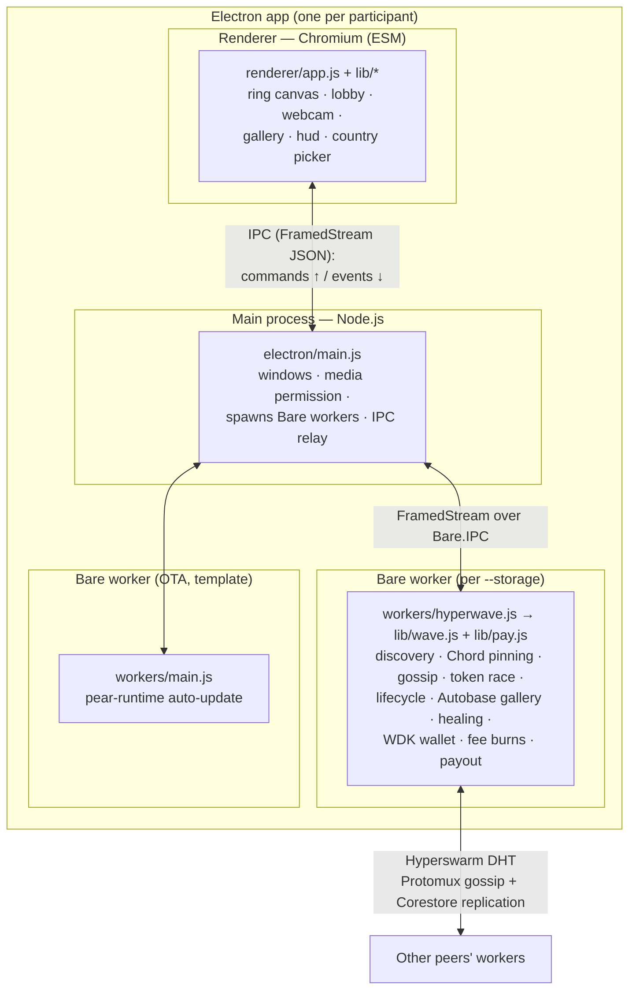

# HyperWave — Architecture

HyperWave is a peer-to-peer "global stadium wave": peers join a match swarm, a ⚽
token races around a ring of participants, each participant takes a selfie into a
shared gallery, their supported-country flag rides along — and real (testnet) money
flows through it: participation fees are **burned** on-chain (anti-spam), a validator
pays **interlocked rewards**, and viewers **tip** selfies. No servers — discovery,
state, and storage are all peer-to-peer (Hyperswarm + Autobase), and payments are
self-custodial (WDK, Tron Nile testnet).

This document covers the **process/layer structure**. For the wire protocol and state
machine (enough to build a compatible client), see [`protocol.md`](./protocol.md).

## Processes & layers



**Why three processes?** It's the [`hello-pear-electron`](https://github.com/holepunchto/hello-pear-electron)
model: Chromium can't run the Holepunch P2P stack, so the networking lives in a **Bare**
worker (Holepunch's JS runtime), and the Electron **main** process brokers between the
sandboxed renderer and the worker.

| Layer | Runtime | Module format | Responsibility |
|---|---|---|---|
| **Main** (`electron/main.js`) | Node.js (Electron) | CJS | Create the window; allow `media` (webcam); spawn Bare workers via `PearRuntime.run`; relay IPC between renderer and workers. Essentially unmodified template + one permission line. |
| **Renderer** (`renderer/`) | Chromium, sandboxed | **ESM** | All UI: ring `<canvas>`, lobby, webcam capture, gallery, HUD, country picker. No P2P, no crypto. |
| **Worker** (`workers/hyperwave.js` + `lib/`) | **Bare** | CJS | All protocol/state: Hyperswarm, Chord topology, gossip, token race, receipts, lifecycle, Autobase gallery, healing — plus the WDK wallet (fees, tips, payout). WDK is ESM-only, so `pay.js` bridges via dynamic `import()`. |
| **Updater** (`workers/main.js`) | Bare | CJS | Template's OTA auto-update; unrelated to the wave. |

(Module format is a deliberate mix — see [Module format](#module-format).)

## The one seam: worker ⇄ renderer

Everything crosses a single boundary — the IPC bridge. The worker emits **events**; the
renderer sends **commands**. The renderer never touches the network or keys.

```
renderer  ──(commands)──▶  worker
  { type: 'start-wave' }                              // burn kick-off fee → announce + lobby
  { type: 'join-wave' }                               // verify wave paid → opt in + burn join fee
  { type: 'set-country', country }
  { type: 'stage-selfie', selfie: { image, caption } }  // lobby-captured; posts when the ball arrives
  { type: 'tip', to, amount, peerId }                 // real TRX to a selfie owner

worker  ──(events)──▶  renderer
  { type: 'state',   me, peers[], successor }         // ring membership (every change)
  { type: 'token',   event, ... }                     // lifecycle + race + payout events (protocol.md)
  { type: 'gallery', items[] }                        // ordered selfies (every change)
  { type: 'wallet',  address, trx }                   // self-custodial wallet chip
  { type: 'burn-result' | 'tip-result', ... }         // fee/tip outcomes (toasts)
```

Transport: `hyperwave.js` wraps `Bare.IPC` in a `FramedStream` and JSON-encodes each
message; `electron/main.js` relays the frames to/from the renderer, which uses the
preload `bridge` (`onWorkerIPC` / `writeWorkerIPC`). See `electron/preload.js`.

## Design principle: where does logic live?

- **Protocol & authoritative state → worker.** Anything that defines correctness on the
  wire (discovery, the ring, the token/receipt chain, lobby/roster, the gallery + its
  write-gate, healing) lives in the worker. Guards are *enforced* here: e.g. "one wave at
  a time" is enforced by `wave.js`, not by hiding a button.
- **Presentation, user input, device APIs → renderer.** Canvas drawing, countdown
  animations, the webcam (`getUserMedia` — Chromium only), the gallery slideshow, and
  the flag rendering (`flagOf`) live in the renderer. The renderer holds only *derived*
  UI state (e.g. `waveActive` to hide a button); the worker remains the source of truth.
- **Borderline, intentionally renderer-side:** country **persistence** (`localStorage`)
  and the proof-window **capture timing** are user/UI preferences; the worker only stores
  the country *code* and doesn't care when a selfie is taken (selfies are optional).

The worker computes ring **angles** (from peer public keys) and the **successor**, and
sends them in `state`; the renderer consumes them for drawing and never recomputes them —
so there's no duplicated protocol logic across the seam.

> **Implemented behind the seam:** the wave only ever asks "who is my successor?", so the
> connection layer was swapped without touching the wave engine. The ring now **drives
> connections** — Chord over Hyperswarm ([`scalable-topology.md`](./scalable-topology.md),
> phases 1–4 + distributed `findSuccessor` routing + gossip flooding), with the Chord math
> pure in `workers/lib/chord.js`.

## Roles

Every instance runs the same code; `role` (env `HYPERWAVE_ROLE`) selects behaviour:

- **`peer`** (default) — participates fully: pays fees, joins waves, selfies, relays.
  Ephemeral storage (galleries wiped per run).
- **`validator`** (a.k.a. seed) — the sponsor + archivist: retains every gallery (store
  persists), is pinned by all peers as a well-connected replication hub, collects
  `wave-proof` hop receipts and `burn-proof`s, and pays the **interlocked payout** from its
  own funded wallet when a wave ends. It relays the ball but never kicks off, joins, or
  selfies. It is a first-class swarm peer — not a server.

## Module map

```
app/
  electron/
    main.js          Electron main: windows, spawn workers, IPC relay (+ media permission)
    preload.js       exposes window.bridge (IPC) to the renderer
  renderer/          ESM, browser
    index.html
    app.js           orchestrator: wire ipc events → views
    lib/
      ipc.js         worker channel: route state/token/gallery/wallet/tip/burn + command senders
      ring.js        all <canvas> drawing (ring, dots, flags, football, centre selfie)
      gallery.js     centre-selfie slideshow + collection progress + 💵 tip button
      lobby.js       lobby panel (countdown + join, gated on payment verification)
      proof.js       lobby webcam capture (staged selfie)
      hud.js         status line, Kick-off button, 💰 wallet chip, country picker + intro
      countries.js   ISO country list + flag emoji
  workers/           Bare, CJS
    hyperwave.js     worker entry: bridges lib/wave.js + lib/pay.js to IPC; charges/verifies fees
    main.js          template OTA updater (unrelated)
    lib/
      wave.js        orchestrator: transport + Chord pinning + lifecycle + gallery + healing + payout
      ring.js        pure ring geometry (angleOf, liveRing, nextClockwise, pickReachable)
      chord.js       pure Chord math (nodeId, successors, fingers, findSuccessorStep, stabilizeStep)
      flood.js       pure gossip-flood dedup (firstSight) for relayed lifecycle messages
      token.js       pure token/payout crypto (receipts, chain accumulator, burn attestation,
                     longestValidChain + payableFromChain = the golden rule)
      gallery.js     Autobase config + ordering (galleryConfig, buildGallery, readGallery, readBurns)
      pay.js         WDK wallet (Tron Nile, native TRX): send, burn(+memo), verifyBurnTx
      wave.run.js    headless harness (one wave per process; WALLET=1, HYPERWAVE_ROLE=validator)
      bootstrap.js   local DHT for fast same-machine testing
      *.test.js      brittle test suites
  scripts/
    fix-bare-engines.js  postinstall: normalize dep engines ranges Bare's semver can't parse
```

## Module format

- **Bare workers are CJS** (`require`/`module.exports`) — idiomatic for Bare and the
  template, and the worker entry is loaded by `PearRuntime.run`.
- **The renderer is ESM** (`import`/`export`) — it works over `file://` in the Electron
  renderer.

Bare *can* run ESM (`.mjs`), but the workers are kept CJS: converting is all-or-nothing
across the require/import graph (`require()` of an ESM module throws), and the ESM
worker-entry boot under `pear-runtime` is unverified. The mix (Bare=CJS, browser=ESM) is
intentional and conventional.
