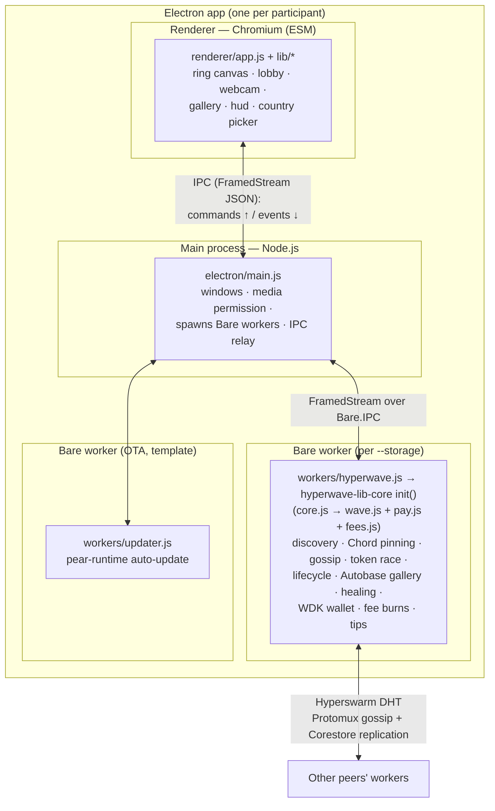

# HyperWave — Architecture

HyperWave is a peer-to-peer "global stadium wave": peers join a match swarm, a ⚽
token races around a ring of participants, each participant takes a selfie into a
shared gallery, their supported-country flag rides along — and real (testnet) money
flows through it: participation fees are **burned** on-chain (anti-spam, no beneficiary),
and viewers **tip** selfies directly. No sponsor rewards. No servers — discovery,
state, and storage are all peer-to-peer (Hyperswarm + Autobase), and payments are
self-custodial (WDK, Tron Nile testnet).

This document covers the **process/layer structure**. For the wire protocol and state
machine (enough to build a compatible client), see [`protocol.md`](./protocol.md).

The repo is an **npm-workspaces monorepo**: the reusable Bare engine lives in
`packages/hyperwave-lib-core/` and boots unchanged under two hosts — the desktop Electron
app (`apps/desktop/`) and an Expo + react-native-bare-kit mobile app (`apps/mobile/`). Each
host is a ~20–40-line shim over the engine's host-agnostic entry, `lib/core.js` `init()`.

## Processes & layers



**Why three processes?** It's the [`hello-pear-electron`](https://github.com/holepunchto/hello-pear-electron)
model: Chromium can't run the Holepunch P2P stack, so the networking lives in a **Bare**
worker (Holepunch's JS runtime), and the Electron **main** process brokers between the
sandboxed renderer and the worker.

The three-process split is **desktop-specific**. The engine itself is host-abstracted: on
mobile the same `hyperwave-lib-core` boots as a single Bare **worklet**
(`packages/hyperwave-lib-core/worklet/app.js` under react-native-bare-kit, bundled by
`bare-pack`), driven by the React Native UI over the identical JSON IPC surface
(`apps/mobile/src/useEngine.js`) — no Electron main, no separate updater.

| Layer                                            | Runtime             | Module format | Responsibility                                                                                                                                                                                                                                                                                                                                                                                                    |
| ------------------------------------------------ | ------------------- | ------------- | ----------------------------------------------------------------------------------------------------------------------------------------------------------------------------------------------------------------------------------------------------------------------------------------------------------------------------------------------------------------------------------------------------------------- |
| **Main** (`apps/desktop/electron/main.js`)       | Node.js (Electron)  | CJS           | Create the window; allow `media` (webcam); resolve + log the storage dir; spawn Bare workers via `PearRuntime.run`; relay IPC between renderer and workers; small helper IPC (`copy-text`, `open-external`, `isPackaged`). Template plus those additions.                                                                                                                                                         |
| **Renderer** (`apps/desktop/renderer/`)          | Chromium, sandboxed | **ESM**       | All UI: ring `<canvas>`, lobby, webcam capture, gallery, HUD, country picker. No P2P, no crypto.                                                                                                                                                                                                                                                                                                                  |
| **Worker** (`apps/desktop/workers/hyperwave.js`) | **Bare**            | CJS           | A thin (~40-line) host: wraps `Bare.IPC` in a `FramedStream` and calls `hyperwave-lib-core`'s `init()`. All protocol/state — Hyperswarm, Chord topology, gossip, token race, receipts, lifecycle, Autobase gallery, healing, plus the WDK wallet (fee burns, tips) — lives in the **engine package** (`core.js` + `wave.js` + `pay.js` + `fees.js`). WDK is ESM-only, so `pay.js` bridges via dynamic `import()`. |
| **Updater** (`apps/desktop/workers/updater.js`)  | Bare                | CJS           | Template's OTA auto-update; unrelated to the wave.                                                                                                                                                                                                                                                                                                                                                                |

(Module format is a deliberate mix — see [Module format](#module-format).)

## The one seam: worker ⇄ renderer

Everything crosses a single boundary — the IPC bridge. The worker emits **events**; the
renderer sends **commands**. The renderer never touches the network or keys.

```
renderer  ──(commands)──▶  worker
  { type: 'start-wave' }                              // burn kick-off fee → announce + lobby
  { type: 'join-wave' }                               // verify wave paid → opt in + burn join fee
  { type: 'set-country', country }
  { type: 'stage-selfie', selfie: { image, caption } }  // lobby-captured; posts when the ball arrives
  { type: 'tip', to, amount }                         // real TRX to a selfie owner
  { type: 'refresh-wallet' }                          // manual balance re-check (after funding)

worker  ──(events)──▶  renderer
  { type: 'state',   me, peers[], successor }         // ring membership (every change)
  { type: 'event',   event, ... }                     // lifecycle + race + raffle events (protocol.md)
  { type: 'gallery', items[] }                        // ordered selfies (every change)
  { type: 'wallet',  address, trx }                   // wallet chip (on ready + every 15s; { error } on init failure)
  { type: 'burn-result' | 'tip-result', ... }         // fee/tip outcomes (toasts)
```

Transport (desktop): `hyperwave.js` wraps `Bare.IPC` in a `FramedStream` and JSON-encodes
each message; `electron/main.js` relays the frames to/from the renderer, which uses the
preload `bridge` (`onWorkerIPC` / `writeWorkerIPC`). See `electron/preload.js`.

Transport (mobile): the worklet wraps `BareKit.IPC` in the **same** `FramedStream` + JSON
framing (`worklet/app.js`), driven from `apps/mobile/src/useEngine.js` over `Worklet.IPC` —
one message surface, two hosts. (The worklet additionally emits `engine-error` on an
unhandled rejection, since mobile has no console.)

## Design principle: where does logic live?

- **Protocol & authoritative state → worker.** Anything that defines correctness on the
  wire (discovery, the ring, the token/receipt chain, lobby/roster, the gallery + its
  write-gate, healing) lives in the worker. Guards are _enforced_ here: e.g. "one wave at
  a time" is enforced by `wave.js`, not by hiding a button.
- **Presentation, user input, device APIs → renderer.** Canvas drawing, countdown
  animations, the webcam (`getUserMedia` — Chromium only), the gallery slideshow, and
  the flag rendering (`flagOf`) live in the renderer. The renderer holds only _derived_
  UI state (e.g. `waveActive` to hide a button); the worker remains the source of truth.
- **Borderline, intentionally renderer-side:** country **persistence** (`localStorage`)
  and the proof-window **capture timing** are user/UI preferences; the worker only stores
  the country _code_ and doesn't care when a selfie is taken (selfies are optional).

The worker computes ring **angles** (from peer public keys) and the **successor**, and
sends them in `state`; the renderer consumes them for drawing and never recomputes them —
so there's no duplicated protocol logic across the seam.

> **Implemented behind the seam:** the wave only ever asks "who is my successor?", so the
> connection layer was swapped without touching the wave engine. The ring now **drives
> connections** — Chord over Hyperswarm ([`scalable-topology.md`](./scalable-topology.md),
> phases 1–4 + distributed `findSuccessor` routing + gossip flooding), with the Chord math
> pure in `lib/chord.js`.

## No roles — every peer is equal

There are no peer roles: every instance runs the same code and behaves identically. Every peer
participates fully (pays fees, joins waves, selfies, relays), and every peer's
`storageDir/hyperwave` store is **wiped on startup**, so galleries are ephemeral per run —
keyed by the random `waveId`, nothing persists across runs.

The only asymmetry is **per-wave and belongs to that wave's initiator** (the peer that kicked
it off):

- It **keeps its own wave's gallery Autobase open and retains it** for the life of the
  process, so the gallery survives for latecomers and replication — but it is the archivist
  for _its own_ wave only. If the initiator goes offline, its wave's gallery is not archived
  by anyone else.
- It **collects the raffle commits** for that wave (from lobby `wave-join` gossip; it records
  its own commit locally when it announces).
- If it funds a raffle (`raffleTrx > 0`, env `HYPERWAVE_RAFFLE_TRX`), it **draws the winner
  and pays the prize from its own wallet** after the wave — never paying itself (if it ranks
  first it is skipped in favour of the next eligible participant). See [`protocol.md`](./protocol.md) §12.

## Module map

```
packages/hyperwave-lib-core/   the reusable Bare engine (npm workspace)
  index.js           package entry: re-exports init (core), wave, pay, fees
  lib/
    core.js          init(): the host-agnostic engine host — wires wave.js + pay.js + fees.js,
                     owns the command dispatch (start/join/tip/stage-selfie/refresh-wallet)
                     and the fee flow; both hosts are thin shims over this
    wave.js          orchestrator: transport + ring pinning + lifecycle + gallery + healing
    ring.js          pure ring geometry (angleOf, liveRing, nextClockwise, pickReachable)
    chord.js         pure Chord math (nodeId, successors, fingers, findSuccessorStep, stabilizeStep)
    chord-routing.js createChordRouting: distributed findSuccessor RPC + join placement + repair
    raffle.js        createRaffle: per-wave commit-reveal draw + payout (run by the wave initiator)
    flood.js         pure gossip-flood dedup (firstSight) for relayed lifecycle messages
    token.js         pure token crypto (receipts, chain accumulator, burn + wave-end attestations)
    gallery.js       Autobase config + ordering (galleryConfig, buildGallery, readGallery)
    fees.js          shared fee flow (burn memo, payFee, confirmBurn, wireWallet)
    pay.js           WDK wallet (Tron Nile, native TRX): send, burn(+memo), verifyBurnTx
    wave.run.js      headless harness (one wave per process; WALLET=1, HYPERWAVE_RAFFLE_TRX for a funded raffle)
    bootstrap.js     local DHT for fast same-machine testing
    *.test.js        brittle unit-test suites (aggregated by test.js)
  worklet/
    app.js           mobile bare-kit worklet entry (same init() over BareKit.IPC)
  e2e/               end-to-end harness + suites (wave.local.e2e.js, wave.onchain.e2e.js)

apps/desktop/        the Electron shell (npm workspace)
  electron/
    main.js          Electron main: windows, storage-dir resolution, spawn workers, IPC relay
                     (+ media permission, copy-text/open-external helpers)
    preload.js       exposes window.bridge (IPC) to the renderer
  renderer/          ESM, browser
    index.html
    app.js           orchestrator: wire ipc events → views
    updater.js       OTA-updater renderer half (template)
    lib/
      ipc.js         worker channel: route state/event/gallery/wallet/tip/burn + command senders
      ring.js        all <canvas> drawing (ring, dots, flags, football, centre selfie)
      gallery.js     centre-selfie slideshow + collection progress + 💵 tip button
      lobby.js       lobby panel (countdown + join, gated on payment verification)
      proof.js       lobby webcam capture (staged selfie)
      hud.js         status line, Kick-off button, 💰 wallet chip, country picker + intro
      countries.js   ISO country list + flag emoji
  workers/           Bare, CJS
    hyperwave.js     thin worker host: FramedStream over Bare.IPC → hyperwave-lib-core init()
    updater.js       template OTA updater (unrelated)

apps/mobile/         the Expo + react-native-bare-kit host (npm workspace)
  App.js             RN UI (speaks the same JSON IPC protocol)
  src/useEngine.js   boots the worklet bundle over Worklet.IPC
  (npm run bundle → bare-pack on the core's worklet entry)

scripts/
  fix-bare-engines.js  postinstall: normalize dep engines ranges Bare's semver can't parse
```

## Module format

- **Bare workers are CJS** (`require`/`module.exports`) — idiomatic for Bare and the
  template, and the worker entry is loaded by `PearRuntime.run`.
- **The renderer is ESM** (`import`/`export`) — it works over `file://` in the Electron
  renderer.

Bare _can_ run ESM (`.mjs`), but the workers are kept CJS: converting is all-or-nothing
across the require/import graph (`require()` of an ESM module throws), and the ESM
worker-entry boot under `pear-runtime` is unverified. The mix (Bare=CJS, browser=ESM) is
intentional and conventional. On mobile the React Native side (`App.js`, `useEngine.js`)
is ESM, while the worklet entry itself stays CJS (the `bare-pack` bundle output is
`.mjs`).
