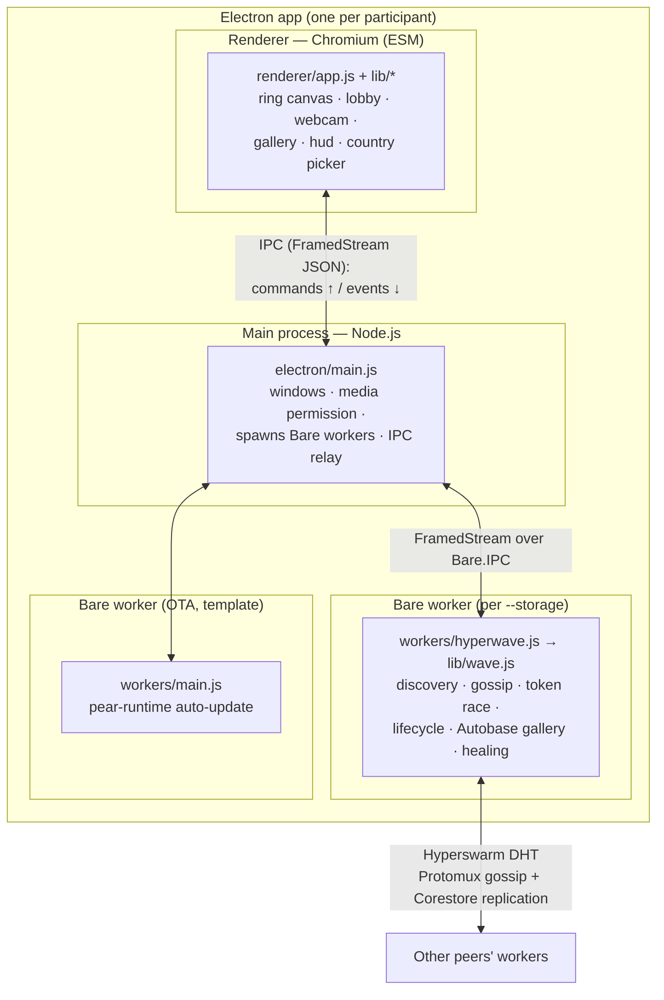

# HyperWave — Architecture

HyperWave is a peer-to-peer "global stadium wave": peers join a match swarm, a ⚽
token races around a ring of participants, each participant takes a selfie into a
shared gallery, and their supported-country flag rides along. No servers — discovery,
state, and storage are all peer-to-peer (Hyperswarm + Autobase).

This document covers the **process/layer structure**. For the wire protocol and state
machine (enough to build a compatible client), see [`protocol.md`](./protocol.md).

## Processes & layers



**Why three processes?** It's the [`hello-pear-electron`](https://github.com/holepunchto/hello-pear-electron)
model: Chromium can't run the Holepunch P2P stack, so the networking lives in a **Bare**
worker (Holepunch's JS runtime), and the Electron **main** process brokers between the
sandboxed renderer and the worker.

| Layer | Runtime | Module format | Responsibility |
|---|---|---|---|
| **Main** (`electron/main.js`) | Node.js (Electron) | CJS | Create the window; allow `media` (webcam); spawn Bare workers via `PearRuntime.run`; relay IPC between renderer and workers. Essentially unmodified template + one permission line. |
| **Renderer** (`renderer/`) | Chromium, sandboxed | **ESM** | All UI: ring `<canvas>`, lobby, webcam capture, gallery, HUD, country picker. No P2P, no crypto. |
| **Worker** (`workers/hyperwave.js` + `lib/`) | **Bare** | CJS | All protocol/state: Hyperswarm, gossip, token race, receipts, lifecycle, Autobase gallery, healing. |
| **Updater** (`workers/main.js`) | Bare | CJS | Template's OTA auto-update; unrelated to the wave. |

(Module format is a deliberate mix — see [Module format](#module-format).)

## The one seam: worker ⇄ renderer

Everything crosses a single boundary — the IPC bridge. The worker emits **events**; the
renderer sends **commands**. The renderer never touches the network or keys.

```
renderer  ──(commands)──▶  worker
  { type: 'start-wave' }
  { type: 'join-wave' }
  { type: 'set-country', country }
  { type: 'post-selfie', selfie: { waveId, hopCount, receiptSig, chainHash, receiptTs, caption, image } }

worker  ──(events)──▶  renderer
  { type: 'state',   me, peers[], successor }          // ring membership (every change)
  { type: 'token',   event, ... }                       // lifecycle + race events (see protocol.md)
  { type: 'gallery', items[] }                           // ordered selfies (every change)
```

Transport: `hyperwave.js` wraps `Bare.IPC` in a `FramedStream` and JSON-encodes each
message; `electron/main.js` relays the frames to/from the renderer, which uses the
preload `bridge` (`onWorkerIPC` / `writeWorkerIPC`). See `electron/preload.js`.

## Design principle: where does logic live?

- **Protocol & authoritative state → worker.** Anything that defines correctness on the
  wire (discovery, the ring, the token/receipt chain, lobby/roster, the gallery + its
  write-gate, healing) lives in the worker. Guards are *enforced* here: e.g. "one wave at
  a time" is enforced by `wave.js`, not by hiding a button.
- **Presentation, user input, device APIs → renderer.** Canvas drawing, countdown
  animations, the webcam (`getUserMedia` — Chromium only), the gallery slideshow, and
  the flag rendering (`flagOf`) live in the renderer. The renderer holds only *derived*
  UI state (e.g. `waveActive` to hide a button); the worker remains the source of truth.
- **Borderline, intentionally renderer-side:** country **persistence** (`localStorage`)
  and the proof-window **capture timing** are user/UI preferences; the worker only stores
  the country *code* and doesn't care when a selfie is taken (selfies are optional).

The worker computes ring **angles** (from peer public keys) and the **successor**, and
sends them in `state`; the renderer consumes them for drawing and never recomputes them —
so there's no duplicated protocol logic across the seam.

## Module map

```
app/
  electron/
    main.js          Electron main: windows, spawn workers, IPC relay (+ media permission)
    preload.js       exposes window.bridge (IPC) to the renderer
  renderer/          ESM, browser
    index.html
    app.js           orchestrator: wire ipc events → views
    lib/
      ipc.js         worker channel: route state/token/gallery + typed command senders
      ring.js        all <canvas> drawing (ring, dots, flags, football, centre selfie)
      gallery.js     centre-selfie slideshow + collection progress
      lobby.js       lobby panel (countdown + join)
      proof.js       circular webcam capture
      hud.js         status line, Kick-off button, country picker + intro screen
      countries.js   ISO country list + flag emoji
  workers/           Bare, CJS
    hyperwave.js     worker entry: bridges lib/wave.js to IPC
    main.js          template OTA updater (unrelated)
    lib/
      wave.js        orchestrator: transport + lifecycle + gallery + healing
      ring.js        pure ring geometry (angleOf, liveRing, nextClockwise, pickReachable)
      token.js       pure token crypto (receipts, blake2b chain accumulator, verify)
      gallery.js     Autobase config + selfie ordering (galleryConfig, buildGallery, readGallery)
      wave.run.js    headless harness (one wave per process)
      bootstrap.js   local DHT for fast same-machine testing
      *.test.js      brittle test suites
```

## Module format

- **Bare workers are CJS** (`require`/`module.exports`) — idiomatic for Bare and the
  template, and the worker entry is loaded by `PearRuntime.run`.
- **The renderer is ESM** (`import`/`export`) — it works over `file://` in the Electron
  renderer.

Bare *can* run ESM (`.mjs`), but the workers are kept CJS: converting is all-or-nothing
across the require/import graph (`require()` of an ESM module throws), and the ESM
worker-entry boot under `pear-runtime` is unverified. The mix (Bare=CJS, browser=ESM) is
intentional and conventional.
