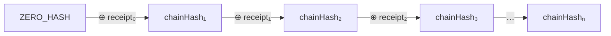
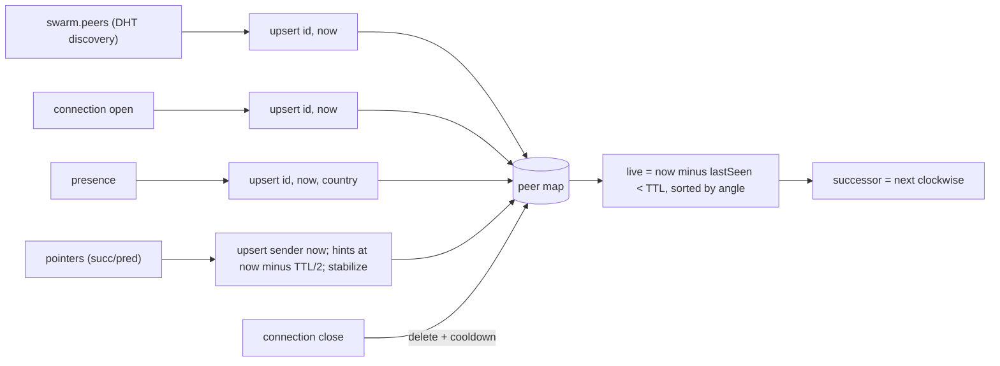
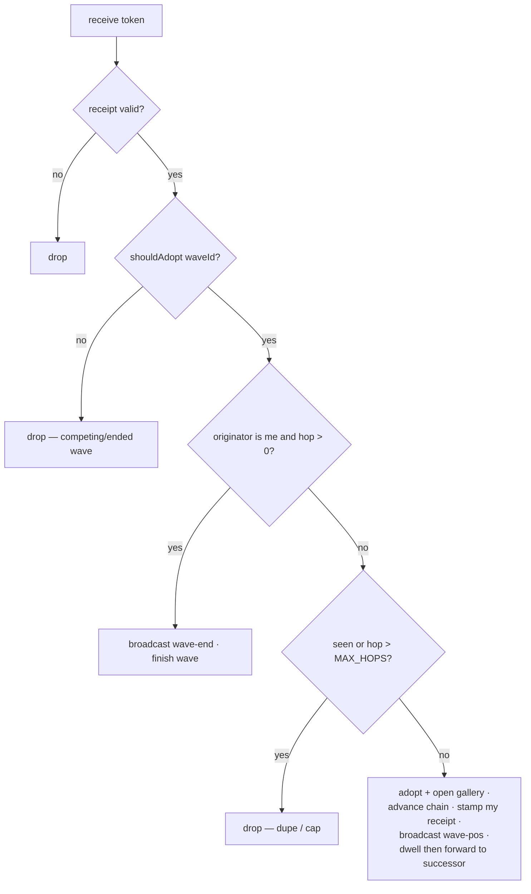
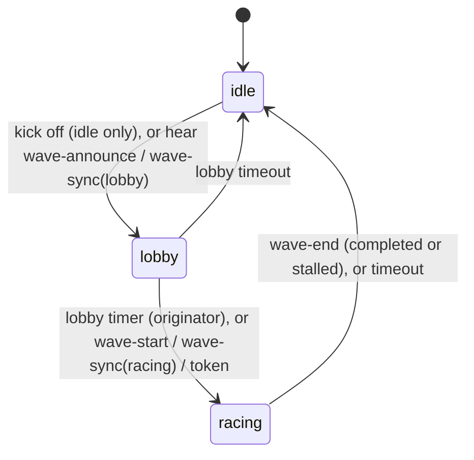
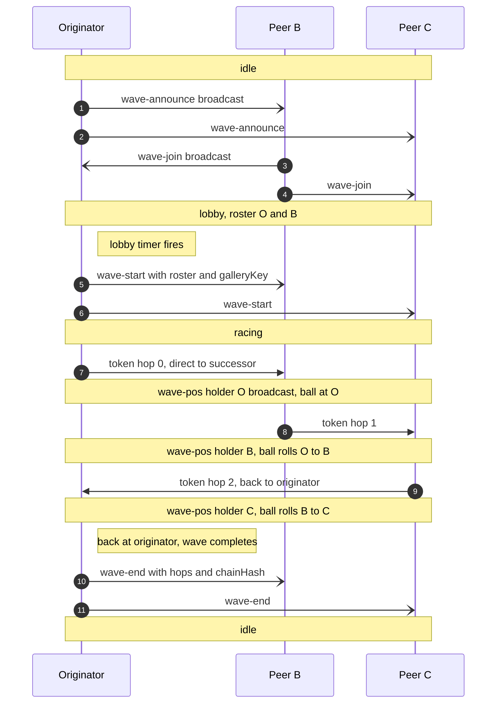
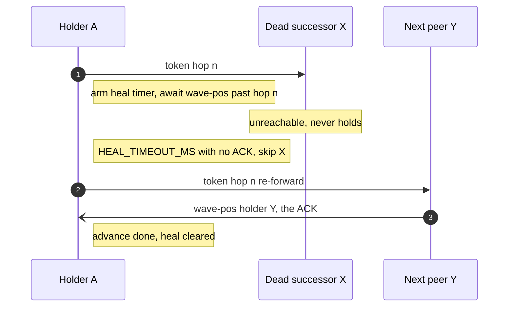
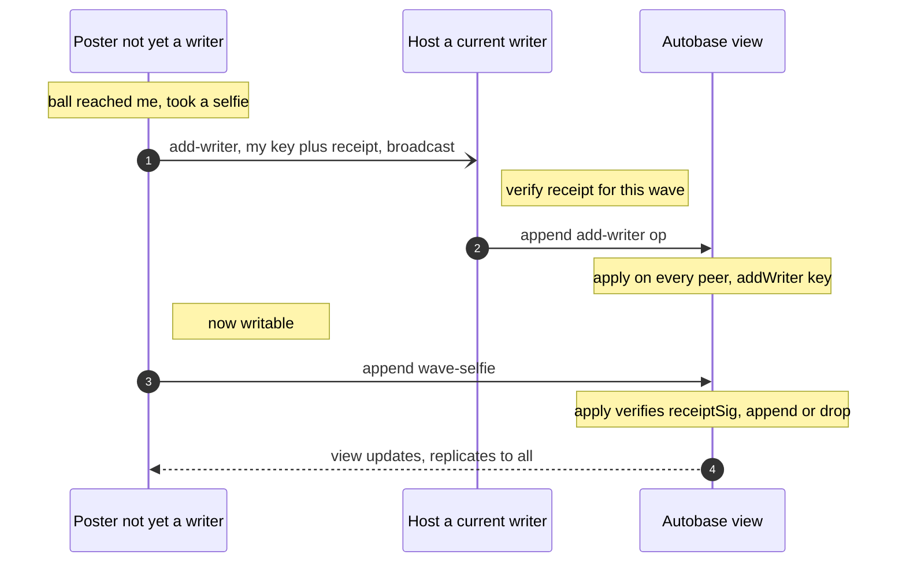

# HyperWave — Protocol & State Machine

A specification of the **on-wire protocol** and the per-peer **state machine**, detailed
enough to implement a compatible client in another language/framework. Everything here is
what peers exchange over the network; the Electron/renderer split (see
[`architecture.md`](./architecture.md)) is one implementation and is **not** part of the
protocol.

Reference implementation: `app/workers/lib/{wave,ring,token,gallery}.js`.

---

## 1. Concepts & roles

- A **match** is a swarm identified by a `matchId` string. Everyone on the same match is
  on one **ring**.
- A **peer**'s cryptographic identity (an Ed25519 key pair) determines its fixed **seat**
  on the ring (an angle derived from its public key).
- A **wave** is a single, one-at-a-time event with a random `waveId`. Its lifecycle is
  **idle → lobby → racing → idle**. An **originator** announces it; peers **opt in**
  (the **roster**); then a **token** (the ⚽) is passed peer-to-peer around the ring,
  each holder signing a **receipt**. When it returns to the originator the wave ends.
- Each roster member may post a **selfie** to the wave's **gallery** (an Autobase
  multi-writer log), gated by their token receipt.

There is no server and no coordinator beyond the per-wave originator. All peers run the
same logic.

## 2. Cryptographic primitives

| Primitive | Algorithm | Encoding on the wire |
|---|---|---|
| Key pair | Ed25519 | — |
| Peer id (`peerId`, `id`, `holder`, `by`, `senderPeerId`) | Ed25519 public key (32 bytes) | lowercase hex (64 chars) |
| Hash (`crypto.hash`) | BLAKE2b-256 (32 bytes) | lowercase hex (64 chars) |
| Signature (`receiptSig`) | Ed25519 sign/verify | lowercase hex (128 chars) |
| `waveId` | 16 random bytes | lowercase hex (32 chars) |
| `timestamp`, `hopCount` | integers | JSON numbers (base-10) |

Hex is lowercase throughout. Byte concatenation is raw bytes (not hex strings).

### 2.1 Ring angle (seat)

Given a 32-byte public key `K`:

```
n     = K[0]*256^5 + K[1]*256^4 + K[2]*256^3 + K[3]*256^2 + K[4]*256 + K[5]   // top 6 bytes, big-endian
angle = (n / 2^48) * 360      // degrees in [0, 360)
```

Angle is **always derived locally** from a peer's id; it is never trusted from the wire.

**Successor** = the next live peer clockwise: among live peers sorted by ascending angle,
the first with `angle > myAngle`, wrapping to the smallest if none is greater. (A peer's
own angle is not in the set.)

### 2.2 Receipt

A receipt binds a peer to a specific hop of a specific wave.

```
receiptHash(waveId, hopCount, chainHash, timestamp)
    = BLAKE2b-256( utf8( waveId + "|" + hopCount + "|" + chainHash + "|" + timestamp ) )

receiptSig  = hex( Ed25519_sign( receiptHash, mySecretKey ) )
verify      = Ed25519_verify( receiptHash, fromHex(receiptSig), fromHex(peerId) )
```

`hopCount` and `timestamp` are rendered as plain base-10 integers; `chainHash` is the
64-char hex accumulator value (see below). For the originator's hop 0, `chainHash` is the
genesis value `ZERO_HASH`.

### 2.3 Chain accumulator (constant-size receipt chain)

Instead of carrying a growing list of receipts, the token carries a rolling hash:

```
ZERO_HASH        = hex(32 zero bytes)                                  // 64 × '0'
advanceChain(prevHex, receiptSigHex)
    = hex( BLAKE2b-256( fromHex(prevHex) ++ fromHex(receiptSigHex) ) )  // 32 ++ 64 = 96 bytes → 32
```

A validator (or any observer collecting the per-hop receipts) can reproduce the final
accumulator by folding `advanceChain` over the receipts in hop order starting from
`ZERO_HASH`:



where `⊕ receiptᵢ` means `advanceChain(prev, receiptSigᵢ) = BLAKE2b(prev ++ receiptSigᵢ)`.

## 3. Transport

- **Topic:** `topic = BLAKE2b-256( utf8(matchId) )` (32 bytes). Join the Hyperswarm DHT
  with `join(topic, { server: true, client: true })`. Default `matchId` in the reference
  build is `"hyperwave:demo-match:v1"`.
- **Per connection** (Noise-encrypted duplex stream from Hyperswarm):
  1. `Corestore.replicate(conn)` — replicates the Autobase gallery cores (see §8).
  2. A **Protomux** channel with protocol id `"hyperwave/gossip"`, carrying a single
     message type whose encoding is `compact-encoding` **`string`** (length-prefixed
     UTF-8). Each message is a **JSON object** with a `kind` field.
- **Broadcast** = send a message on every open gossip channel. **Direct** = send only on
  a specific peer's channel (used to forward the token to the successor).
- The gossip channel and the Corestore replication share the same underlying stream
  (Protomux multiplexes them).

All timing constants are in §9.

### 3.1 Message propagation & relay rules

Gossip is **broadcast to direct neighbours, with no relay/flooding**:

- A **broadcast** is sent once on every open gossip channel — i.e. to each *directly
  connected* peer.
- A received gossip message is **processed locally and never re-broadcast**. There is no
  multi-hop flooding: a control message (`presence`, `pointers`, `wave-*`, `add-writer`)
  reaches only the sender's direct neighbours.
- The **token** is the exception to "broadcast": it is **unicast** to the current
  successor and deliberately relayed **hop by hop** as the wave mechanic — but each holder
  *re-stamps* it with a fresh receipt before forwarding (§6). It is never broadcast.
- **Membership** is now primarily **DHT-discovered**: each peer seeds its ring from
  `swarm.peers` (Hyperswarm's PeerInfo set on the topic) and refreshes on `swarm.on('update')`
  — ids arrive before/without gossip. On top of that, a slim **pointer exchange** (each peer
  advertising only its own successor-list + predecessor, `pointers`) propagates local ring
  structure at O(k + log N), replacing the old O(N) full `peers` snapshot. `presence` (a
  liveness/country heartbeat) goes only to pinned neighbours.

The ring now **drives connections** (Chord over Hyperswarm, Phases 1–4 in
[`scalable-topology.md`](./scalable-topology.md), implemented): each peer deliberately
`swarm.joinPeer`s its successor-list, predecessor, and O(log N) finger table, so the
successor is reachable without a full mesh. Consequences:
- A peer not directly connected to an originator won't receive its `wave-announce`/`wave-start`
  — covered by **`wave-sync`** on every new connection (§7.4), which brings a peer up to date
  as it connects.
- Broadcast cost is O(direct connections) = O(log N) with Chord pinning, not O(N²·hops).
  `wave-*` fanout still uses full broadcast pending the Phase-5 propagation decision; only the
  membership gossip (`presence`/`pointers`) is neighbour-scoped today.

## 4. Peer map (membership & liveness)

Each peer maintains a map of **other** peers (never itself), keyed by id:
`id -> { id, angle, lastSeen, country }`. `angle` is derived from `id` (§2.1) — never
trusted from the wire; `country` is a cosmetic ISO-3166-1 alpha-2 code (or null).

Inputs that build the map:

| Event | Effect |
|---|---|
| **DHT discovery** (`swarm.peers`, refreshed on `swarm.on('update')` + each tick) | `upsert(id, now)` for every discovered PeerInfo — the primary membership source. |
| connection **open** | `upsert(remoteId, now)`; also mark **reachable** (eligible token successor); lift any churn cooldown. A direct connection is authoritative liveness. |
| connection **close** | delete the peer (and its reachable mark); set a `goneUntil` cooldown (`TTL_MS`) so DHT re-seeding can't immediately resurrect the dead peer. |
| `presence { id, country }` | `upsert(id, now, country)` |
| `pointers { id, country, succ: [id…], pred: id }` | `upsert(id, now, country)`; upsert each `succ`/`pred` id at `now − TTL/2` (discovery hint); run one stabilize step. |

```
upsert(id, lastSeen, country):
  if id == me: return
  cur = map[id]
  if cur is missing OR lastSeen > cur.lastSeen:
      map[id] = { id, angle: angleOf(id), lastSeen, country: country ?? cur?.country ?? null }
  else if country is set:
      cur.country = country          # country always tracks the latest report
```

So `lastSeen` is **monotonic per peer** (only advances) and `angle` is always recomputed
from the id.

**Liveness, ring, successor.** A peer is **live** if `now − lastSeen < TTL_MS`. The **ring**
is the live peers sorted by angle; the **successor** is the next live peer clockwise
(§2.1). A direct disconnect removes a peer immediately (and cools it down against DHT
re-seeding); the TTL only expires peers known *indirectly* (a `pointers` discovery hint, or
a `swarm.peers` entry that has since gone) once they stop being refreshed.

**Reachable vs known.** A peer may be *known* (in the map, e.g. DHT-discovered or a
`pointers` hint) without being *reachable* (no direct connection). The token is only
forwarded to a **reachable** live successor; healing (§7.3) skips known-but-unreachable peers.



On connect, a peer **greets** the newcomer with a `presence`, its `pointers`, and — if a
wave is active — a `wave-sync` (§7.4), so the newcomer's map *and* wave state converge
immediately.

## 5. Gossip message catalog

All are JSON objects on the `hyperwave/gossip` channel. Unknown `kind`s are ignored.

### presence — to pinned neighbours, every `PRESENCE_MS`
```json
{ "kind": "presence", "id": "<peerId>", "country": "BR" | null }
```
Heartbeat. Receiver upserts the peer (`lastSeen = now`, `country`). Sent only to pinned ring
neighbours (Chord successor-list + predecessor + fingers), not every connection.

### pointers — to pinned neighbours, every `RINGUPDATE_MS`
```json
{ "kind": "pointers", "id": "<peerId>", "country": "BR" | null,
  "succ": ["<peerId>", ...], "pred": "<peerId>" | null }
```
The sender's own Chord pointers — successor-list (`succ`, ≤ `K_SUCCESSORS`) + predecessor
(`pred`). O(k + log N), replacing the old O(N) full peer snapshot. Receiver upserts the
sender (`lastSeen = now`) and each advertised id as a discovery hint (`lastSeen = now −
TTL/2`), then runs one Chord stabilize step (`scalable-topology.md` §4.4). Primary membership comes from DHT discovery
(`swarm.peers`), so pointers are structure/liveness hints, not the authoritative peer set.

### wave-announce — broadcast (originator, on kick-off)
```json
{ "kind": "wave-announce", "waveId": "<hex16>", "by": "<peerId>", "lobbyMs": 15000 }
```
Opens the lobby. Receivers that accept it (§7.1 adoption) enter `lobby` for `waveId`.

### wave-join — broadcast (a peer opting in during lobby)
```json
{ "kind": "wave-join", "waveId": "<hex16>", "peerId": "<peerId>" }
```
Receiver adds `peerId` to the wave's roster (if it's the current wave).

### wave-start — broadcast (originator, when the lobby closes)
```json
{ "kind": "wave-start", "waveId": "<hex16>", "by": "<peerId>",
  "roster": ["<peerId>", ...], "key": "<autobaseKeyHex>" }
```
Finalizes the roster and begins the race. `key` is the wave's gallery Autobase bootstrap
key (§8). Receivers open the gallery and transition `lobby → racing`.

### token — DIRECT to the successor (the ⚽)
```json
{ "kind": "token", "waveId": "<hex16>", "originator": "<peerId>",
  "hopCount": 3, "prevChainHash": "<hex32>",
  "senderPeerId": "<peerId>", "senderReceiptSig": "<hex64>",
  "timestamp": 1719705612080, "autobaseKey": "<autobaseKeyHex>" }
```
The token as forwarded by `senderPeerId` at hop `hopCount`. `senderReceiptSig` is that
sender's receipt over `(waveId, hopCount, prevChainHash, timestamp)`. Processing: §6.

### wave-pos — broadcast (a peer when it becomes the holder)
```json
{ "kind": "wave-pos", "waveId": "<hex16>", "holder": "<peerId>", "hopCount": 3 }
```
Tells every peer the ball is now at `holder` (so all clients can animate it). Also serves
as the **ACK** that healing (§7.3) waits for.

### wave-end — broadcast (originator on completion, or any peer on a dead-end stall)
```json
{ "kind": "wave-end", "waveId": "<hex16>", "by": "<peerId>",
  "hops": 7, "chainHash": "<hex32>", "stalled": false }
```
Ends the wave for everyone. `stalled: true` means a peer hit a dead end (no reachable
successor); `hops`/`chainHash` are present on normal completion.

### add-writer — broadcast (a peer requesting gallery write access)
```json
{ "kind": "add-writer", "key": "<requesterAutobaseLocalKeyHex>", "peerId": "<peerId>",
  "waveId": "<hex16>", "hopCount": 3, "chainHash": "<hex32>",
  "receiptTs": 1719705612080, "receiptSig": "<hex64>" }
```
Asks the gallery host to admit `key` as an Autobase writer, presenting a valid receipt
(§8.2). Any current writer that verifies the receipt appends an `add-writer` op.

### wave-sync — DIRECT to a newly-connected peer (join-time state)
```json
{ "kind": "wave-sync", "waveId": "<hex16>", "phase": "lobby" | "racing",
  "by": "<peerId>", "roster": ["<peerId>", ...], "key": "<autobaseKeyHex>|null",
  "lobbyMsLeft": 8000 }
```
Lets a peer joining mid-wave sync (§7.4).

## 6. Token processing

When a peer receives a `token`:

1. **Verify** `senderReceiptSig` against `receiptHash(waveId, hopCount, prevChainHash,
   timestamp)` and `senderPeerId`. If invalid, drop.
2. **Wave filter:** if `!shouldAdopt(waveId)` (§7.1), drop (it's a competing/finished
   wave).
3. **Completion:** if `originator == me` and `hopCount > 0`, the token has returned:
   broadcast `wave-end { hops: hopCount, chainHash: prevChainHash, by: me }`, finish the
   wave locally, stop.
4. **Dedup / cap:** key = `waveId + "|" + hopCount`; if already in `seen`, or `hopCount >
   MAX_HOPS`, drop. Else add to `seen`.
5. **Adopt & learn gallery:** ensure engaged with this wave and `racing` (a peer that
   missed announce/start catches up here); open the gallery from `autobaseKey`.
6. **Advance & stamp:** compute `newChainHash = advanceChain(prevChainHash,
   senderReceiptSig)`, `hopCount' = hopCount + 1`, and a fresh receipt over `(waveId,
   hopCount', newChainHash, now)`. This is *my* hop.
7. **Hold & forward:**
   - Broadcast `wave-pos { holder: me, hopCount' }`.
   - (UI: if I'm in the roster, deliver the receipt to my proof window — usually already
     **pre-armed** one hop earlier, see below.)
   - After `HOP_DELAY_MS` (a **minimal** dwell — just the visible roll pace), forward the
     new token to my **successor** (§7.3 handles a dead successor).

**Selfie ceremony is decoupled from the dwell.** The token must never wait on a human, so
the proof window runs on its own clock, *pipelined* ahead of the ball:
- When a roster peer sees a `wave-pos` from its **immediate predecessor** (the ball is one
  hop away), it emits a `prearm` (once per wave): the renderer opens the camera and starts
  the 3s countdown *before* the ball arrives.
- The `holding` event (this peer's own hop) then delivers the receipt into that already-open
  window a moment later; the auto-capture at the end of the countdown posts the selfie.
- If the pre-arm is missed (e.g. the predecessor was healed around), the window opens on
  `holding` instead — same 3s countdown, just no head start.

This is why `HOP_DELAY_MS` can be small (250ms): it no longer has to cover a human taking a
selfie. Captures stay staggered (each peer pre-arms one dwell apart), just time-shifted by
the countdown.

The originator starts the chain at hop 0: `prevChainHash = ZERO_HASH`, its own receipt,
then hold & forward as above.



## 7. Wave lifecycle state machine

Each peer holds at most one `wave = { id, phase, by, roster:Set, joined:bool }` (or
`null` = **idle**), plus `endedWaves:Set` (finished ids) and `seen:Set`.



A full wave, three peers (successor order O → B → C → O):



(Solid arrows = the token, sent **direct** to the successor; open arrows = **broadcast**
gossip. Each hop the holder broadcasts `wave-pos`, and — if in the roster — takes a selfie.)

### 7.1 Adoption & tie-break (`shouldAdopt(waveId)`)
- If `waveId ∈ endedWaves` → **reject** (a finished wave never restarts).
- If idle, or `waveId == wave.id` → **accept**.
- Else accept **iff `waveId < wave.id`** (lexicographic on hex). Lower id wins, so
  concurrent starts deterministically converge on one wave. On accepting a different
  wave, the old one is abandoned (added to `endedWaves`).

### 7.2 Roles in a wave
- **Originator:** the peer that called `startWave` — sends `wave-announce`, runs the lobby
  timer, sends `wave-start`, starts the token at hop 0, and detects completion.
- **Joiner (roster):** opted in during the lobby; gets a selfie prompt.
- **Spectator:** engaged with the wave but not in the roster; relays the token if it
  passes, but no selfie prompt. (The ball visits *everyone*, keeping the full-ring
  visual; only the roster selfies.)

### 7.3 Healing
When forwarding, pick the **next reachable peer clockwise** (directly connected, not
already skipped). After forwarding, watch for the wave to advance past my hop — the
successor's `wave-pos` is the ACK. If none arrives within `HEAL_TIMEOUT_MS`, mark that
successor skipped and re-forward to the next reachable peer. If none remain, it's a
**dead end**: broadcast `wave-end { stalled: true }` and finish.



### 7.4 Join-time sync
Lifecycle broadcasts fire once, so a peer connecting mid-wave would miss them. On each new
connection, existing peers send a **direct** `wave-sync`. The newcomer:
- `phase: lobby` → enter the lobby (join window with `lobbyMsLeft` remaining), merge roster.
- `phase: racing` → open the gallery from `key` and go straight to `racing` (spectator
  unless it holds the token).
Either way it's now engaged, so it can't start a competing wave.

### 7.5 Ending & anti-revival
A wave ends on completion (originator), a stall, `wave-end`, or the `WAVE_TIMEOUT_MS`
fallback. On ending: add `waveId` to `endedWaves`, clear `seen`, return to idle. Because
`endedWaves` blocks re-adoption, a straggler token/gossip can't revive a finished wave.

## 8. Gallery (Autobase multi-writer log)

Each wave has its own gallery: an **Autobase** (Holepunch multi-writer append log with a
deterministic linearized view), namespaced per wave so it starts empty.

### 8.1 Setup
- The **originator** creates the Autobase (bootstrap key = null → its own key), and
  publishes the resulting **`autobaseKey`** (hex) in `wave-start` and in every `token`.
- Other peers **open** the same Autobase by that bootstrap key. It replicates over the
  existing `Corestore.replicate(conn)` on each connection.
- `valueEncoding`: JSON. The linearized **view** is an append-only list of `wave-selfie`
  entries (in hop/timestamp order after `buildGallery`, §8.3).

### 8.2 Writer admission & the receipt gate (anti-spam)
Autobase writes only count from keys in the writer set, and only an existing writer can
admit a new one. Membership + content are gated by receipts:
- **Admission:** to post, a non-writer broadcasts `add-writer` with its Autobase local key
  **and a valid receipt for the current wave**. A current writer (initially the
  originator) verifies the receipt and, if valid, appends an `add-writer` **op** to the
  base. Once linearized, the requester becomes a writer.
- **`apply()` (runs deterministically on every peer):**
  - `{ type: 'add-writer', key }` → `addWriter(key)`.
  - `{ type: 'wave-selfie', ... }` → append to the view **only if** its `receiptSig`
    verifies (Ed25519) for `(waveId, hopCount, chainHash, receiptTs)` by `peerId`.
    Invalid/unsigned/impersonated entries are dropped identically everywhere.



> **Scope of the gate:** this is *authenticity* — entries are provably from the claimed
> peer. It is **not** proof-of-participation: a peer can self-sign a receipt for a hop it
> never held. Full proof requires cross-checking the receipt against the real token chain
> (a validator's job, out of scope here).

### 8.3 `wave-selfie` op (Autobase entry)
```json
{ "type": "wave-selfie", "waveId": "<hex16>", "peerId": "<peerId>",
  "hopCount": 3, "receiptSig": "<hex64>", "chainHash": "<hex32>", "receiptTs": 1719705612080,
  "country": "BR", "caption": "Vamos! 🇧🇷", "image": "data:image/jpeg;base64,...", "timestamp": 1719705650000 }
```
`image` is an inline JPEG data URL (a compressed thumbnail) in the reference build;
Hyperblobs is the scaling path. Ordering (`buildGallery`): one entry per `(waveId,
peerId)` (newest `timestamp` wins), sorted by `hopCount` then `timestamp`.

## 9. Constants (reference build)

| Constant | Value | Meaning |
|---|---|---|
| `PRESENCE_MS` | 2000 | presence heartbeat cadence |
| `RINGUPDATE_MS` | 4000 | peers-snapshot cadence |
| `TTL_MS` | 12000 | drop a peer not refreshed within this |
| `HOP_DELAY_MS` | 250 | per-hop dwell (visible roll pace; selfie is decoupled, §6) |
| `LOBBY_MS` | 15000 | lobby / opt-in window |
| `WAVE_TIMEOUT_MS` | 90000 | force-idle if a wave doesn't finish |
| `HEAL_TIMEOUT_MS` | 3000 | no advance past my hop ⇒ skip successor |
| `MAX_HOPS` | 5000 | runaway-token safety cap |
| writer-admission wait | 8000 | give up if not admitted to the gallery |

These are timing/UX tunables, not wire-format; a compatible client should keep them in the
same ballpark for interop but exact values aren't required to match.

## 10. Security & trust notes

- **Angle/seat** is bound to the public key and can't be forged without grinding keys.
- **Receipts** authenticate each hop and each gallery entry to a peer identity; the
  **chain accumulator** lets an observer reconstruct/verify hop order from collected
  receipts.
- The **gallery write-gate** is authenticity, not proof-of-participation (§8.2). A malicious
  fork can drop/ignore anything locally (open P2P); the protocol keeps *honest* peers
  consistent. A real reward system needs a validator arbitrating the token chain.
- Country is cosmetic and self-reported.

## Appendix A — app-internal IPC (informative, not on-wire)

The reference build splits worker (protocol) from renderer (UI); they exchange these over
a local IPC bridge. A different client would have its own UI and need not match these —
only §3–§8 are the interop surface.

**Renderer → worker (commands):** `start-wave`, `join-wave`, `set-country {country}`,
`post-selfie {selfie:{waveId,hopCount,receiptSig,chainHash,receiptTs,caption,image}}`.

**Worker → renderer (events):** `state {me,peers,successor}`; `gallery {items}`; and
`token` events: `wave-announce`, `joined`, `roster`, `wave-active`, `wave-idle`, `busy`,
`started`, `prearm {canSelfie}` (ball one hop away — pre-open the proof window),
`holding {canSelfie,...}`, `position`, `forwarded`, `completed`, `healed`, `stalled`,
`gallery-error`.
