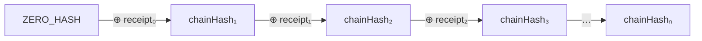
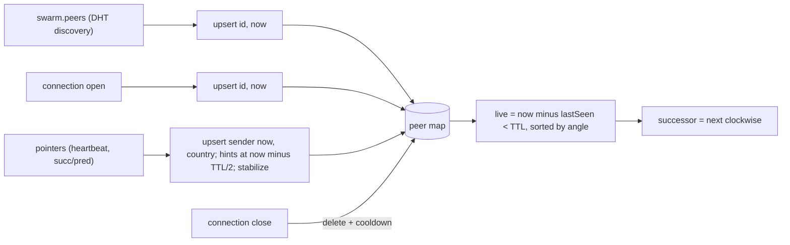
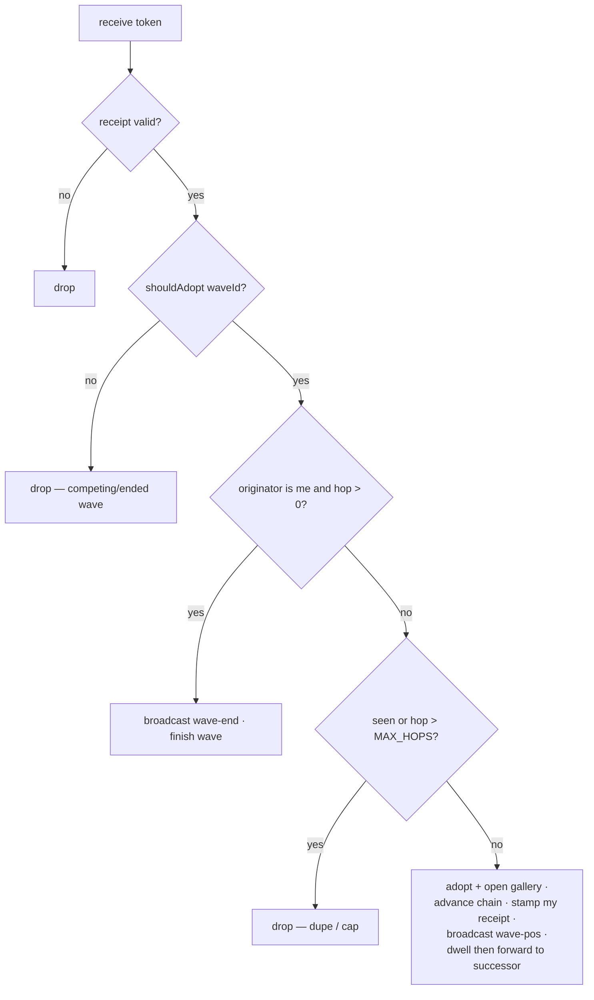
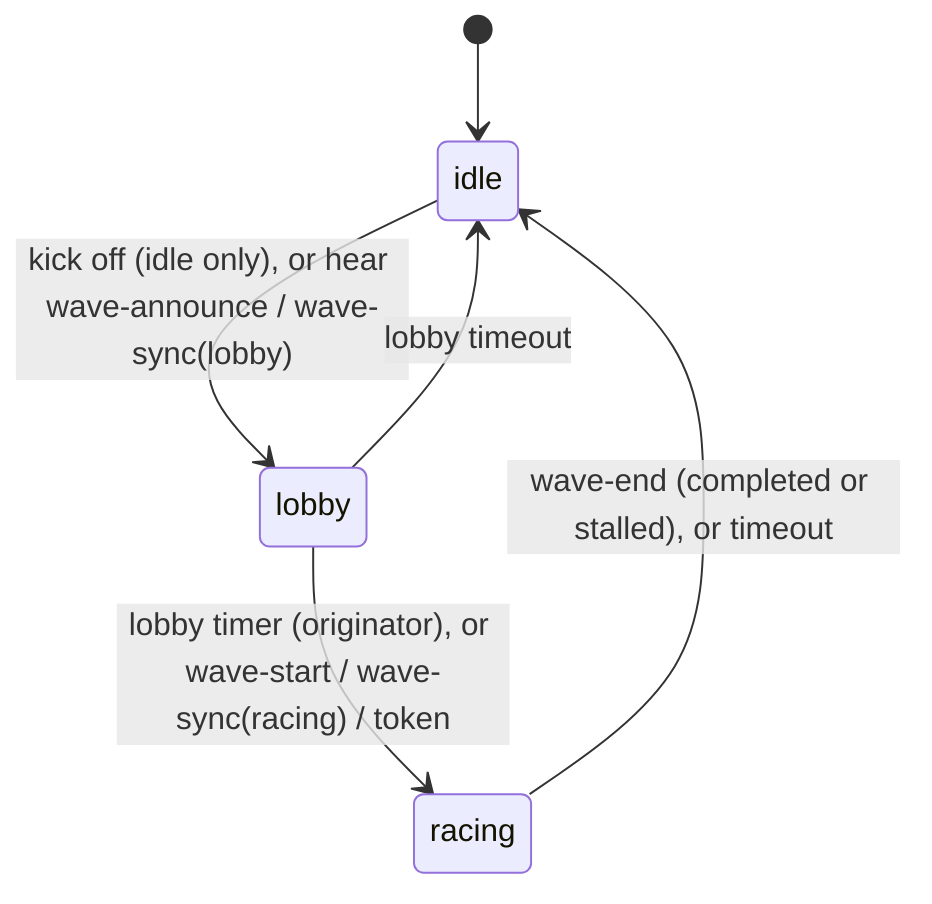
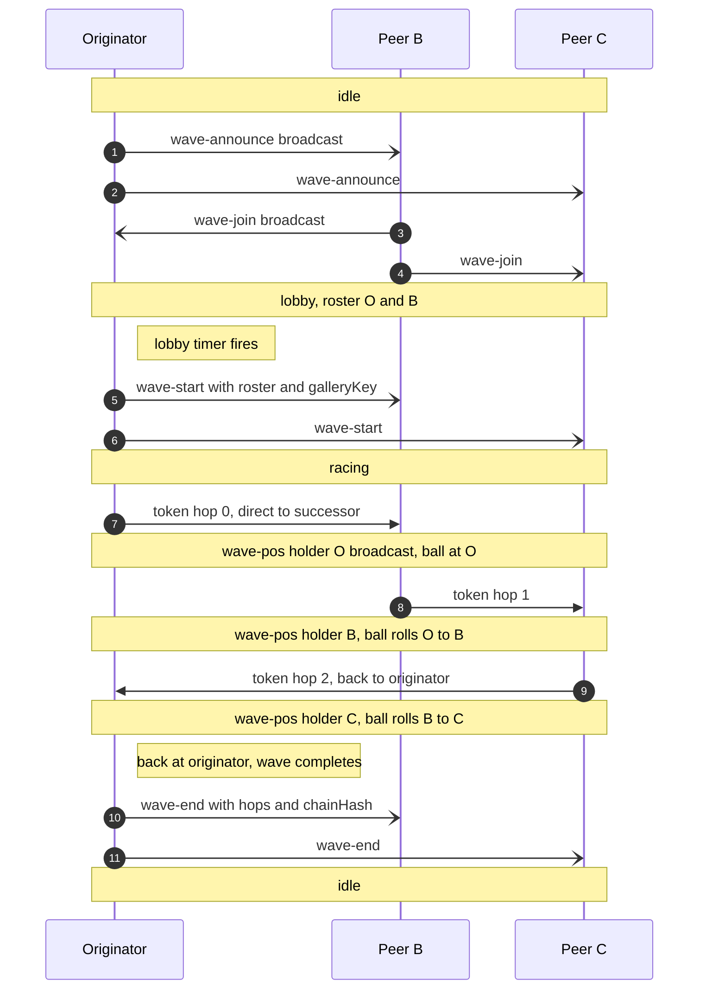
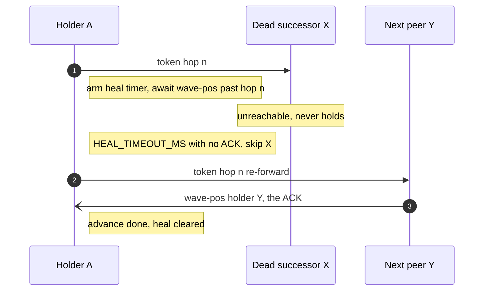
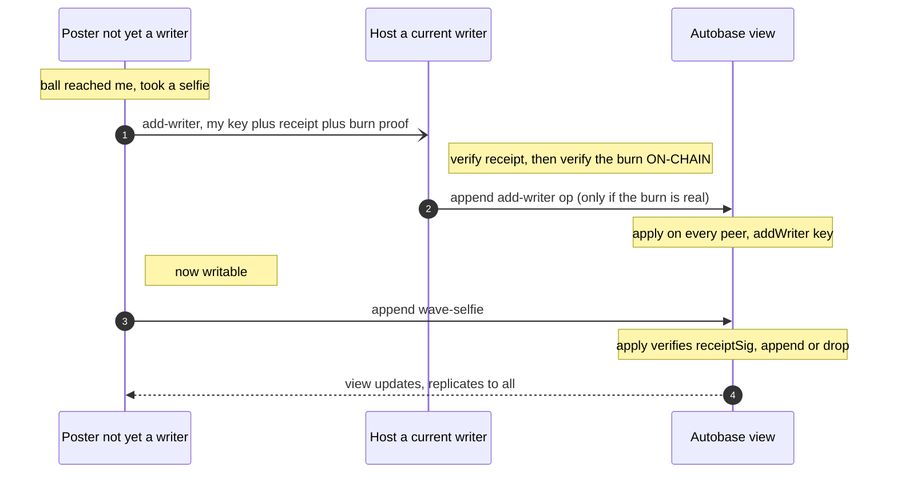

# HyperWave — Protocol & State Machine

A specification of the **on-wire protocol** and the per-peer **state machine**, detailed
enough to implement a compatible client in another language/framework. Everything here is
what peers exchange over the network; the Electron/renderer split (see
[`architecture.md`](./architecture.md)) is one implementation and is **not** part of the
protocol.

Reference implementation: `app/workers/lib/{wave,ring,token,gallery}.js`.

---

## 1. Concepts & roles

- A **match** is a swarm identified by a `matchId` string. Everyone on the same match is
  on one **ring**.
- A **peer**'s cryptographic identity (an Ed25519 key pair) determines its fixed **seat**
  on the ring (an angle derived from its public key).
- A **wave** is a single, one-at-a-time event with a random `waveId`. Its lifecycle is
  **idle → lobby → racing → idle**. An **originator** announces it; peers **opt in**
  (the **roster**); then a **token** (the ⚽) is passed peer-to-peer around the ring,
  each holder signing a **receipt**. When it returns to the originator the wave ends.
- Each roster member may post a **selfie** to the wave's **gallery** (an Autobase
  multi-writer log), gated by their token receipt.

There is no server and no coordinator beyond the per-wave originator. All peers run the
same logic.

## 2. Cryptographic primitives

| Primitive | Algorithm | Encoding on the wire |
|---|---|---|
| Key pair | Ed25519 | — |
| Peer id (`peerId`, `id`, `holder`, `by`, `senderPeerId`) | Ed25519 public key (32 bytes) | lowercase hex (64 chars) |
| Hash (`crypto.hash`) | BLAKE2b-256 (32 bytes) | lowercase hex (64 chars) |
| Signature (`receiptSig`) | Ed25519 sign/verify | lowercase hex (128 chars) |
| `waveId` | 16 random bytes | lowercase hex (32 chars) |
| `timestamp`, `hopCount` | integers | JSON numbers (base-10) |

Hex is lowercase throughout. Byte concatenation is raw bytes (not hex strings).

### 2.1 Ring angle (seat)

Given a 32-byte public key `K`:

```
n     = K[0]*256^5 + K[1]*256^4 + K[2]*256^3 + K[3]*256^2 + K[4]*256 + K[5]   // top 6 bytes, big-endian
angle = (n / 2^48) * 360      // degrees in [0, 360)
```

Angle is **always derived locally** from a peer's id; it is never trusted from the wire.

**Successor** = the next live peer clockwise: among live peers sorted by ascending angle,
the first with `angle > myAngle`, wrapping to the smallest if none is greater. (A peer's
own angle is not in the set.)

### 2.2 Receipt

A receipt binds a peer to a specific hop of a specific wave.

```
receiptHash(waveId, hopCount, chainHash, timestamp)
    = BLAKE2b-256( utf8( waveId + "|" + hopCount + "|" + chainHash + "|" + timestamp ) )

receiptSig  = hex( Ed25519_sign( receiptHash, mySecretKey ) )
verify      = Ed25519_verify( receiptHash, fromHex(receiptSig), fromHex(peerId) )
```

`hopCount` and `timestamp` are rendered as plain base-10 integers; `chainHash` is the
64-char hex accumulator value (see below). For the originator's hop 0, `chainHash` is the
genesis value `ZERO_HASH`.

### 2.3 Chain accumulator (constant-size receipt chain)

Instead of carrying a growing list of receipts, the token carries a rolling hash:

```
ZERO_HASH        = hex(32 zero bytes)                                  // 64 × '0'
advanceChain(prevHex, receiptSigHex)
    = hex( BLAKE2b-256( fromHex(prevHex) ++ fromHex(receiptSigHex) ) )  // 32 ++ 64 = 96 bytes → 32
```

A validator (or any observer collecting the per-hop receipts) can reproduce the final
accumulator by folding `advanceChain` over the receipts in hop order starting from
`ZERO_HASH`:



where `⊕ receiptᵢ` means `advanceChain(prev, receiptSigᵢ) = BLAKE2b(prev ++ receiptSigᵢ)`.

## 3. Transport

- **Topic:** `topic = BLAKE2b-256( utf8(matchId) )` (32 bytes). Join the Hyperswarm DHT
  with `join(topic, { server: true, client: true })`. Default `matchId` in the reference
  build is `"hyperwave:demo-match:v1"`.
- **Per connection** (Noise-encrypted duplex stream from Hyperswarm):
  1. `Corestore.replicate(conn)` — replicates the Autobase gallery cores (see §8).
  2. A **Protomux** channel with protocol id `"hyperwave/gossip"`, carrying a single
     message type whose encoding is `compact-encoding` **`string`** (length-prefixed
     UTF-8). Each message is a **JSON object** with a `kind` field.
- **Broadcast** = send a message on every open gossip channel. **Direct** = send only on
  a specific peer's channel (used to forward the token to the successor).
- The gossip channel and the Corestore replication share the same underlying stream
  (Protomux multiplexes them).

All timing constants are in §10.

### 3.1 Message propagation & relay rules

Past Hyperswarm's mesh limit a large swarm is only a **partial random mesh** — each peer
is directly connected to ~its connection-limit's worth of a random subset, so a plain
one-hop broadcast reaches only a fraction of the swarm. Different message classes are
propagated differently to match what each needs:

| Class | Messages | Fanout |
|---|---|---|
| **Flood (relayed + dedup)** | `wave-announce`, `wave-join`, `wave-start`, `wave-end` | every peer |
| **One-hop broadcast** | `wave-pos`, `add-writer` | direct neighbours only |
| **Neighbour-scoped** | `pointers` (the heartbeat) | pinned ring neighbours (O(k + log N)) |
| **Unicast** | `token`, `wave-sync` | one specific peer |

**Flood (epidemic broadcast).** The wave *lifecycle* messages must reach every seat, so they
are relayed hop-to-hop:
- The originator stamps the message with a unique `mid` (random id) and broadcasts it to all
  direct connections.
- On **first** receipt of a given `mid`, a peer records it, **re-broadcasts** to its other
  neighbours (everyone except the sender), and then processes it locally. On any **repeat**
  `mid` it does nothing (drops the duplicate) — this dedup is what stops loops and bounds the
  flood.
- On the partial random mesh (average degree ≈ connection limit, diameter ≈ log N / log
  degree ≈ a few hops) this blankets the whole swarm in ~2–3 relay rounds — hundreds of ms,
  far inside the lobby — and is robust to peer/link loss thanks to the many redundant paths.
- Cost is O(edges) message-sends per flood; fine for the handful of small, infrequent
  lifecycle messages. Seen-`mid`s are capped (`GOSSIP_SEEN_CAP`) so the dedup set can't grow
  unbounded over a long session.

**One-hop broadcast (no relay).** `wave-pos` is emitted every hop (~`HOP_DELAY_MS`); flooding
it would be a storm, and it doesn't need to reach everyone — its role as the heal-ACK only
needs to reach the **predecessor** (a pinned neighbour), and distant ball-animation is a
nice-to-have. `add-writer` is one-hop today; gallery admission across a partial mesh is
tracked with gallery replication (`scalable-topology.md` §4.7).

**Unicast.** The **token** is sent only to the current successor and deliberately relayed
**hop by hop** as the wave mechanic — each holder *re-stamps* it with a fresh receipt before
forwarding (§6). **`wave-sync`** is sent point-to-point to a newcomer on connect (§7.4).

**Membership** is **DHT-discovered but liveness-gated.** `swarm.peers` (Hyperswarm's PeerInfo
set on the topic) drives *which peers we dial* (Chord pinning), not the visible ring — a DHT
announcement alone is just "this key advertised the topic once", so a stale announce from a
since-closed instance is never shown as a seat. A **seat requires real liveness**: a live
connection or direct gossip. On top of that, a slim **pointer exchange** (`pointers`: each
peer advertising only its own successor-list + predecessor, O(k + log N)) propagates local
ring structure, replacing the old O(N) full-table snapshot. `pointers` doubles as the
liveness **heartbeat** (it refreshes `lastSeen` and carries `country` + `role`) — there is
no separate presence message.

The ring **drives connections** (Chord over Hyperswarm, Phases 1–4 in
[`scalable-topology.md`](./scalable-topology.md)): each peer deliberately `swarm.joinPeer`s
its successor-list, predecessor, and O(log N) finger table, so the successor is reachable
without a full mesh. Flooding rides the same connections, so lifecycle messages reach every
seat whether or not the swarm is fully meshed; **`wave-sync`** on connect remains the catch-up
path for a peer that joins after a flood has already passed.

## 4. Peer map (membership & liveness)

Each peer maintains a map of **other** peers (never itself), keyed by id:
`id -> { id, angle, lastSeen, country }`. `angle` is derived from `id` (§2.1) — never
trusted from the wire; `country` is a cosmetic ISO-3166-1 alpha-2 code (or null).

Inputs that build the map:

| Event | Effect |
|---|---|
| **DHT discovery** (`swarm.peers`, refreshed on `swarm.on('update')` + each tick) | `upsert(id, now)` for every discovered PeerInfo — the primary membership source. |
| connection **open** | `upsert(remoteId, now)`; also mark **reachable** (eligible token successor); lift any churn cooldown. A direct connection is authoritative liveness. |
| connection **close** | delete the peer (and its reachable mark); set a `goneUntil` cooldown (`TTL_MS`) so DHT re-seeding can't immediately resurrect the dead peer. |
| `pointers { id, country, role, succ: [id…], pred: id }` | `upsert(id, now, country)` (the heartbeat); note `role` validator/seed; upsert each `succ`/`pred` id at `now − TTL/2` (discovery hint); run one stabilize step. |

```
upsert(id, lastSeen, country):
  if id == me: return
  cur = map[id]
  if cur is missing OR lastSeen > cur.lastSeen:
      map[id] = { id, angle: angleOf(id), lastSeen, country: country ?? cur?.country ?? null }
  else if country is set:
      cur.country = country          # country always tracks the latest report
```

So `lastSeen` is **monotonic per peer** (only advances) and `angle` is always recomputed
from the id.

**Liveness, ring, successor.** A peer is **live** if `now − lastSeen < TTL_MS`. The **ring**
is the live peers sorted by angle; the **successor** is the next live peer clockwise
(§2.1). A direct disconnect removes a peer immediately (and cools it down against DHT
re-seeding); the TTL only expires peers known *indirectly* (a `pointers` discovery hint, or
a `swarm.peers` entry that has since gone) once they stop being refreshed.

**Reachable vs known.** A peer may be *known* (in the map, e.g. DHT-discovered or a
`pointers` hint) without being *reachable* (no direct connection). The token is only
forwarded to a **reachable** live successor; healing (§7.3) skips known-but-unreachable peers.



On connect, a peer **greets** the newcomer with its `pointers` and — if a wave is active —
a `wave-sync` (§7.4), so the newcomer's map *and* wave state converge immediately.

## 5. Gossip message catalog

All are JSON objects on the `hyperwave/gossip` channel. Unknown `kind`s are ignored.

### pointers — to pinned neighbours, every `HEARTBEAT_MS`
```json
{ "kind": "pointers", "id": "<peerId>", "country": "BR" | null, "role": "peer" | "validator",
  "succ": ["<peerId>", ...], "pred": "<peerId>" | null }
```
The heartbeat **and** the Chord pointer exchange in one message, sent only to pinned ring
neighbours (successor-list + predecessor + fingers), not every connection. Carries the
sender's own pointers — successor-list (`succ`, ≤ `K_SUCCESSORS`) + predecessor (`pred`) —
O(k + log N), replacing the old O(N) full peer snapshot. Receiver upserts the sender
(`lastSeen = now`, `country`) and each advertised id as a discovery hint (`lastSeen = now −
TTL/2`), then runs one Chord stabilize step (`scalable-topology.md` §4.4). `role`
`validator`/`seed` marks a **gallery seed**: peers deliberately pin it (a well-connected
replication hub that keeps galleries alive after participants leave, §4.7). Primary
membership comes from DHT discovery (`swarm.peers`), so pointers are structure/liveness
hints, not the authoritative peer set.

The four `wave-*` lifecycle messages below are **flooded** (§3.1): each carries a unique
`mid` (random hex id); receivers relay on first sight and drop repeats.

### wave-announce — flooded (originator, on kick-off)
```json
{ "kind": "wave-announce", "mid": "<hex8>", "waveId": "<hex16>", "by": "<peerId>", "lobbyMs": 15000,
  "paid": { /* kick-off attestation, §9.0 — present when the paid-wave gate is enforced */ },
  "commit": "<hex32>", "commitSig": "<hex64>" /* raffle commit, §12 — present when raffle is on */ }
```
Opens the lobby. Receivers that accept it (§7.1 adoption) enter `lobby` for `waveId`. `commit`
is the initiator's raffle commitment (it's a participant too); see §12.

**Paid-wave gate (anti-spam).** When enforced (every instance has a wallet), the initiator
**does not announce until it has burned the kick-off fee and confirmed it on-chain** — the
announce then carries `paid`, the kick-off `burn-proof`. A peer **ignores any announce whose
`paid` proof is missing or not validly signed** (an unpaid/spam wave is invisible), and before
it will **join** (and pay its own fee) it verifies the burn **on-chain** (`verifyBurnTx`:
`to == ` the black hole, `amount ≥ fee`, memo commits `waveId`). `join()` is refused until the
kick-off is `verified`. So no peer ever pays into a wave the initiator hasn't paid for. The
same `paid` proof rides `wave-sync`, so a mid-lobby newcomer can verify too. (Without wallets
— headless/tests — enforcement is off and waves announce immediately, unpaid.)

### wave-join — flooded (a peer opting in during lobby)
```json
{ "kind": "wave-join", "mid": "<hex8>", "waveId": "<hex16>", "peerId": "<peerId>",
  "commit": "<hex32>", "commitSig": "<hex64>" /* raffle commit, §12 — present when raffle is on */ }
```
Receiver adds `peerId` to the wave's roster (if it's the current wave). Flooded so it reaches
the initiator (which assembles the roster) even across a partial mesh. `commit` is the
joiner's raffle commitment; a sponsor/seed records it during the lobby (§12).

### wave-start — flooded (originator, when the lobby closes)
```json
{ "kind": "wave-start", "mid": "<hex8>", "waveId": "<hex16>", "by": "<peerId>",
  "roster": ["<peerId>", ...], "key": "<autobaseKeyHex>", "keySig": "<hex64>",
  "paid": { /* kick-off attestation, §9.0 — present when the paid-wave gate is enforced */ } }
```
Finalizes the roster and begins the race. `key` is the wave's gallery Autobase bootstrap key
(§8); `keySig` is the originator's Ed25519 signature over `(waveId, key)` — receivers verify
it against the wave's originator before opening the gallery, so a relay can't swap the
(unsigned) key to point them at an attacker-controlled Autobase (§8.1). Receivers transition
`lobby → racing`. When the paid-wave gate is enforced, `wave-start` also carries the kick-off
`paid` proof and is gated on it (§11); carrying it also lets a peer that adopted via
`wave-start` re-authenticate a later `wave-sync` to a newcomer.

### token — DIRECT to the successor (the ⚽)
```json
{ "kind": "token", "waveId": "<hex16>", "originator": "<peerId>",
  "hopCount": 3, "prevChainHash": "<hex32>",
  "senderPeerId": "<peerId>", "senderReceiptSig": "<hex64>",
  "timestamp": 1719705612080, "autobaseKey": "<autobaseKeyHex>", "autobaseKeySig": "<hex64>" }
```
`autobaseKeySig` is the originator's signature over the gallery key (as in `wave-start`),
carried so a peer catching up via the token — and re-stamped hop to hop — still verifies the
key rather than trusting a forwarder (§8.1). The token as forwarded by `senderPeerId` at hop
`hopCount`. `senderReceiptSig` is that
sender's receipt over `(waveId, hopCount, prevChainHash, timestamp)`. Processing: §6.

### wave-pos — one-hop broadcast (a peer when it becomes the holder)
```json
{ "kind": "wave-pos", "waveId": "<hex16>", "holder": "<peerId>", "hopCount": 3 }
```
Tells direct neighbours the ball is now at `holder` (so they can animate it). Also serves as
the **ACK** that healing (§7.3) waits for — the predecessor is a pinned neighbour, so it's
received without needing a flood. Deliberately **not** relayed (emitted every hop). `holder`
is connection-bound (§11), and healing only accepts the ACK when `holder` is the **specific
successor** it forwarded to, so a bogus `wave-pos` can't suppress healing of a dead successor.

### wave-end — flooded (originator on completion, or a participant on a dead-end stall)
```json
// completion (by the originator):
{ "kind": "wave-end", "mid": "<hex8>", "waveId": "<hex16>", "by": "<peerId>",
  "hops": 7, "chainHash": "<hex32>", "sig": "<hex64>" }
// stall (by the participant that dead-ended):
{ "kind": "wave-end", "mid": "<hex8>", "waveId": "<hex16>", "by": "<originatorId>",
  "stalled": true, "staller": "<peerId>", "hopCount": 5, "chainHash": "<hex32>",
  "receiptTs": 1719705612080, "receiptSig": "<hex64>" }
```
Ends the wave for everyone. Because it is flooded (forgeable by any relay), it is honoured
only with proof it's genuine (§11): a **completion** carries `sig`, the originator's Ed25519
signature over `(waveId, hops, chainHash)`; a **stall** carries the staller's own hop
`receiptSig`, proving it was an admitted participant that hit a dead end. An outside attacker
holding neither can no longer force-terminate a live wave.

### add-writer — one-hop broadcast (a peer requesting gallery write access)
```json
{ "kind": "add-writer", "key": "<requesterAutobaseLocalKeyHex>", "peerId": "<peerId>",
  "waveId": "<hex16>", "hopCount": 3, "chainHash": "<hex32>",
  "receiptTs": 1719705612080, "receiptSig": "<hex64>",
  "burn": { /* the requester's fee-burn attestation, §9.0 — present when the gate is enforced */ } }
```
Asks the gallery host to admit `key` as an Autobase writer, presenting a valid receipt **and**
the requester's fee-burn attestation (§8.2). Any current writer verifies the receipt, then
verifies the burn on-chain, and only then appends an `add-writer` op.

### wave-sync — DIRECT to a newly-connected peer (join-time state)
```json
{ "kind": "wave-sync", "waveId": "<hex16>", "phase": "lobby" | "racing",
  "by": "<peerId>", "roster": ["<peerId>", ...], "key": "<autobaseKeyHex>|null",
  "keySig": "<hex64>", "lobbyMsLeft": 8000 }
```
Lets a peer joining mid-wave sync (§7.4). `keySig` carries the originator's gallery-key
signature (§8.1) so the newcomer verifies the key. When the paid-wave gate is enforced, a `wave-sync`
must carry the kick-off `paid` proof (§9.0) **for either phase** — including `racing` — and is
adopted only if it verifies (§11), so a fabricated racing sync can't push a newcomer into a
bogus wave. (`paid` is omitted from the schema line above for brevity.)

## 6. Token processing

When a peer receives a `token` (identity binding first: `senderPeerId` must equal the
connection it arrived on, §11 — else drop):

1. **Wave filter (cheap):** if `!shouldAdopt(waveId)` (§7.1), drop (it's a competing/finished
   wave).
2. **Dedup / cap (cheap):** key = `waveId + "|" + hopCount`; unless this is a completion (next
   step), if already in `seen` or `hopCount > MAX_HOPS`, drop. These cheap rejects run
   **before** the expensive signature verify, so a token flood can't force unbounded Ed25519
   work.
3. **Verify:** check `senderReceiptSig` against `receiptHash(waveId, hopCount, prevChainHash,
   timestamp)` and `senderPeerId`. If invalid, drop.
4. **Completion:** if I am **running** this wave (`wave.id == waveId`), `originator == me`, and
   `hopCount > 0`, the token has returned: flood `wave-end { hops, chainHash, by: me, sig }`
   where `sig` signs the completion (§11), finish the wave locally, stop. (Requiring that I'm
   actually running the wave stops a token with `originator == me` for a wave I never started
   from forging a completion.) Otherwise add the key to `seen`.
5. **Adopt & learn gallery:** ensure engaged with this wave and `racing` (a peer that
   missed announce/start catches up here); open the gallery from `autobaseKey`.
6. **Advance & stamp:** compute `newChainHash = advanceChain(prevChainHash,
   senderReceiptSig)`, `hopCount' = hopCount + 1`, and a fresh receipt over `(waveId,
   hopCount', newChainHash, now)`. This is *my* hop.
7. **Hold & forward:**
   - Broadcast `wave-pos { holder: me, hopCount' }`.
   - If I'm in the roster, **post my staged selfie now** (see below): I have my receipt for
     this hop, and my image was captured back in the lobby.
   - After `HOP_DELAY_MS` (a **minimal** dwell — just the visible roll pace), forward the
     new token to my **successor** (§7.3 handles a dead successor).

**The selfie is captured up-front, in the lobby.** The token must never wait on a human, so
capture and posting are split:
- **Capture (lobby, synchronized):** when a peer opts in, the renderer opens the camera and
  shows a countdown to kickoff. At kickoff (or on a manual press) it grabs one frame and
  **stages** it to the worker (`stage-selfie` command → `stagedSelfie`). Everyone captures
  around the same moment, at a relaxed pace — independent of ring size or dwell.
- **Post (race, on the ball):** when the token reaches me I record my hop's receipt
  (`recordMyReceipt`) and post the staged image to the gallery, gated on that receipt (the
  add-writer credential). `tryPostSelfie` fires once **both** the staged image and the
  receipt are present, so it's robust to either arriving first (e.g. the originator, which
  stages and holds at hop 0 almost simultaneously). Posted exactly once per wave.

So `HOP_DELAY_MS` can be small (250ms) — it never has to cover a human taking a selfie — and
selfies still land in the gallery in **ring order**, as the ball passes each participant.

The originator starts the chain at hop 0: `prevChainHash = ZERO_HASH`, its own receipt,
then hold & forward as above.



## 7. Wave lifecycle state machine

Each peer holds at most one `wave = { id, phase, by, roster:Set, joined:bool }` (or
`null` = **idle**), plus `endedWaves:Set` (finished ids) and `seen:Set`.



A full wave, three peers (successor order O → B → C → O):



(Solid arrows = the token, sent **direct** to the successor; open arrows = **broadcast**
gossip. Each hop the holder broadcasts `wave-pos`, and — if in the roster — takes a selfie.)

### 7.1 Adoption & tie-break (`shouldAdopt(waveId)`)
- If `waveId ∈ endedWaves` → **reject** (a finished wave never restarts).
- If idle, or `waveId == wave.id` → **accept**.
- Else accept **iff `waveId < wave.id`** (lexicographic on hex). Lower id wins, so
  concurrent starts deterministically converge on one wave. On accepting a different
  wave, the old one is abandoned (added to `endedWaves`).

### 7.2 Roles in a wave
- **Originator:** the peer that called `startWave` — sends `wave-announce`, runs the lobby
  timer, sends `wave-start`, starts the token at hop 0, and detects completion.
- **Joiner (roster):** opted in during the lobby; gets a selfie prompt.
- **Spectator:** engaged with the wave but not in the roster; relays the token if it
  passes, but no selfie prompt. (The ball visits *everyone*, keeping the full-ring
  visual; only the roster selfies.)

### 7.3 Healing
When forwarding, pick the **next reachable peer clockwise** (directly connected, not
already skipped). After forwarding, watch for the wave to advance past my hop — a `wave-pos`
**from that specific successor** is the ACK (a position from any other peer is ignored for
healing, §11). If none arrives within `HEAL_TIMEOUT_MS`, mark that successor skipped and
re-forward to the next reachable peer. If none remain, it's a **dead end**: flood a stall
`wave-end` carrying my hop receipt (§11) and finish.



### 7.4 Join-time sync
Lifecycle broadcasts fire once, so a peer connecting mid-wave would miss them. On each new
connection, existing peers send a **direct** `wave-sync`. The newcomer:
- `phase: lobby` → enter the lobby (join window with `lobbyMsLeft` remaining), merge roster.
- `phase: racing` → open the gallery from `key` and go straight to `racing` (spectator
  unless it holds the token).
Either way it's now engaged, so it can't start a competing wave.

### 7.5 Ending & anti-revival
A wave ends on completion (originator), a stall, `wave-end`, or the `WAVE_TIMEOUT_MS`
fallback. On ending: add `waveId` to `endedWaves`, clear `seen`, return to idle. Because
`endedWaves` blocks re-adoption, a straggler token/gossip can't revive a finished wave.

## 8. Gallery (Autobase multi-writer log)

Each wave has its own gallery: an **Autobase** (Holepunch multi-writer append log with a
deterministic linearized view), namespaced per wave so it starts empty.

### 8.1 Setup & the signed gallery key
- The **originator** creates the Autobase (bootstrap key = null → its own key), and
  publishes the resulting **`autobaseKey`** (hex) in `wave-start` and in every `token`.
- **The key is signed.** The originator also publishes `keySig` = Ed25519 over
  `(waveId, autobaseKey)`; a peer opens the gallery only after verifying it against the wave's
  originator (and rejects a key whose claimed originator doesn't match the one it already
  adopted). The key travels on *unsigned, relayed/re-stamped* fields, so without this a
  malicious relay could swap it and point peers at an attacker-controlled Autobase — the
  signature makes that a detectable forgery. (Pure integrity; independent of payments.)
- Other peers **open** the same Autobase by that bootstrap key. It replicates over the
  existing `Corestore.replicate(conn)` on each connection.
- `valueEncoding`: JSON. The linearized **view** is an append-only list of `wave-selfie`
  entries (one per peer, in hop/timestamp order; see §8.2–§8.3).

### 8.2 Writer admission: the burn gate (anti-spam)
Autobase writes only count from keys in the writer set, and only an existing writer can
admit a new one. Admission is where the fee actually earns its keep — **a gallery seat
requires a verified fee burn**:
- **Admission:** to post, a non-writer broadcasts `add-writer` with its Autobase local key,
  a valid receipt for the current wave, **and its fee-burn attestation** (§9.0). A current
  writer (initially the originator) checks, in order: the receipt verifies (authenticity;
  `peerId` is connection-bound, §11); the burn attestation is signed by that `peerId` for
  this wave (`burnAuthorizes`); and the burn `txHash` is real **on-chain** (`verifyBurnTx` —
  to the black hole, from the attested address, `amount ≥ fee`, memo commits the `waveId`).
  Only then does it append the `add-writer` op. So **no burn, no seat** — and because tips go
  to gallery entries, every tippable selfie is from a peer who paid in.
- **`apply()` (runs deterministically on every peer):**
  - `{ type: 'add-writer', key }` → `addWriter(key)`.
  - `{ type: 'wave-selfie', ... }` → append to the view **only if** its `receiptSig`
    verifies (Ed25519) for `(waveId, hopCount, chainHash, receiptTs)` by `peerId`.
    Invalid/unsigned/impersonated entries are dropped identically everywhere. Two more
    deterministic rules: **one entry per peer** (the first valid write wins; extras are
    dropped, so a paid seat can't append unbounded entries); and the tip **`address` survives
    only if a signed burn backs it** — the entry carries the peer's burn attestation, and the
    address is kept only when it equals that burn's `tronAddress` (`burnAuthorizes` +
    `tronAddress === address`), else it's blanked (the selfie still shows, but isn't tippable).
    The bulky burn is verified then dropped from the stored entry. So a **tip always reaches
    the wallet that paid the fee**, never a self-declared unrelated address.



> **Two layers, two properties.** The on-chain **burn check at admission** is
> proof-of-payment: it bounds the gallery to peers who each burned a fee, so a Sybil pays per
> identity and can't flood it. The **`apply()` receipt check** is authenticity: it's
> deterministic (no network I/O), so every peer independently drops unsigned/impersonated
> entries. The burn check is non-deterministic, so it's the *admitter* that vouches — the
> guarantee holds while admissions route through an honest, well-connected writer (the
> originator or a seed). When enforcement is off (no wallet / tests) only the receipt gate
> applies. A receipt still isn't proof the peer *held* the token (it can self-sign one) — but
> with no rewards riding on hops, that no longer matters; the burn is what gates value.

### 8.3 `wave-selfie` op (Autobase entry)
```json
{ "type": "wave-selfie", "waveId": "<hex16>", "peerId": "<peerId>",
  "hopCount": 3, "receiptSig": "<hex64>", "chainHash": "<hex32>", "receiptTs": 1719705612080,
  "country": "BR", "caption": "Vamos! 🇧🇷", "image": "data:image/jpeg;base64,...",
  "address": "T…", "burn": { /* the poster's §9.0 attestation — verified then dropped */ },
  "raffleSecret": "<hex32>" /* raffle REVEAL, §12 — present when raffle is on */,
  "burnTx": "<tron-tx-hash>" /* kept from the burn so the on-chain raffle commit is locatable */,
  "timestamp": 1719705650000 }
```
`image` is an inline JPEG data URL (a compressed thumbnail) in the reference build;
Hyperblobs is the scaling path. `address` is the poster's Tron (TRX) wallet, carried so a
viewer can **tip** this selfie with a real testnet transfer (renderer `tip` → worker
`pay.send(address, amount)`; §WDK) — but only if `apply()` finds it backed by the `burn`
(§8.2), so a tip always reaches the wallet that paid in. Stored form: one entry per
`(waveId, peerId)`, the bulky `burn` stripped (its `txHash` kept as `burnTx` for raffle audit),
sorted by `hopCount` then `timestamp`.

## 9. Participation fees — burning & verification

The money layer is deliberately minimal: **burned fees** (anti-spam / skin in the game) and
**gallery tips** (§8.3). There are **no sponsor rewards** — nothing pays participants for
racing, so there's no reward ledger, no proof-collection, and no chain-walk to arbitrate.
Each burn does real work: the **kick-off** burn gates whether a wave is adoptable at all (the
paid-wave gate, §9.3), and a **join** burn gates whether a peer may write to the gallery (the
admission gate, §8.2). (Wire details: the paid-wave gate on
`wave-announce`/`wave-start`/`wave-sync` §5; the admission gate on `add-writer` §8.2.)

### 9.0 Fee-burn attestation
A fee burn is attested by a signed proof. The **kick-off** attestation is carried as the
`paid` field on `wave-announce` / `wave-start` / `wave-sync`; a **join** attestation is
carried as the `burn` field on `add-writer` (§8.2). It is **not** an on-wire gallery entry:
```json
{ "waveId": "<hex16>", "peerId": "<peerId>", "reason": "kickoff" | "join", "amount": 1,
  "txHash": "<tron-tx-hash>", "tronAddress": "T…", "burnTs": 1719705612080, "sig": "<hex128>" }
```
Two independent bindings make it verifiable (the Tron key that signs the burn is a different
keypair from the ring identity, so both are needed):
1. **On-chain memo.** The burn tx carries `data = "hyperwave:<waveId>:<peerId>"` (readable via
   `gettransactionbyid`). The burn *itself names the wave* — a third party can confirm it
   from-chain, and it can't be an old burn replayed for another wave (each carries its own
   random `waveId`, unguessable in advance).
2. **Ring attestation.** `sig` = Ed25519 by `peerId` over
   `(waveId, peerId, reason, amount, txHash, tronAddress, burnTs)` — binds the ring
   participant to the on-chain tx. `validKickoff` admits the proof only if `sig` verifies,
   and a peer then cross-checks the `txHash` on-chain before joining (§9.2).

### 9.1 The mechanism: fees are burned, not paid

Starting a wave (**kick-off fee**) and opting into one (**join fee**) each cost a fixed
amount (1 TRX in the reference build), and the payment is **burned**: sent to Tron's
black-hole address

```
T9yD14Nj9j7xAB4dbGeiX9h8unkKHxuWwb        (base58check of the all-zero EVM address)
```

for which no private key exists — the funds are provably unspendable by *anyone*. This is
deliberate: the fee creates **skin in the game with no beneficiary**. Nobody (not the
validator, not the initiator) profits from fees, so there is no censorship or collusion
incentive, no custodial ledger, and no refund path to dispute. (Tron rejects zero-amount
transfers, so a burn is a real small transfer; Tron also burns tx fees at the protocol
level.) Spamming waves or Sybil-joining costs real, irrecoverable value.

### 9.2 Binding a burn to its wave and its peer

A raw burn tx only proves "someone sent TRX to the black hole." The **on-chain memo** makes
it *"peer P burned specifically for wave W"*: every fee burn carries
`data = "hyperwave:<waveId>:<peerId>[:<raffleCommit>]"`, readable via `gettransactionbyid`
(the `raffleCommit` segment is present only when the raffle is on — §12). Replay across waves
is impossible — each `waveId` is 16 random bytes, unguessable before the wave exists, and the
memo is part of the signed tx.

A second binding ties the burn to the ring identity, since the Tron key that signs the tx is a
**different keypair** from the peer's Ed25519 ring identity: the peer signs the attestation of
§9.0 with its ring key. Both fees carry it — the **kick-off** one as the `paid` proof (so
peers can gate wave adoption), the **join** one as the `add-writer` `burn` field (so the
gallery admitter can gate write access).

### 9.3 Verification (who checks what, when)

- **Before joining (every peer):** a `wave-announce` must carry the initiator's kick-off
  attestation (§9.0), validly signed — otherwise the announce is **ignored** (an unpaid wave
  is invisible). Before a peer joins (and pays its own fee), it verifies the kick-off burn
  **on-chain** — `verifyBurnTx`: the tx exists, is a `TransferContract` **to the black
  hole**, from the attested address, `amount ≥ fee`, and the **memo commits this `waveId`**.
  `join()` is refused until this passes, so no peer ever pays into a wave the initiator
  hasn't paid for. The initiator, symmetrically, does not announce until its own burn is
  readable on-chain.
- **Before admitting a gallery writer (the admitter):** the same `verifyBurnTx` check is run
  on the requester's **join** burn before granting write access (§8.2), so a gallery seat —
  and therefore a tippable selfie — requires a real, on-chain-verified burn.
- **Anyone, later:** because every fee's memo is on-chain, a third party can audit the fees
  of any wave with nothing but a Tron node — no trust in anyone's bookkeeping required.

Enforcement is active whenever an instance has a wallet; walletless test/headless runs skip
the gate (waves announce immediately, unpaid).

## 10. Constants (reference build)

| Constant | Value | Meaning |
|---|---|---|
| `HEARTBEAT_MS` | 2000 | pointers-heartbeat cadence |
| `RINGUPDATE_MS` | 4000 | re-pin + gallery-pull maintenance cadence |
| `TTL_MS` | 12000 | drop a peer not refreshed within this |
| `HOP_DELAY_MS` | 250 | per-hop dwell (visible roll pace; selfie is decoupled, §6) |
| `LOBBY_MS` | 15000 | lobby / opt-in window |
| `WAVE_TIMEOUT_MS` | 90000 | force-idle if a wave doesn't finish |
| `HEAL_TIMEOUT_MS` | 3000 | no advance past my hop ⇒ skip successor |
| `MAX_HOPS` | 5000 | runaway-token safety cap |
| `ADMIT_TIMEOUT_MS` | 25000 | give up requesting gallery admission (re-broadcasts every 3s) |
| `RAFFLE_DELAY_MS` | 5000 | settle delay after wave-end before the seed draws the raffle (§12) |
| `raffleTrx` | 0 | raffle prize per wave (seed-only; 0 = raffle off) |

These are timing/UX tunables, not wire-format; a compatible client should keep them in the
same ballpark for interop but exact values aren't required to match.

## 11. Security & trust notes

### 11.1 Foundations
- **Angle/seat** is bound to the public key and can't be forged without grinding keys.
- **Receipts** authenticate each hop and each gallery entry to a peer identity; the
  **chain accumulator** lets an observer reconstruct/verify hop order from collected
  receipts.
- The **gallery write-gate** is authenticity, not proof-of-participation (§8.2). A malicious
  fork can drop/ignore anything locally (open P2P); the protocol keeps *honest* peers
  consistent. There are **no sponsor rewards**, so there is nothing to steal by faking
  participation — the only money flows are burned fees (nobody profits) and voluntary tips
  (paid directly, peer to peer). This removes the whole class of reward-gaming attacks.
- Country is cosmetic and self-reported.

### 11.2 Adversarial hardening (against a modified client)
The transport (Noise over Hyperswarm) authenticates *who* a message came from, but the
application logic must actually **use** that rather than trust self-reported fields. The
following guards keep a hostile peer running a modified app from disrupting honest peers:

- **Identity binding.** For a message that describes its own sender — `pointers.id`,
  `wave-pos.holder`, `token.senderPeerId`, `add-writer.peerId` — the claimed id must equal the
  authenticated connection id it arrived on, else it's dropped (before any signature work).
  This blocks peer-map/ring pollution under spoofed ids and stops a peer from requesting
  gallery admission under a key it doesn't hold. Flooded `wave-*` fields (`by`, roster ids)
  are third-party at relay hops and are instead authenticated by the signatures they carry
  (kick-off attestation, receipts).
- **Authenticated lifecycle termination.** `wave-end` is flooded (forgeable by any relay), so
  it is honoured only with proof: a **completion** carries the originator's Ed25519 signature
  over `(waveId, hops, chainHash)`; a **stall** carries the staller's own hop receipt. An
  outsider holding neither can't force-terminate a live wave. (A malicious *admitted*
  participant can still stall a wave it's part of — but it could already do that by simply not
  forwarding; no new power.)
- **Paid-gate on every adoption path.** When enforced, `wave-announce`, `wave-start`, and
  `wave-sync` (both lobby **and** racing) are all gated on a valid kick-off burn-proof, so no
  single message shape can push a peer into an unpaid/forged wave.
- **Burn-gated gallery admission.** A writer is admitted only after the admitter verifies the
  requester's join burn on-chain (§8.2). This bounds the gallery to one entry per real burn —
  a Sybil pays per identity — and means a tip (which targets a gallery entry) always reaches a
  peer who paid in. Holds while admissions route through an honest well-connected writer.
- **Signed gallery key.** The gallery Autobase key is opened only after verifying the
  originator's signature over `(waveId, key)` (§8.1), so a relay can't swap the (unsigned,
  re-stamped) key to redirect peers to an attacker's gallery.
- **Burn-bound tip address + one entry per peer.** `apply()` deterministically keeps a
  selfie's tip `address` only if a signed burn names that wallet, and admits one entry per
  peer (§8.2) — so tips can't be routed to a non-payer and a paid seat can't bloat the log.
- **Completion self-guard.** A peer treats a returning token as completion only for a wave it
  is actually running, so a token with `originator == me` for a wave it never started can't
  forge a completion.
- **Heal-ACK precision.** The heal timer is cleared only by a `wave-pos` from the exact
  successor a peer forwarded to (§7.3), so a bogus position can't suppress healing.
- **Cheap-before-expensive.** Token processing runs the cheap wave-filter and dedup/cap
  checks before the Ed25519 verify (§6), limiting the CPU a token flood can extract.

### 11.3 Known residual risks (hardening backlog)
- **No per-connection rate limiting.** Gossip has flood-dedup, `seen`/`MAX_HOPS` caps, and the
  cheap-before-verify ordering, but not yet a per-peer message budget; a peer can still spend a
  connection's bandwidth/CPU. Planned: per-connection token buckets per message kind, plus a
  byte-size cap on the inline selfie `image` (entry *count* is already bounded — one per burn)
  and bounds on the auxiliary maps.
- **Byzantine admitter at scale.** The burn-gated admission (§8.2) is enforced by whichever
  writer admits — sound when that's the originator or a seed, but a malicious *already-admitted*
  writer could admit a non-payer by skipping the check. Mitigation would be quorum admission or
  moving the on-chain proof into the op; fine for the MVP (admissions route through the
  originator/seed).
- **Wallet-less mode is unauthenticated by design.** All paid-gate and burn-gated-admission
  guarantees hold only when a wallet is present (`enforcePaid`); an unfunded demo/test run
  accepts unpaid waves and receipt-only gallery admission so the lifecycle can be exercised
  without on-chain calls. Don't mistake that mode for the security model.

## 12. Raffle — optional sponsor incentive (commit-reveal)

Off by default. A **sponsor/seed** with a funded wallet (`raffleTrx > 0`) draws one winner
among the wave's gallery participants and pays the prize — a positive incentive to
participate, on top of burned fees + tips. Fairness is **commit-reveal**, using the wave's two
phases and **no external randomness beacon** (design + trade-offs: `ideas/raffle.md`).

1. **Commit (lobby).** Each participant generates a 32-byte `secret` and commits to
   `commit = BLAKE2b(secret)` **on-chain**, in its fee-burn **memo**
   (`hyperwave:<waveId>:<peerId>:<commit>`, §9.2), before anyone reveals. The burn happens in
   the lobby, so the commit is **timestamped on-chain, immutable, and auditable by anyone** —
   not just held in the seed's memory. (It also rides `wave-join`/`wave-announce`, ring-signed
   `commitSig`, as a **fallback** the seed uses only when there's no on-chain burn, e.g.
   wallet-less test runs.)
2. **Reveal (gallery).** Each participant reveals `secret` in its `wave-selfie` entry, which
   also carries the burn's `burnTx` so anyone can find the on-chain commit.
3. **Draw (seed, after wave-end + `RAFFLE_DELAY_MS`).** Eligible tickets = entries whose
   `BLAKE2b(raffleSecret) ==` that peer's commit, **read from the on-chain memo** via `burnTx`
   (authoritative; the gossip commit is the wallet-less fallback). `seed = BLAKE2b("raffle|" ‖
   waveId ‖ sorted secrets)`; `winner = tickets[ uint(BLAKE2b(seed ‖ 0)) mod M ]` (sorted by
   `peerId`). The seed pays `raffleTrx` to the winner's burn-verified `address`. Because commits
   and reveals are both public (on-chain + gallery), **anyone can recompute and audit the whole
   draw** with a Tron node — no trust in the seed's bookkeeping.

A missing/mismatched reveal (a peer that committed but didn't reveal by the draw) **does not
abort the raffle** — that peer is simply excluded and the draw runs over the remaining valid
reveals (no eligible tickets → no winner, a no-op). Because each peer commits before seeing
others, it can't choose a secret to steer the draw; the residual is a **last-revealer abort**:
withholding your reveal removes you and shifts the seed — a *bounded, binary* re-roll at the
cost of your own ticket, **not** the ability to aim (nor to cancel the draw). Removing even
this needs a **VDF (Verifiable Delay Function)** or a threshold scheme (`ideas/raffle.md`).

> **Trust caveat (MVP): sponsor = admitter = seed.** For simplicity one trusted role funds the
> prize and draws. With commits on-chain the **draw math is publicly auditable** (nobody has to
> trust the seed's RNG), but the seed *could* still **censor the entry set** — it gates who's
> admitted to the gallery, so it could keep honest peers out. This is acceptable only under the
> trusted-sponsor + testnet assumption. **Production must separate the admitter (an independent
> wave originator) from the prize-holder** so the funder can't shape *who's in* the draw. Also:
> a paid-entry game of chance is legally a **lottery** in most jurisdictions — keep it testnet,
> or get legal review.

## Appendix A — app-internal IPC (informative, not on-wire)

The reference build splits worker (protocol) from renderer (UI); they exchange these over
a local IPC bridge. A different client would have its own UI and need not match these —
only §3–§8 are the interop surface.

**Renderer → worker (commands):** `start-wave`, `join-wave`, `set-country {country}`,
`stage-selfie {selfie:{image,caption}}` (the lobby-captured selfie; the worker attaches the
receipt and posts it when the token arrives), `tip {to, amount, peerId}` (send a real TRX
tip to a selfie owner's wallet).

**Worker → renderer (events):** `state {me,peers,successor}`; `gallery {items}`;
`wallet {address, trx}` (self-custodial TRX wallet); `tip-result {hash?, error?}`;
`burn-result {hash?, amount?, error?, waveId, reason}` (a **participation fee** — 1 TRX burned
to Tron's black hole address `T9yD14Nj9j7xAB4dbGeiX9h8unkKHxuWwb`, i.e. the all-zero EVM
address: unspendable by anyone, so the fee proves skin in the game without enriching any
party. `reason: 'kickoff'` for the initiator on `start-wave`, `'join'` for each opt-in on
`join-wave`. Fired alongside the action, never blocking the wave); and
`token` events: `wave-announce`, `paying` (initiator burning the kick-off fee before
announcing), `wave-verified` (kick-off burn proven — join is now allowed), `wave-unpaid`
(kick-off failed verification — wave abandoned), `join-blocked {reason}` (tried to join
before the kick-off is verified), `joined`, `roster`, `wave-active`, `wave-idle`, `busy`,
`started`, `holding {canSelfie,angle,...}` (ball reached me — my staged selfie posts now),
`position`, `forwarded`, `completed`, `healed`, `stalled`, `gallery-error`; and (seed, when
the raffle is on) `raffle-draw {tickets,seed,winner}` + `raffle-win {winner,address,amount,hash}`.
