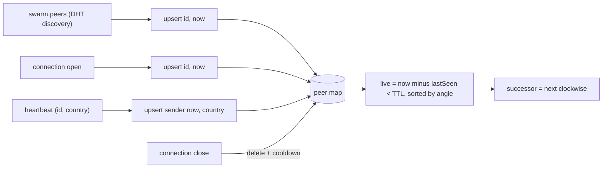
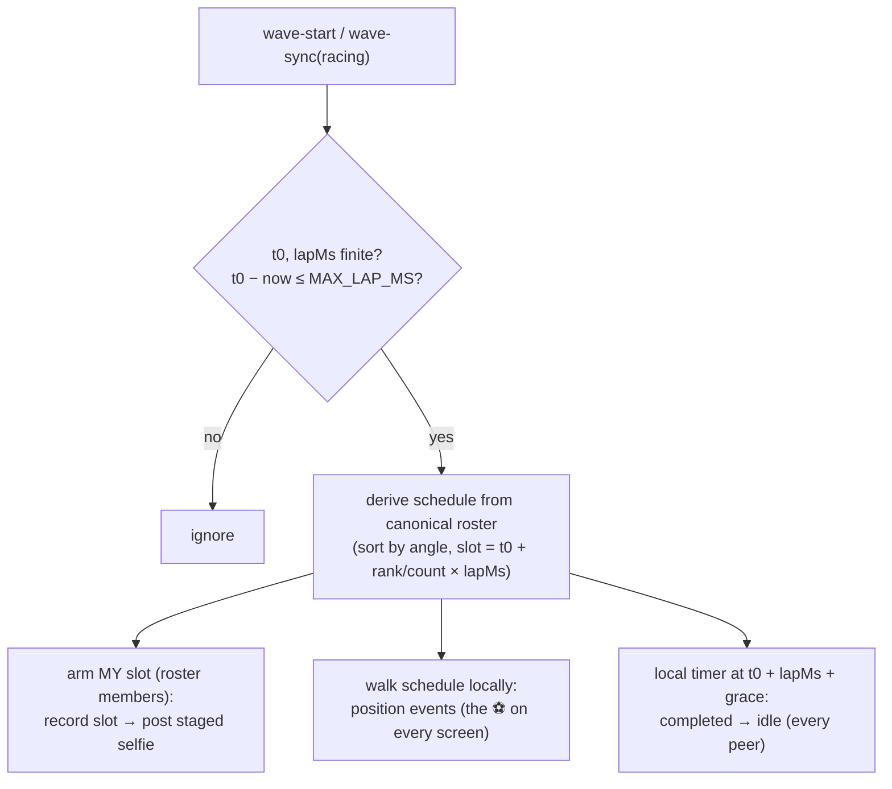
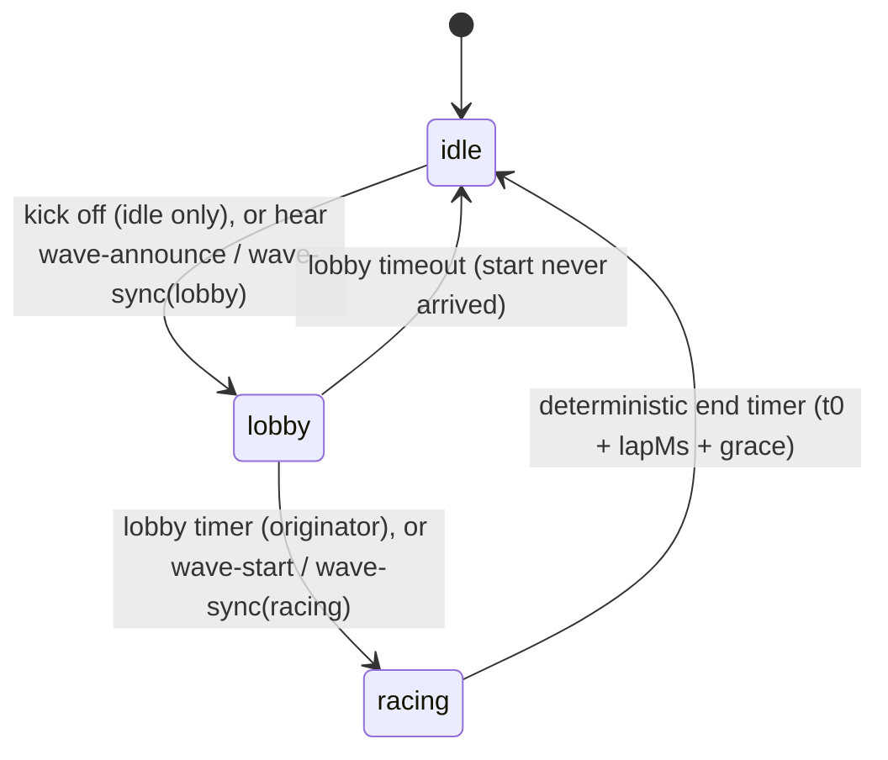
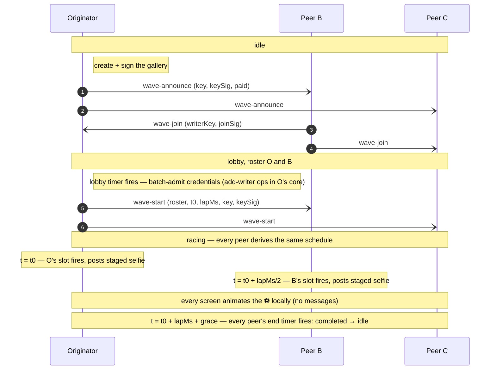
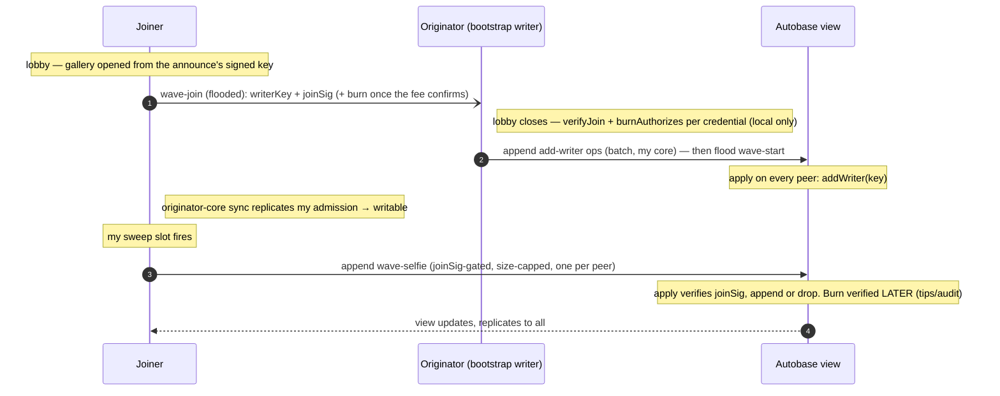

# HyperWave — Protocol & State Machine

A specification of the **on-wire protocol** and the per-peer **state machine**, detailed
enough to implement a compatible client in another language/framework. Everything here is
what peers exchange over the network; the Electron/renderer split (see
[`architecture.md`](./architecture.md)) is one implementation and is **not** part of the
protocol.

Reference implementation:
`packages/hyperwave-engine/lib/{wave,ring,sweep,attest,gallery,gallery-session}.js`.

---

## 1. Concepts & roles

- A **match** is a swarm identified by a `matchId` string. Everyone on the same match is
  on one **ring**.
- A **peer**'s cryptographic identity (an Ed25519 key pair) determines its fixed **seat**
  on the ring (an angle derived from its public key). The key pair is derived from a seed
  persisted at `<storage>/swarm.seed`, so a peer keeps the **same seat and identity across
  restarts** (independent of the wallet seed for key isolation — a leaked wallet seed shouldn't
  also compromise the ring signing identity. Note this is not unlinkability: a fee burn already
  ties the wallet address to the `peerId` on-chain via its `hyperwave:<waveId>:<peerId>` memo).
- A **wave** is a single, one-at-a-time event with a random `waveId`. Its lifecycle is
  **idle → lobby → racing → idle**. An **originator** announces it (creating and signing the
  wave's gallery first); peers **opt in** during the lobby (the **roster**) — each `wave-join`
  doubles as the joiner's gallery-admission request. At lobby close the originator
  **batch-admits** the roster and floods `wave-start` carrying the roster plus the sweep
  parameters (`t0`, `lapMs`); then the wave **sweeps**: every peer derives the identical
  angle-ordered schedule locally and self-triggers at its own slot. There is no passed token —
  the wave is choreography, not an object — and the wave ends **deterministically** on every
  peer at `t0 + lapMs + END_GRACE_MS`, with no end message.
- Each roster member may post a **selfie** to the wave's **gallery** (an Autobase
  multi-writer log), gated by its signed **join attestation**.

There is no server and no coordinator beyond the per-wave originator. All peers run the
same logic.

## 2. Cryptographic primitives

| Primitive                              | Algorithm                     | Encoding on the wire      |
| -------------------------------------- | ----------------------------- | ------------------------- |
| Key pair                               | Ed25519                       | —                         |
| Peer id (`peerId`, `id`, `by`)         | Ed25519 public key (32 bytes) | lowercase hex (64 chars)  |
| Hash (`crypto.hash`)                   | BLAKE2b-256 (32 bytes)        | lowercase hex (64 chars)  |
| Signature (`joinSig`, `keySig`, `sig`) | Ed25519 sign/verify           | lowercase hex (128 chars) |
| `waveId`                               | 16 random bytes               | lowercase hex (32 chars)  |
| `timestamp`, `hopCount`, `t0`, `lapMs` | integers                      | JSON numbers (base-10)    |

Hex is lowercase throughout. Byte concatenation is raw bytes (not hex strings).

### 2.1 Ring angle (seat)

Given a 32-byte public key `K`:

```
n     = K[0]*256^5 + K[1]*256^4 + K[2]*256^3 + K[3]*256^2 + K[4]*256 + K[5]   // top 6 bytes, big-endian
angle = (n / 2^48) * 360      // degrees in [0, 360)
```

**Successor** = the next live peer clockwise: among live peers sorted by ascending angle,
the first with `angle > myAngle`, wrapping to the smallest if none is greater. (A peer's
own angle is not in the set.)

Angle is **always derived locally** from a peer's id; it is never trusted from the wire.

> Why is the angle derived this way? It's a deterministic, uniform hash-to-circle: take enough high-order key bits to make collisions negligible, but few enough (48) to stay within JavaScripts's exact-integer range (53 bits), normalize to [0,1), scale to degrees. Uniform placement, no coordination, no trust, and cheap pure-integer math.

> One nuance worth noting: it uses only the top 6 of 32 bytes for the angle, but identity/ordering still uses the full key elsewhere — so the truncation is purely about the visual/ring geometry, not about security.

### 2.2 Join attestation

A peer's signed opt-in to a wave, binding its ring identity to the gallery **writer core**
it wants admitted:

```
joinHash(waveId, peerId, writerKey)
    = BLAKE2b-256( utf8( "join|" + waveId + "|" + peerId + "|" + writerKey ) )

joinSig = hex( Ed25519_sign( joinHash, mySecretKey ) )
verify  = Ed25519_verify( joinHash, fromHex(joinSig), fromHex(peerId) )
```

It rides `wave-join` (the join **is** the admission request; §8.2) and every gallery entry
(the write-gate in `apply()`, §8.2). Covering `writerKey` matters: without it, a relay could
substitute its own writer key under someone else's `peerId` and steal that peer's one gallery
seat. This is authenticity, not uniqueness — one-entry-per-peer and the byte caps bound what a
seat can do.

### 2.3 Gallery-key attestation

The originator signs the wave's gallery Autobase key so a relay can't swap it (§8.1):

```
galleryKeyHash(waveId, autobaseKey)
    = BLAKE2b-256( utf8( "gallery-key|" + waveId + "|" + autobaseKey ) )

keySig = hex( Ed25519_sign( galleryKeyHash, originatorSecretKey ) )
```

### 2.4 Fee-burn attestation

The signed proof binding a peer's ring identity to its on-chain fee burn (schema and
verification in §9.0):

```
burnHash(waveId, peerId, reason, amount, txHash, tronAddress, burnTs)
    = BLAKE2b-256( utf8( waveId + "|" + peerId + "|" + reason + "|" + amount + "|"
                         + txHash + "|" + tronAddress + "|" + burnTs ) )

sig = hex( Ed25519_sign( burnHash, mySecretKey ) )
```

## 3. Transport

- **Topic:** `topic = BLAKE2b-256( utf8(matchId) )` (32 bytes). Join the Hyperswarm DHT
  with `join(topic, { server: true, client: true })`. Default `matchId` in the reference
  build is `"hyperwave:demo-match:v1"`.
- **Per connection** (Noise-encrypted duplex stream from Hyperswarm):
  1. `Corestore.replicate(conn)` — replicates the Autobase gallery cores (see §8).
  2. A **Protomux** channel with protocol id `"hyperwave/gossip"`, carrying a single
     message type whose encoding is `compact-encoding` **`string`** (length-prefixed
     UTF-8). Each message is a **JSON object** with a `kind` field.
- **Broadcast** = send a message on every open gossip channel. **Direct** = send only on
  a specific peer's channel (used for `wave-sync` to a newcomer).
- The gossip channel and the Corestore replication share the same underlying stream
  (Protomux multiplexes them).

All timing constants are in §10.

### 3.1 Message propagation & relay rules

Past Hyperswarm's mesh limit a large swarm is only a **partial random mesh** — each peer
is directly connected to ~its connection-limit's worth of a random subset, so a plain
one-hop broadcast reaches only a fraction of the swarm. Different message classes are
propagated differently to match what each needs:

| Class                       | Messages                                   | Fanout                                     |
| --------------------------- | ------------------------------------------ | ------------------------------------------ |
| **Flood (relayed + dedup)** | `wave-announce`, `wave-join`, `wave-start` | every peer                                 |
| **Neighbour-scoped**        | `heartbeat`                                | pinned ring neighbours (constant, §4)      |
| **Unicast**                 | `wave-sync`                                | one specific peer (a newcomer, on connect) |

**Flood (epidemic broadcast).** The wave _lifecycle_ messages must reach every seat, so they
are relayed hop-to-hop:

- The originator stamps the message with a unique `mid` (random message id) and broadcasts it to all
  direct connections.
- On **first** receipt of a given `mid`, a peer records it, **re-broadcasts** to its other
  neighbours (everyone except the sender), and then processes it locally. On any **repeat**
  `mid` it does nothing (drops the duplicate) — this dedup (de-duplication) is what stops loops and bounds the
  flood.
- On the partial random mesh (average degree ≈ connection limit, diameter ≈ log N / log
  degree ≈ a few hops) this blankets the whole swarm in ~2–3 relay rounds — hundreds of ms,
  far inside the lobby — and is robust to peer/link loss thanks to the many redundant paths.
- Cost is O(edges) message-sends per flood; fine for the handful of small, infrequent
  lifecycle messages. Seen-`mid`s are capped (`GOSSIP_SEEN_CAP`); at the cap the **oldest** id
  is evicted first, so under pressure the dedup set forgets the ids least likely to still be
  in flight rather than the recent ones.

**Unicast.** **`wave-sync`** is sent point-to-point to a newcomer on connect (§7.4) — the
catch-up path for a peer that joins after a flood has already passed.

**Membership** is **DHT-discovered but liveness-gated.** `swarm.peers` (Hyperswarm's PeerInfo
set on the topic) drives _which peers we dial_ (pinning), not the visible ring — a DHT
announcement alone is just "this key advertised the topic once", so a stale announce from a
since-closed instance is never shown as a seat. A **seat requires real liveness**: a live
connection or direct gossip. The only membership gossip is the **`heartbeat`** (a peer's
own `id` + `country`, sent to its pinned neighbours every `HEARTBEAT_MS`): it refreshes
`lastSeen` and carries the cosmetic country — nothing else. There is **no pointer
exchange**: peers do not gossip ring structure (successor/predecessor adverts and the
Chord stabilize step were removed with the token walk — the sweep needs no successor
precision, so pins are recomputed purely from DHT discovery + live connections).

Each peer deliberately `swarm.joinPeer`s **`PIN_BUDGET` sticky random peers** (random-K
pinning, see `pins.js` and [`scalable-topology.md`](./scalable-topology.md) §4.3): pins are
edges the peer _chose_ — dialed with priority and immune to `maxPeers` — so the flood graph
has a floor that does not depend on the quality of Hyperswarm's incidental topic mesh. The
sweep needs only a **connected flood graph** with small diameter; measured at N=128, random
K=7 pinning floods with full reach (even with 10% of peers killed) in ≤4 relay rounds.
Pins are topped up, never reshuffled (a stable pin set keeps channels alive), and a dead
pin is replaced on the next topology refresh. The structured Chord ring pinning this
replaced is retired — nothing routes, so nothing needs a successor. **`wave-sync`** on
connect remains the catch-up path.

## 4. Peer map (membership & liveness)

Each peer maintains a map of **other** peers (never itself), keyed by id:
`id -> { id, angle, lastSeen, country }`. `angle` is derived from `id` (§2.1) — never
trusted from the wire; `country` is a cosmetic ISO-3166-1 alpha-2 code (or null).

Inputs that build the map:

| Event                                                                            | Effect                                                                                                               |
| -------------------------------------------------------------------------------- | -------------------------------------------------------------------------------------------------------------------- |
| **DHT discovery** (`swarm.peers`, refreshed on `swarm.on('update')` + each tick) | `upsert(id, now)` for every discovered PeerInfo — the primary membership source.                                     |
| connection **open**                                                              | `upsert(remoteId, now)`; lift any churn cooldown. A direct connection is authoritative liveness.                     |
| connection **close**                                                             | delete the peer; set a churn cooldown (`PEER_STALE_MS`) so DHT re-seeding can't immediately resurrect the dead peer. |
| `heartbeat { id, country }`                                                      | `upsert(id, now, country)` — refresh the sender's seat + country.                                                    |

```
upsert(id, lastSeen, country):
  if id == me: return
  cur = map[id]
  if cur is missing OR lastSeen > cur.lastSeen:
      map[id] = { id, angle: angleOf(id), lastSeen, country: country ?? cur?.country ?? null }
  else if country is set:
      cur.country = country          # country always tracks the latest report
```

So `lastSeen` is **monotonic per peer** (only advances) and `angle` is always recomputed
from the id.

**Liveness, ring, successor.** A peer is **live** if `now − lastSeen < PEER_STALE_MS`. The **ring**
is the live peers sorted by angle; the **successor** is the next live peer clockwise
(§2.1). A direct disconnect removes a peer immediately (and cools it down against DHT
re-seeding); the TTL only expires peers known _indirectly_ (a `swarm.peers` entry that has
since gone) once they stop being refreshed.

Note the peer map serves **topology and display**, not the sweep: the sweep's schedule is
derived from the canonical roster flooded on `wave-start` (§6), so all peers agree on it even
if their live-ring views differ.



On connect, a peer **greets** the newcomer with its `heartbeat` and — if a wave is active —
a `wave-sync` (§7.4), so the newcomer's map _and_ wave state converge immediately.

## 5. Gossip message catalog

The protocol has exactly **five** message kinds, all JSON objects on the
`hyperwave/gossip` channel. Unknown `kind`s are ignored.

### 5.0 Uniform message envelope (planned)

> **Status: planned, not yet implemented.** The per-message schemas below document the wire
> format **as built**, which is inconsistent: the author field is variously `id` (`heartbeat`),
> `by` (`wave-announce`/`wave-start`/`wave-sync`), or `peerId` (`wave-join`); only some
> messages carry a signature; and there is no uniform per-message timestamp. The target is a
> single envelope shared by **every** gossip message. Tracked in `TODO.md` (Adversarial
> hardening).

Every message will carry these three envelope fields in addition to its `kind` and payload:

```jsonc
{
  "kind": "<message-kind>",
  "origin": "<peerId>", // one convention everywhere for who authored the message
  // (replaces id / by / peerId)
  "ts": 1719705612080, // origin timestamp (ms) — when the author created the message
  "sig": "<hex64>" // Ed25519 signature by origin's ring key over the canonical
  // serialization of the whole message minus `sig`
  // …kind-specific payload fields…
}
```

- **`origin`** — the single authorship field on every message. `angle` is still derived from it
  locally (§2.1), never trusted from the wire; the identity binding of §11.2 (self-describing id
  must match the Noise connection id, where the message came direct) becomes **one shared check**
  instead of a per-kind one.
- **`sig`** — an Ed25519 signature by `origin`'s ring key covering **all** fields (canonical
  serialization of the message with `sig` removed). Any relay or recipient can verify authenticity
  before acting or re-flooding, so authenticity no longer depends on the connection a flooded
  message arrived over. This **generalizes** today's ad-hoc signatures (the gallery-key
  `keySig`, the join `joinSig`, the burn attestation `sig`) rather than replacing their
  _semantics_: those domain signatures still bind their specific tuples (gallery key, join,
  burn), but the envelope `sig` additionally authenticates the message as a whole.
- **`ts`** — the origin timestamp, enabling **age-based relay decisions**: a peer refuses to
  accept or re-flood any message older than a max-lifetime bound (`GOSSIP_MAX_AGE_MS`, TBD). This
  is a **hard cap on how long any flooded message can circulate** — independent of `mid` dedup — so
  a routing loop or a dedup-set bug cannot amplify into unbounded flooding; a message simply dies
  once it is too old. Requires generous clock-skew tolerance (peers are not time-synchronized).

Until implemented, treat the individual schemas below as authoritative.

### heartbeat — to pinned neighbours, every `HEARTBEAT_MS`

```json
{
  "kind": "heartbeat",
  "id": "<peerId>",
  "country": "BR" | null
}
```

Pure liveness + cosmetic country, sent only to pinned peers (the random-K floor), not
every connection. Receiver upserts the sender
(`lastSeen = now`, `country`). It carries **no ring structure** — the old `pointers`
succ/pred advert and its Chord stabilize step were removed with the token walk (the sweep
needs no successor precision). Every peer is equal — the heartbeat carries no role and no
peer is pinned specially. Primary membership comes from DHT discovery (`swarm.peers`); the
heartbeat is liveness, not the authoritative peer set.

The three `wave-*` lifecycle messages below are **flooded** (§3.1): each carries a unique
`mid` (random hex id); receivers relay on first sight and drop repeats.

### wave-announce — flooded (originator, on kick-off)

```json
{
  "kind": "wave-announce",
  "mid": "<hex8>",
  "waveId": "<hex16>",
  "by": "<peerId>",
  "lobbyMs": 15000,
  "key": "<autobaseKeyHex>",
  "keySig": "<hex64>",
  "paid": {
    /* kick-off attestation, §9.0 — present when the paid-wave gate is enforced */
  }
}
```

Opens the lobby. Receivers that accept it (§7.1 adoption) enter `lobby` for `waveId`.

**The gallery key rides the announce.** The originator creates the wave's gallery Autobase
and signs its key (`keySig`, §2.3) **before** announcing, so peers open the gallery during
the lobby — a joiner needs the open gallery to know its own **writer key**, which its
`wave-join` carries as the admission credential (§8.2). Peers verify `keySig` against the
originator before opening (§8.1).

**Paid-wave gate (anti-spam).** When enforced (every instance has a wallet), the initiator
**does not announce until it has burned the kick-off fee and confirmed it on-chain** — the
announce then carries `paid`, the kick-off `burn-proof`. A peer **ignores any announce whose
`paid` proof is missing or not validly signed** (an unpaid/spam wave is invisible), and before
it will **join** (and pay its own fee) it verifies the burn **on-chain** (`verifyBurnTx`:
`to == ` the black hole, `amount ≥ fee`, memo commits `waveId`). `join()` is refused until the
kick-off is `verified`. So no peer ever pays into a wave the initiator hasn't paid for. The
same `paid` proof rides `wave-sync`, so a mid-lobby newcomer can verify too. (Without wallets
— headless/tests — enforcement is off and waves announce immediately, unpaid.)

### wave-join — flooded (a peer opting in during lobby)

```json
{
  "kind": "wave-join",
  "mid": "<hex8>",
  "waveId": "<hex16>",
  "peerId": "<peerId>",
  "writerKey": "<autobaseLocalKeyHex>",
  "joinSig": "<hex64>",
  "burn": {
    /* the joiner's fee-burn attestation, §9.0 — once its join fee confirms */
  }
}
```

Receiver adds `peerId` to the wave's roster (if it's the current wave). Flooded so it reaches
the initiator (which assembles the roster) even across a partial mesh.

**The join is also the gallery-admission request.** `writerKey` is the joiner's Autobase
local (writer core) key for this wave's gallery, and `joinSig` is its join attestation over
`(waveId, peerId, writerKey)` (§2.2). The **initiator collects these credentials** and
batch-admits them at lobby close (§8.2); it keeps the **latest** credential per peer
(upsert). A joiner whose join fee confirms mid-lobby **re-floods** its `wave-join` with the
`burn` attestation attached, so the burn reaches the initiator before the batch. A join
without a credential still counts as a roster opt-in (that peer just can't post).

`wave-join` is authenticated by its carried `joinSig` (bound to `peerId` + wave + writer
key), not by the connection — it is relayed, so at relay hops its `peerId` is a third party.

### wave-start — flooded (originator, when the lobby closes)

```json
{
  "kind": "wave-start",
  "mid": "<hex8>",
  "waveId": "<hex16>",
  "by": "<peerId>",
  "roster": ["<peerId>", ...],
  "t0": 1719705612080,
  "lapMs": 8000,
  "key": "<autobaseKeyHex>",
  "keySig": "<hex64>",
  "paid": { /* kick-off attestation, §9.0 — present when the paid-wave gate is enforced */ }
}
```

Finalizes the roster and starts the sweep. `t0` is the epoch-ms moment the sweep begins
(`now + SWEEP_LEAD_MS` at the initiator — a short lead so the flooded start blankets the
swarm before the first slot fires); `lapMs` is the lap duration,
`clamp(rosterSize × SLOT_MS, MIN_LAP_MS, MAX_LAP_MS)`. Every receiver derives the identical
schedule from `(roster, t0, lapMs)` (§6). Receivers clamp hostile values: `lapMs` is capped
at `MAX_LAP_MS`, and a start whose `t0` is more than `MAX_LAP_MS` in the future is ignored
(§11.2).

`key`/`keySig` repeat the signed gallery key (as on the announce) so a peer that missed the
announce can still open the gallery. When the paid-wave gate is enforced, `wave-start` also
carries the kick-off `paid` proof and is gated on it (§11); carrying it also lets a peer that
adopted via `wave-start` re-authenticate a later `wave-sync` to a newcomer. Receivers
transition `lobby → racing`.

The `roster` is the initiator-finalized answer to "who is actually in this wave?" — flooded so
(a) everyone agrees on membership despite the lobby's flooded, partial-mesh joins (the roster
is the **canonical input to the schedule**: all peers must compute the same slots), and (b)
each peer knows whether it has a slot (roster member) or merely watches (spectator).

### wave-sync — DIRECT to a newly-connected peer (join-time state)

```json
{
  "kind": "wave-sync",
  "waveId": "<hex16>",
  "phase": "lobby" | "racing",
  "by": "<peerId>",
  "roster": ["<peerId>", ...],
  "t0": 1719705612080,
  "lapMs": 8000,
  "key": "<autobaseKeyHex>|null",
  "keySig": "<hex64>",
  "lobbyMsLeft": 8000
}
```

Lets a peer joining mid-wave sync (§7.4). `keySig` carries the originator's gallery-key
signature (§8.1) so the newcomer verifies the key; in the lobby phase this is what lets a
mid-lobby newcomer open the gallery in time to join with a credential. `t0`/`lapMs` (racing
phase) let a mid-race newcomer derive the schedule, animate the ball from the right point,
and end at the same deterministic moment as everyone else. When the paid-wave gate is
enforced, a `wave-sync` must carry the kick-off `paid` proof (§9.0) **for either phase** —
including `racing` — and is adopted only if it verifies (§11), so a fabricated racing sync
can't push a newcomer into a bogus wave. (`paid` is omitted from the schema line above for
brevity.)

## 6. The sweep

The wave's propagation is a **deterministic angular sweep** — pure local computation from
the flooded `wave-start`, no per-hop messages, no passed object.

### 6.1 Schedule derivation

Every peer computes the identical schedule from the canonical `(roster, t0, lapMs)`:

```
seats  = dedupe(rosterIds), each with angle = angleOf(id)            // §2.1
sort seats by (angle asc, id asc)                                    // id breaks angle ties
count  = |seats|
slot[rank] = { id, angle, rank, at: t0 + round((rank / count) × lapMs) }
```

`rank` (0-based, angle order) is the entry's **`hopCount`** — still the gallery ordering key
(§8.3). Because the inputs are the flooded canonical roster and two integers, all honest
peers derive byte-identical schedules; nothing about the sweep depends on any peer's local
ring view.

### 6.2 Slot firing (my moment)

A roster member arms a local timer for its own slot. When it fires:

- Record the slot (`waveId`, `hopCount = rank`) into the selfie pipeline. The pipeline pairs
  it with the selfie **staged during the lobby** and posts the gallery entry (§8.2) —
  whichever half arrives second triggers the post, exactly once per wave.
- Emit the local `holding` event (UI: "the wave is at my seat").

Posting waits (up to `ADMIT_TIMEOUT_MS`) for the peer's batch admission to replicate back
from the originator's core (§8.2) — the wave itself never waits on anything.

**The selfie is captured up-front, in the lobby.** The sweep must never wait on a human, so
capture and posting are split: when a peer opts in, the renderer opens the camera and shows a
countdown; the captured frame is **staged** to the worker (`stage-selfie`), and posted at the
peer's slot. Everyone captures around the same moment, at a relaxed pace — independent of
ring size.

### 6.3 Ball animation (position events)

Every peer — roster member or spectator — walks the schedule locally and emits a `position`
event as each slot's time passes (`{ holder, angle, hopCount }`). The ⚽ on every screen is
rendered from this local walk; **there is no position gossip**. A mid-race newcomer that
adopts via `wave-sync` flushes the already-past slots at once and animates from the current
point.

### 6.4 Deterministic end

Every peer ends the wave at `t0 + lapMs + END_GRACE_MS` on its **own local timer**, emitting
`completed { waveId, hops: scheduleLength, angle: originatorAngle }`. There is no end
message: completion needs no trust and cannot be lost in the mesh, and every peer finishes
together (modulo clock skew).

### 6.5 Dead peers

A dead or unreachable roster member's slot **simply passes** — nobody waits, nothing stalls,
no healing is needed. The cost is one empty beat in the choreography (and one missing
gallery entry); the wave's duration is fixed regardless.

### 6.6 Receiver-side clamps

A hostile or buggy `wave-start` (or racing `wave-sync`) can't wedge a wave open:

- `lapMs` is clamped to `MAX_LAP_MS` (and must be a positive finite number);
- a start whose `t0` is more than `MAX_LAP_MS` in the future is ignored;
- `t0`/`lapMs` must be finite numbers or the start is ignored.

So the longest any adopted wave can occupy a peer is bounded by
`MAX_LAP_MS (horizon) + MAX_LAP_MS (lap) + END_GRACE_MS`.



## 7. Wave lifecycle state machine

Each peer holds at most one `wave = { id, phase, by, roster:Set, joined:bool }` (or
`null` = **idle**), plus `endedWaves:Set` (finished ids).



A full wave, three peers (angle order O → B → C):



(Open arrows = **flooded** gossip. C never joined, so it has no slot — it watches the same
sweep and ends at the same moment.)

### 7.1 Adoption & tie-break (`shouldAdopt(waveId)`)

- If `waveId ∈ endedWaves` → **reject** (a finished wave never restarts).
- If idle, or `waveId == wave.id` → **accept**.
- Else accept **iff `waveId < wave.id`** (lexicographic on hex). Lower id wins, so
  concurrent starts deterministically converge on one wave. On accepting a different
  wave, the old one is abandoned (added to `endedWaves`).

### 7.2 Roles in a wave

- **Originator:** the peer that called `startWave` — creates + signs the gallery, sends
  `wave-announce`, runs the lobby timer, batch-admits the roster's credentials (§8.2), and
  sends `wave-start` with the sweep parameters. From then on it's an ordinary roster member
  (its slot is wherever its angle falls); its lasting asymmetries are being the gallery's
  sole indexer and retaining it (§8).
- **Archivists:** `ARCHIVIST_COUNT` (3) roster members, chosen **deterministically** from
  the frozen roster (evenly spread by ring angle, `sweep.js archivists`), also retain the
  gallery so extra copies survive the initiator leaving. Every peer derives the same set
  from the roster, so no message names them. They **preserve** the gallery as-of the
  initiator's last checkpoint; they don't re-index it (the initiator is still the sole
  indexer, §8.1).
- **Joiner (roster):** opted in during the lobby (join = admission request); gets a selfie
  prompt and a slot in the schedule.
- **Spectator:** engaged with the wave but not in the roster — it animates the same sweep
  and ends at the same moment, but has no slot and no selfie. **A peer whose join misses the
  lobby is a spectator**: admission happens once, at lobby close, and there is no late
  admission path.

### 7.3 Join-time sync

Lifecycle floods fire once, so a peer connecting mid-wave would miss them. On each new
connection, existing peers send a **direct** `wave-sync`. The newcomer:

- `phase: lobby` → enter the lobby (join window with `lobbyMsLeft` remaining), open the
  gallery from `key`/`keySig` (so a join can carry a credential), merge roster.
- `phase: racing` → open the gallery, derive the schedule from `(roster, t0, lapMs)`, and go
  straight to `racing` as a spectator — animating from the current point and ending at the
  same deterministic moment.
  Either way it's now engaged, so it can't start a competing wave.

### 7.4 Ending & anti-revival

A wave ends on every peer's own deterministic end timer (`t0 + lapMs + END_GRACE_MS`), or —
if the start never arrives — a lobby-timeout fallback. On ending: add `waveId` to
`endedWaves`, return to idle. Because `endedWaves` blocks re-adoption, a straggler flood
can't revive a finished wave.

## 8. Gallery (Autobase multi-writer log)

Each wave has its own gallery: an **Autobase** (Holepunch multi-writer append log with a
deterministic linearized view), namespaced per wave so it starts empty.

### 8.1 Setup & the signed gallery key

- The **originator** creates the Autobase (bootstrap key = null → its own key) **before
  announcing**, and publishes the resulting **`autobaseKey`** (hex) as `key` on
  `wave-announce`, `wave-start`, and `wave-sync`.
- **The key is signed.** The originator also publishes `keySig` = Ed25519 over
  `(waveId, autobaseKey)` (§2.3); a peer opens the gallery only after verifying it against the
  wave's originator (and rejects a key whose claimed originator doesn't match the one it
  already adopted). The key travels on _unsigned, relayed_ fields, so without this a
  malicious relay could swap it and point peers at an attacker-controlled Autobase — the
  signature makes that a detectable forgery. (Pure integrity; independent of payments.)
- Opening **during the lobby matters**: a joiner's `wave-join` must carry its writer key for
  this gallery (§8.2), which it only has once the Autobase is open locally.
- Other peers **open** the same Autobase by that bootstrap key. It replicates over the
  existing `Corestore.replicate(conn)` on each connection.
- `valueEncoding`: JSON. The linearized **view** is an append-only list of `wave-selfie`
  entries (one per peer, in slot/timestamp order; see §8.2–§8.3).

### 8.2 Writer admission: batched at lobby close, verified where it pays off

Autobase writes only count from keys in the writer set, and only an existing writer can admit
a new one. Admission is **batched and initiator-only**:

- **The join is the request.** Each `wave-join` carries the joiner's `writerKey` + `joinSig`
  (§2.2), and — once its join fee confirms — its `burn` attestation (a joiner re-floods its
  join to attach it; the initiator keeps the latest credential per peer).
- **The initiator admits, once, at lobby close.** Just before flooding `wave-start`, it
  validates every collected credential — `verifyJoin` (the signature binds `peerId` to this
  wave **and** that writer key, so a relayed join stays sound and nobody can substitute a
  writer key under someone else's `peerId`), plus, when the paid gate is enforced,
  `burnAuthorizes` (the burn attestation **signature**, bound to peerId + wave) — and appends
  one `add-writer` op per valid credential to **its own core** (writers are added as
  non-indexers; the originator is the sole indexer, so linearization never stalls on a churny
  writer quorum).
- **No on-chain call on the write path** — that would be O(N) REST calls concentrated on the
  initiator. The burn is verified only where it matters: by **tippers/auditors** at their own
  pace via the entry's `burnTx`.
- **A joiner becomes writable via replication it needs anyway:** everyone replicates the
  originator's core (it's the Autobase bootstrap), and that same sync delivers the
  `add-writer` ops. Posting waits for writability up to `ADMIT_TIMEOUT_MS`.
- **There is no late admission.** Admission happens exactly once; a peer whose join (or
  credential) misses the lobby close is a spectator for this wave.
- **Spam is bounded locally** so optimistic (signature-only) admission can't be abused:
  **one entry per peer** (dedup in `apply()`) **+ a byte-size cap** on the entry (image ≤
  `MAX_IMAGE_BYTES`, caption ≤ `MAX_CAPTION_BYTES`; oversized entries dropped). A fake-burn
  entry is cheap to make but is worthless to tip and is publicly detectable.
- **`apply()` (runs deterministically on every peer):**
  - `{ type: 'add-writer', key }` → `addWriter(key, { indexer: false })`.
  - `{ type: 'wave-selfie', ... }` → append to the view **only if** its `joinSig` verifies
    (Ed25519) over `(waveId, peerId, writerKey)` by `peerId` (§2.2), and it's within the
    size caps. Plus: **one entry per peer** (first valid write wins); and the tip **`address`
    survives only if a signed burn backs it** (`burnAuthorizes` + `tronAddress === address`,
    else blanked). The bulky burn is verified-for-address then dropped; the burn `txHash` is
    kept as `burnTx` so the on-chain burn stays locatable.



> **What each layer guarantees.** `apply()`'s checks are **deterministic** (no network I/O),
> so every peer independently drops unsigned/impersonated/oversized/duplicate entries — that's
> what bounds the gallery under optimistic admission. The **on-chain burn** is proof-of-payment
> but it's checked **lazily, off the hot path** (anyone via `burnTx`), so a gallery seat is
> cheap to take but its _value_ (being worth a tip) still requires a real burn. This trades the
> old hard "no unpaid write, ever" gate for a **soft,
> publicly-detectable** one — a deliberate scale trade-off. When enforcement is off (no wallet
> / tests) admission is join-attestation-only.

### 8.3 `wave-selfie` op (Autobase entry)

```json
{
  "type": "wave-selfie",
  "waveId": "<hex16>",
  "peerId": "<peerId>",
  "hopCount": 3,
  "writerKey": "<autobaseLocalKeyHex>",
  "joinSig": "<hex64>",
  "country": "BR",
  "caption": "Vamos! 🇧🇷",
  "image": "data:image/jpeg;base64,...",
  "address": "T…",
  "burn": {/* the poster's §9.0 attestation — verified then dropped */},
  "burnTx": "<tron-tx-hash>" /* kept from the burn so the on-chain burn is locatable */,
  "timestamp": 1719705650000
}
```

`hopCount` is the poster's **sweep rank** (its slot index in the schedule, §6.1) — the
gallery ordering key, so selfies present in ring order. `writerKey` + `joinSig` are the
write-gate credential `apply()` verifies (§8.2). `image` is an inline JPEG data URL (a
compressed thumbnail) in the reference build; Hyperblobs is the scaling path. `address` is
the poster's Tron (TRX) wallet, carried so a viewer can **tip** this selfie with a real
testnet transfer (renderer `tip` → worker `pay.send(address, amount)`; §WDK) — but only if
`apply()` finds it backed by the `burn` (§8.2), so a tip always reaches the wallet that paid
in. Stored form: one entry per `(waveId, peerId)`, the bulky `burn` stripped (its `txHash`
kept as `burnTx` for audit), sorted by `hopCount` then `timestamp`.

## 9. Participation fees — burning & verification

The money layer is **burned fees** (anti-spam / skin in the game) and **gallery tips** (§8.3).
Each burn does real work: the **kick-off** burn gates whether a wave is adoptable at all (the
paid-wave gate, §9.3), and a **join** burn gates whether a peer may write to the gallery (the
admission gate, §8.2). (Wire details: the paid-wave gate on
`wave-announce`/`wave-start`/`wave-sync` §5; the admission gate rides `wave-join` §8.2.)

### 9.0 Fee-burn attestation

A fee burn is attested by a signed proof. The **kick-off** attestation is carried as the
`paid` field on `wave-announce` / `wave-start` / `wave-sync`; a **join** attestation is
carried as the `burn` field on `wave-join` (§8.2). It is **not** an on-wire gallery entry:

```json
{
  "waveId": "<hex16>",
  "peerId": "<peerId>",
  "reason": "kickoff" | "join",
  "amount": 1,
  "txHash": "<tron-tx-hash>",
  "tronAddress": "T…",
  "burnTs": 1719705612080,
  "sig": "<hex128>"
}
```

Two independent bindings make it verifiable (the Tron key that signs the burn is a different
keypair from the ring identity, so both are needed):

1. **On-chain memo.** The burn tx carries `data = "hyperwave:<waveId>:<peerId>"` (readable via
   `gettransactionbyid`). The burn _itself names the wave_ — a third party can confirm it
   from-chain, and it can't be an old burn replayed for another wave (each carries its own
   random `waveId`, unguessable in advance).
2. **Ring attestation.** `sig` = Ed25519 by `peerId` over
   `(waveId, peerId, reason, amount, txHash, tronAddress, burnTs)` (§2.4) — binds the ring
   participant to the on-chain tx. `validKickoff` admits the proof only if `sig` verifies,
   and a peer then cross-checks the `txHash` on-chain before joining (§9.2).

### 9.1 The mechanism: fees are burned, not paid

Starting a wave (**kick-off fee**) and opting into one (**join fee**) each cost a fixed
amount (1 TRX in the reference build), and the payment is **burned**: sent to Tron's
black-hole address

```
T9yD14Nj9j7xAB4dbGeiX9h8unkKHxuWwb        (base58check of the all-zero EVM address)
```

for which no private key exists — the funds are provably unspendable by _anyone_. This is
deliberate: the fee creates **skin in the game with no beneficiary** — nobody, not even the
wave's initiator, profits from a fee. (Tron rejects zero-amount transfers, so a burn is a real
small transfer; Tron also burns tx fees at the protocol level.) Spamming waves or Sybil-joining
costs real, irrecoverable value.

### 9.2 Binding a burn to its wave and its peer

A raw burn tx only proves "someone sent TRX to the black hole." The **on-chain memo** makes
it _"peer P burned specifically for wave W"_: every fee burn carries
`data = "hyperwave:<waveId>:<peerId>"`, readable via `gettransactionbyid`. Replay across waves
is impossible — each `waveId` is 16 random bytes, unguessable before the wave exists, and the
memo is part of the signed tx.

A second binding ties the burn to the ring identity, since the Tron key that signs the tx is a
**different keypair** from the peer's Ed25519 ring identity: the peer signs the attestation of
§9.0 with its ring key. Both fees carry it — the **kick-off** one as the `paid` proof (so
peers can gate wave adoption), the **join** one as the `wave-join` `burn` field (so the
initiator can gate gallery admission at lobby close).

### 9.3 Verification (who checks what, when)

- **Before joining (every peer):** a `wave-announce` must carry the initiator's kick-off
  attestation (§9.0), validly signed — otherwise the announce is **ignored** (an unpaid wave
  is invisible). Before a peer joins (and pays its own fee), it verifies the kick-off burn
  **on-chain** — `verifyBurnTx`: the tx exists, is a `TransferContract` **to the black
  hole**, from the attested address, `amount ≥ fee`, and the **memo commits this `waveId`**.
  `join()` is refused until this passes, so no peer ever pays into a wave the initiator
  hasn't paid for. The initiator, symmetrically, does not announce until its own burn is
  readable on-chain.
- **At lobby close (the initiator):** only each join credential's burn attestation
  **signature** is checked locally (`burnAuthorizes`, bound to peerId + wave) — admission is
  **optimistic**, with deliberately **no on-chain call on the write path** (§8.2). The burn
  is verified on-chain where it has value: by tippers/auditors via the entry's `burnTx`.
- **Anyone, later:** because every fee's memo is on-chain, a third party can audit the fees
  of any wave with nothing but a Tron node — no trust in anyone's bookkeeping required.

Enforcement is active whenever an instance has a wallet; walletless test/headless runs skip
the gate (waves announce immediately, unpaid).

## 10. Constants (reference build)

| Constant              | Value  | Meaning                                                                |
| --------------------- | ------ | ---------------------------------------------------------------------- |
| `HEARTBEAT_MS`        | 2000   | heartbeat cadence (liveness + country)                                 |
| `RINGUPDATE_MS`       | 4000   | re-pin + gallery-pull maintenance cadence                              |
| `PEER_STALE_MS`       | 12000  | a peer with no heartbeat within this window is stale (dropped)         |
| `LOBBY_MS`            | 15000  | lobby / opt-in window                                                  |
| `SWEEP_LEAD_MS`       | 3000   | wave-start lead: `t0 = now + lead`, so the flooded start beats slot 0  |
| `SLOT_MS`             | 400    | per-roster-member slot spacing target (`lapMs ≈ rosterSize × SLOT_MS`) |
| `MIN_LAP_MS`          | 4000   | lap floor (a tiny roster still sweeps visibly)                         |
| `MAX_LAP_MS`          | 60000  | lap cap; also the receiver's `t0` horizon clamp (§6.6)                 |
| `END_GRACE_MS`        | 2000   | after the last slot, before every peer returns to idle                 |
| `CREDENTIALS_WAIT_MS` | 5000   | how long a join waits for the wave's gallery to open (writer key)      |
| `ADMIT_TIMEOUT_MS`    | 25000  | posting waits this long for the batch admission to replicate back      |
| `PAY_TIMEOUT_MS`      | 60000  | initiator abandons the wave if its kick-off burn never confirms        |
| `PIN_BUDGET`          | 7      | sticky random pins held (the flood graph's chosen floor)               |
| `GOSSIP_SEEN_CAP`     | 4096   | flood-dedup id cap (oldest evicted first)                              |
| `MAX_IMAGE_BYTES`     | 262144 | per-selfie image cap (bounds writes under optimistic admission, §8.2)  |
| `MAX_CAPTION_BYTES`   | 512    | per-selfie caption cap                                                 |

These are timing/UX tunables, not wire-format; a compatible client should keep them in the
same ballpark for interop but exact values aren't required to match. The exceptions are the
receiver-side clamps (`MAX_LAP_MS` as lap cap + `t0` horizon), which are enforcement, not
tuning.

## 11. Security & trust notes

### 11.1 Foundations

- **Angle/seat** is bound to the public key and can't be forged without grinding keys.
- **Join attestations** authenticate each gallery entry to a peer identity and to the writer
  core it posted from (§2.2); the **schedule** is derived by every peer from the same flooded
  canonical roster, so all honest peers agree on who fires when without trusting each other.
- The **gallery write-gate** is authenticity, not proof-of-participation (§8.2). A malicious
  fork can drop/ignore anything locally (open P2P); the protocol keeps _honest_ peers
  consistent. There are **no sponsor rewards**, so there is nothing to steal by faking
  participation — the only money flows are burned fees (nobody profits) and voluntary tips
  (paid directly, peer to peer). This removes the whole class of reward-gaming attacks.
- **Completion needs no trust.** The wave ends on every peer's own timer at
  `t0 + lapMs + END_GRACE_MS` — there is no end message to forge, lose, or suppress. (The
  token-era hardening around signed `wave-end`, receipt-carrying stalls, and heal-ACK
  precision is **not applicable**: there is no token to stall and no heal to suppress.)
- Country is cosmetic and self-reported.

### 11.2 Adversarial hardening (against a modified client)

The transport (Noise over Hyperswarm) authenticates _who_ a message came from, but the
application logic must actually **use** that rather than trust self-reported fields. The
following guards keep a hostile peer running a modified app from disrupting honest peers:

- **Identity binding.** For a message that describes its own sender and arrives direct —
  `heartbeat.id` — the claimed id must equal the authenticated connection id it arrived on,
  else it's dropped. This blocks peer-map/ring pollution under spoofed ids. The flooded
  `wave-*` messages are deliberately **not** connection-bound: they are relayed, so their
  `by`/`peerId` is a third party at relay hops — they are authenticated by the signatures
  they carry instead (kick-off attestation, `joinSig`, `keySig`).
- **Join attestation covers the writer key.** A `wave-join`'s credential is signed over
  `(waveId, peerId, writerKey)` (§2.2), so a relay can't substitute its own writer key under
  someone else's `peerId` and steal that peer's gallery seat; the same signature is
  re-verified deterministically by `apply()` on every entry.
- **Hostile wave-start clamps.** A receiver caps `lapMs` at `MAX_LAP_MS` and ignores a start
  whose `t0` is more than `MAX_LAP_MS` in the future (§6.6), so a forged/buggy start can't
  wedge a wave open indefinitely — the deterministic end always arrives.
- **Canonical-roster schedule.** The sweep schedule is a pure function of the flooded
  `(roster, t0, lapMs)`, so no peer can shift its own (or anyone's) slot without producing a
  different `wave-start` — which the paid-gate + lower-id tie-break already constrain.
- **Paid-gate on every adoption path.** When enforced, `wave-announce`, `wave-start`, and
  `wave-sync` (both lobby **and** racing) are all gated on a valid kick-off burn-proof, so no
  single message shape can push a peer into an unpaid/forged wave.
- **Batched optimistic admission, bounded locally.** Admission requires a valid join
  attestation and a _signed_ burn attestation but **no on-chain check on the write path**
  (that's O(N) reads on the initiator, §8.2). Spam is bounded deterministically instead —
  **one entry per peer + a byte-size cap** — and the burn is verified where it has value: by
  tippers/auditors via `burnTx`. Trade-off: the hard "no unpaid write" gate becomes a
  **soft, publicly-detectable** one.
- **Signed gallery key.** The gallery Autobase key is opened only after verifying the
  originator's signature over `(waveId, key)` (§8.1), so a relay can't swap the (unsigned,
  relayed) key to redirect peers to an attacker's gallery.
- **Burn-bound tip address + one entry per peer.** `apply()` deterministically keeps a
  selfie's tip `address` only if a signed burn names that wallet, and admits one entry per
  peer (§8.2) — so tips can't be routed to a non-payer and a seat can't bloat the log.
- **Cheap-before-expensive.** Adoption runs the cheap wave-filter (`shouldAdopt`) and flood
  dedup before any signature verification, limiting the CPU a gossip flood can extract.

### 11.3 Known residual risks (hardening backlog)

- **No per-connection rate limiting.** Gossip has flood-dedup, receiver clamps, and the
  cheap-before-verify ordering, but not yet a per-peer message budget; a peer can still spend a
  connection's bandwidth/CPU. With optimistic admission this matters more (gallery seats are
  cheap now — only signatures + one-per-peer + byte cap), so a per-connection token bucket is
  the natural cap on _how many_ joins/selfies a single peer can push.
- **Optimistic admission is a soft gate.** Since the burn isn't checked on the write path
  (§8.2), the gallery can hold unpaid entries until they're caught (a tipper / an auditor via
  `burnTx`). They are detectable, but they _do_ consume (bounded) storage. Acceptable for the
  MVP scale; pair with the rate limit above at scale.
- **Clock skew shifts the choreography.** Slots and the deterministic end are wall-clock
  epoch times; a peer with a badly skewed clock fires early/late (a cosmetic wobble) and ends
  off-beat. `END_GRACE_MS` absorbs ordinary skew; there is no time-sync protocol.
- **Wallet-less mode is unauthenticated by design.** All paid-gate guarantees hold only when a
  wallet is present (`enforcePaid`); an unfunded demo/test run accepts unpaid waves and
  join-attestation-only gallery admission so the lifecycle can be exercised without on-chain
  calls. Don't mistake that mode for the security model.

## Appendix A — app-internal IPC (informative, not on-wire)

The reference build splits worker (protocol) from renderer (UI); they exchange these over
a local IPC bridge. A different client would have its own UI and need not match these —
only §3–§8 are the interop surface.

**Renderer → worker (commands):** `start-wave`, `join-wave`, `set-country {country}`,
`stage-selfie {selfie:{image,caption}}` (the lobby-captured selfie; the worker pairs it with
the peer's sweep slot and posts it when the slot fires), `tip {to, amount}` (send a real TRX
tip to a selfie owner's wallet), `refresh-wallet` (manual balance re-check after funding).

**Worker → renderer (events):** `state {me,peers,successor}`; `gallery {items}`;
`wallet {address, trx}` (self-custodial TRX wallet); `tip-result {hash?, error?}`;
`burn-result {stage: 'confirming'|'burned'|'failed', hash?, amount?, error?, waveId?, reason}`
(a **participation fee** — 1 TRX burned
to Tron's black hole address `T9yD14Nj9j7xAB4dbGeiX9h8unkKHxuWwb`, i.e. the all-zero EVM
address: unspendable by anyone, so the fee proves skin in the game without enriching any
party. `reason: 'kickoff'` for the initiator on `start-wave`, `'join'` for each opt-in on
`join-wave`. Fired alongside the action, never blocking the wave); and
`event` events: `wave-announce`, `paying` (initiator burning the kick-off fee before
announcing), `wave-verified` (kick-off burn proven — join is now allowed), `wave-unpaid`
(kick-off failed verification — wave abandoned), `join-blocked {reason}` (tried to join
before the kick-off is verified), `joined`, `roster`, `wave-active`, `wave-idle`, `busy`,
`started`, `holding {canSelfie,angle,hopCount,...}` (my sweep slot fired — my staged selfie
posts now), `position {holder,angle,hopCount}` (locally generated from the schedule as each
slot passes — this is what animates the ⚽; there is no position gossip), `completed
{waveId,hops,angle}` (fires on **every** peer at the deterministic end), `gallery-error`.
