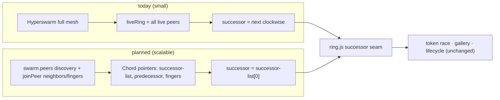

# HyperWave — Scalable Topology (design / plan)

**Status:** Phases 1–4 implemented (DHT discovery; pin successor-list + predecessor + finger table via `joinPeer`; stabilize + churn cooldown + slim pointer-exchange gossip), **plus control-plane flooding** (lifecycle `wave-*` relayed with dedup, §4.6) and **distributed `findSuccessor` routing** (§4.5); Phase 5 (sweep) planned. See §8 for remaining items. This is the design for making HyperWave scale
from a handful of peers to a large, global swarm by aligning our logical ring with the
physical Hyperswarm connection graph — the "make the ring drive connections" idea.

Read [`protocol.md`](./protocol.md) and [`architecture.md`](./architecture.md) first.

## 1. Problem

Today the ring is a **pure logical overlay**: `angle = f(pubkey)` over _all_ peers, with no
relationship to Hyperswarm's actual connection graph. It works only because Hyperswarm
**fully meshes small swarms**, so every successor edge happens to be a physical connection.

Past the mesh limit Hyperswarm connects each peer to an arbitrary _subset_, and the overlay
and the physical graph **diverge**: the token can only be forwarded to a _reachable_
successor, so the ring silently degrades to "next _reachable_ clockwise" — skipping peers,
approximate order. Root cause: **the overlay doesn't influence which peers we connect to.**

## 2. Goal & principles

Make the wave work at large scale **without a full mesh**, while keeping the token race,
gallery, and lifecycle unchanged behind the existing `successor` seam (`ring.js`).

- **The ring drives connections (Chord).** Each peer deliberately connects to its
  successor(s), predecessor, and O(log N) _fingers_ — not to everyone.
- **Reuse Hyperswarm.** `swarm.peers` (DHT discovery) for ring membership; `swarm.joinPeer(key)`
  to make ring edges physical; `conn.remotePublicKey` for identity (already used).
- **Isolate the change.** All of it lives behind `successor` / a new `chord` module; the
  wave engine (`wave.js`) keeps calling "who is my successor?".

## 3. Two axes of scale (both matter)

Scaling has **two independent axes**; this plan's primary focus is (A).

**(A) Connectivity, discovery, routing → Chord.** You cannot full-mesh 10k peers. This is
the concrete work below: O(log N) connections + lookup.

**(B) Propagation _time_ → deterministic sweep (a decision, not built here).** A _serial_
token lap is inherently `O(N)` — each hop adds a network round-trip, so at N=10,000 the lap
takes many seconds even at network speed, which defeats "a wave." Chord fixes connectivity,
**not** lap time. For a truly global,
near-instant wave the propagation model should become the **deterministic angular sweep**
from the original design: publish `(waveStartTime, angularSpeed, direction)`, and every
peer _independently_ computes when the wave reaches its seat
(`trigger = start + (angleFromStart / angularSpeed)`), lighting the whole ring in one sweep
regardless of N — O(1) per peer, no serial passing.

Trade-off: the deterministic sweep drops the **interlocked receipt chain** (each receipt
depends on the predecessor's), because there's no serial hand-off. With sponsor rewards
removed this no longer affects payments (there are none) — the receipt chain now only backs
the token mechanic and the gallery write-gate, both of which the sweep would replace with
independent per-seat proofs. **Decision to make when we get there:** keep the serial token
(small/medium waves) vs. adopt the deterministic sweep (instant at any N). We can support
both: serial for intimate waves, sweep for stadium/global moments.

**Status:** decided (keep serial for small, sweep for global) but the sweep is **not built**
— the serial token remains the only propagation model, so a genuinely large wave is still
O(N) in per-hop network round-trips. Note the sweep's `(startTime, speed, direction)` params are exactly what the
**control-plane flood** (§4.6) already delivers to every seat — so the flood is the
delivery mechanism for _either_ model's kickoff; only the per-peer trigger logic differs.

## 4. Chord design (axis A)

### 4.1 Identifier space

`nodeId(pubkey)` = top 8 bytes of the key as an unsigned 64-bit integer; the ring is
`mod 2^64`. (`angle` stays for display, derived from the same bytes.) 64 bits gives finger
headroom without BigInt-heavy math getting silly; revisit if collisions matter at extreme N.

### 4.2 Membership discovery

- Seed the peer set from **`swarm.peers`** (PeerInfo public keys on the topic) and refresh
  on `swarm.on('update')` — DHT discovery gives ring members before/without gossip.
- Liveness + country ride the **`pointers` heartbeat** to neighbours (no separate presence
  message). Drop the O(N) full `peers` snapshot (§4.6). (There is no `role` field — every peer
  is equal; see §4.7.)

### 4.3 Pointers & connections (the core change)

Maintain, per node:

- **successor list** — the next `k` nodes clockwise (k≈3) for fault tolerance;
- **predecessor**;
- **finger table** — `finger[i]` = first node ≥ `(nodeId + 2^i) mod 2^64`, for i in 0..63.

`swarm.joinPeer()` the successor(s), predecessor, and fingers → **O(log N) connections**.
Stop depending on Hyperswarm's incidental meshing for the ring.

### 4.4 Stabilization (Chord)

- **stabilize** (periodic): ask successor for its predecessor `x`; if `x` is between me and
  my successor, adopt `x` as successor; then notify the successor of me.
- **fixFingers**: as built, the whole finger set is recomputed locally from known ids on
  each topology refresh (pure `fingers(ids, myId)` inside `maintainNeighbours`) — that
  recompute _is_ fixFingers; there is no per-tick single-finger `findSuccessor` lookup.
- **checkPredecessor**: as built, covered by the connection-`close` path only — there is no
  periodic predecessor probe (see §8).
- **churn:** on a connection close, promote the next successor-list entry and re-stabilize.

### 4.5 Routing / lookup — **implemented**

`findSuccessor(target)` = standard Chord lookup: route the query through fingers,
O(log N) hops, so it resolves to the correct successor **even when no single peer knows the
whole ring** (the partial-knowledge case that a purely local computation gets wrong).

- **Pure core** (`chord.js`): `findSuccessorStep(me, successor, known, target)` is the per-hop
  decision — answer if `target ∈ (me, successor]`, else forward to `closestPrecedingNode`
  (the finger closest below the target). With a full finger table it converges in O(log N);
  with only a successor pointer it degrades to a _correct_ linear walk. Brittle-tested,
  including a simulation over 64-node partial-knowledge networks (correct within the
  2·log₂N ≤ 12-hop test bound).
- **Transport** (`chord-routing.js`, `createChordRouting`): `find-succ` / `find-succ-reply`
  messages. `findSuccessor` sends the query to the closest preceding _connected_ finger;
  each hop forwards along connected fingers and the reply **retraces the same path** back to
  the origin (no ad-hoc connections), with a hop cap + timeout. Wired by `wave.js` and
  exposed as `wave.findSuccessor(target)`.
- **Consumers:** at **join time**, once a peer gets its first connection it places itself in
  the ring by routing `findSuccessor(me + 1)` — the successor of its own position — through
  a seed (Chord `n.join`; the same `repairSuccessor` call used periodically) — so a joiner
  finds its true successor even when its own DHT sample is incomplete, rather than waiting
  for the slow path. Thereafter the periodic `repairSuccessor` corrects any successor a
  partial local view missed. Both feed the result into pin candidates (additive; a no-op at
  small scale where local knowledge already resolves the lookup with zero hops).

Uses: placing where a token starts / where a joining node inserts / routing a control message
to a specific seat. The token still walks successor→successor for the _visual_ wave (axis B).

### 4.6 Gossip slimming & flooding

Two changes, both implemented:

- **Slim the membership plane.** Replace the O(N) `peers` snapshot with **pointer exchange**
  (successor-list + predecessor), O(k + log N), sent only to neighbours; `pointers` doubles
  as the liveness heartbeat (country rides it — no separate presence message).
  Membership is DHT-discovered but **liveness-gated** — `swarm.peers` drives
  _who we dial_ (pinning), while a ring **seat** requires a real connection or direct gossip,
  so a stale announce can't become a ghost seat.
- **Flood the lifecycle plane.** The one-hop broadcast that §4.6 originally kept for `wave-*`
  only works on a full mesh — past the mesh limit an announce would reach ~1% of a partial
  random mesh. So `wave-announce` / `wave-join` / `wave-start` / `wave-end` are now **flooded**:
  each carries a unique `mid`, and a peer relays it to its other neighbours **on first sight**,
  dropping repeats (pure `flood.js`, verified for reach over synthetic partial meshes in
  `flood.test.js`). On the random mesh (diameter ≈ log N / log degree) this blankets every
  seat in a few relay rounds. `wave-pos` stays one-hop (chatty; its heal-ACK only needs the
  predecessor). `add-writer` is **also flooded** (in `RELAYED_KINDS`, re-flooded on each
  admission retry) — a one-hop broadcast silently failed to reach a current writer across a
  sparse/churned mesh; it's authenticated by its carried receipt signature, so relaying is
  sound.

**`wave-sync` on connect** stays essential as the catch-up path for a peer that joins after a
flood has already passed.

### 4.7 Gallery replication over a partial mesh — **reach verified; persistence held by the initiator**

`Corestore.replicate(conn)` runs on every connection, and the gallery Autobase is opened by
essentially every peer that sees the wave (`openGallery` fires on `wave-start`, inside
`processToken` so even non-roster **relayers** open it, and on `wave-sync`) — so intermediate
peers hold the cores and can re-serve them. Selfie images are **inline** (JSON dataURL, no
separate Hyperblobs), so this is the only core set to propagate.

**Transitive reach is now proven** (`gallery.replication.test.js`): over a **line** topology
A—B—C wired A↔B and B↔C but _not_ A↔C, C becomes a writer and converges to A's selfie **purely
through B**, and A receives C's selfie through B. So Hypercore/Corestore does forward the
gallery along connected (ring/finger) paths when intermediates keep it open — no full mesh
required.

**Persistence — held by the wave's initiator.** There are **no peer roles** (no validator/seed
archivist hub). Every peer is equal and wipes its store per run, so a gallery only survives as
long as a peer keeps it open. The one per-wave asymmetry belongs to the **initiator** of a
wave: the peer that kicks it off keeps _that_ wave's gallery open and retains it (archivist for
its own wave only), so it can keep serving that gallery to latecomers after other participants
disconnect. Verified in `gallery.replication.test.js`: a latecomer connected _only_ to the
initiator gets the full gallery after other participants have left. **Accepted simplification:**
if the initiator goes offline its wave's gallery isn't archived anywhere else (no dedicated hub
pins/retains it), and nothing persists across runs. (Convergence _lag_ at large depth remains
unmeasured.)

## 5. Migration behind the seam

`ring.js` keeps exposing "successor"; only _how it's computed_ changes (full-ring sort →
Chord pointer). `pickReachable` collapses to "the successor pointer" (reachable by
construction). `wave.js` is untouched.

## 6. Phases (each shippable + testable)

1. **Discover via `swarm.peers`** — seed the peer map from DHT discovery (additive, low
   risk; ring converges faster, less gossip). **✅ Done:** `wave.js` `discoveredIds()` walks
   `swarm.peers` (PeerInfo keyed by hex key) into the ring (consumed by
   `maintainNeighbours()`), fired on `swarm.on('update')`,
   after `discovery.flushed()`, and each `RINGUPDATE_MS` tick; peers are refreshed while
   discoverable and TTL-pruned once Hyperswarm GCs them. Forwarding still targets only
   _connected_ peers (`pickReachable ∩ senders`), so it's purely additive.
2. **`joinPeer` successor + predecessor (+ successor-list)** — make ring edges physical;
   keep full-ring gossip as a fallback initially. **✅ Done:** pure `lib/chord.js`
   (`nodeId`/`successors`/`predecessor`/`connectionTargets`, brittle-tested in
   `chord.test.js`) computes the target neighbour set; `wave.js` `maintainNeighbours()`
   diffs it against a `pinned` set and `swarm.joinPeer`/`leavePeer`s the delta on every
   topology refresh (k=3 successors + predecessor). `leavePeer` only drops the explicit
   pin, so the topic-driven full mesh remains as the fallback until Phase 3.
3. **Finger table + `findSuccessor` + `fixFingers`** — O(log N) connections; drop full-mesh
   reliance. **✅ Done:** `chord.js` adds `findSuccessor(ids, target)` (first node clockwise
   of a keyspace position) and `fingers(ids, myId)` (finger[i] = successor of `myNid + 2^i`,
   i in 0..63, deduped to O(log N) distinct nodes), composed into `pinTargets` = successor-
   list ∪ predecessor ∪ fingers. `wave.js` `maintainNeighbours()` now pins `pinTargets`;
   recomputing the fingers on each topology refresh _is_ `fixFingers`. Brittle-tested in
   `chord.test.js`. The finger set spans the ring so reachability no longer depends on the
   incidental mesh (which remains only until gossip is slimmed in Phase 4).
4. **`stabilize` + churn handling + slim gossip** — remove the O(N) `peers` snapshot.
   **✅ Done:** the O(N) `peers` snapshot is gone; membership is DHT-discovery-first
   (`swarm.peers`) plus a compact **`pointers`** advert (successor-list + predecessor,
   O(k + log N)) sent only to pinned neighbours — it doubles as the liveness heartbeat.
   `chord.js` adds `inOpenInterval` + `stabilizeStep` (brittle-tested); a `pointers` from
   my current successor whose predecessor sits between us triggers an immediate re-pin
   (nextClockwise then adopts the closer successor). Churn: on a pinned-neighbour close we
   re-pin immediately (successor-list failover / finger repair), and a `goneUntil` cooldown
   stops DHT re-seeding from resurrecting a just-dead peer. Verified end-to-end on the local
   DHT: 4 peers converge + gallery replicates with the slim gossip; killing a node mid-wave
   heals (token skips it, `wave` completes, gallery minus the dead peer) with no ghost seat.
5. **(decision) Propagation at scale** — deterministic angular sweep for stadium/global
   waves (axis B), with independent proofs; keep the serial token for small waves.

## 7. Testing

- **Pure unit tests (brittle):** `nodeId` from key; finger targets; `findSuccessor` over a
  synthetic node set; one `stabilize` step; successor-list failover. Put Chord math in a
  pure module (`packages/hyperwave-lib-core/lib/chord.js`) so it's unit-testable without a swarm.
- **Partial-topology flood harness** (`flood.test.js`): drives the real per-node flood
  decision (`flood.js`) over synthetic graphs (line, ring, star, random partial mesh,
  disconnected) — Hyperswarm full-meshes small swarms, so this is how we prove **relay
  reach** without the transport. Asserts full reach in the connected component, exactly-once
  dedup, sends ≤ 2·|E|, and diameter-ish rounds (the N=200 partial mesh asserts full reach
  within a ≤ 20-round bound; a disconnected component is correctly _not_ reached).
- **Line-topology gallery replication + initiator persistence** (`gallery.replication.test.js`):
  real Corestores/Autobases with no swarm. (1) A↔B, B↔C (no A↔C) — the gallery replicates
  _transitively_ (C converges to A's writes through B). (2) the wave initiator retains its own
  gallery, other participants leave, a latecomer connected _only_ to the initiator still gets
  the full gallery. The §4.7 reach + persistence tests.
- **Local DHT integration** (`bootstrap.js`): N processes; assert the ring converges (every
  peer's successor is correct), a token completes a full lap visiting all seats, and the
  gallery replicates across the partial mesh.
- **Churn:** kill a node mid-wave; assert successor-list failover + stabilize repair; the
  wave heals (existing §7.3) and continues.

## 8. Remaining work / risks

Phases 1–4 + the control-plane flood are built and unit/partial-mesh tested. The **top 3**
things that decide whether this actually works at scale — in priority order:

1. ~~**Ring correctness under partial membership knowledge (§4.3–4.5).**~~ **Done** — the
   **distributed `findSuccessor` routing** is built (pure `findSuccessorStep` + the
   `find-succ` transport RPC in `chord-routing.js`, §4.5), so a lookup resolves to the correct
   successor even when the DHT only samples membership. Wired at **join time** (a peer routes
   `findSuccessor(me + 1)` on its first connection to place itself — the same `repairSuccessor`
   used periodically, Chord `n.join`); both feed
   routed results back into pinning. Verified over simulated 64-node partial-knowledge networks
   (within the 2·log₂N ≤ 12-hop test bound) and end-to-end on the local DHT incl. a late joiner. _Still to harden:_ validate
   convergence under real large-N churn (can't force a partial mesh locally).
2. **Propagation at scale — build the sweep (§3B / Phase 5).** The serial token is O(N) in
   per-hop network round-trips ≈ many seconds at N=10k, so there is currently _no_ working
   large-N wave. The deterministic
   angular sweep (per-peer self-trigger, independent proofs) is the only path to a genuinely
   global wave; its kickoff already has a delivery mechanism (the §4.6 flood).
3. ~~**Gallery persistence (§4.7).**~~ **Done (bounded)** — transitive reach _and_ per-wave
   persistence are covered: with **no peer roles**, the wave's **initiator** retains its own
   wave's gallery, so it survives other participants leaving (`gallery.replication.test.js`).
   Accepted simplification: no dedicated archivist hub, so a gallery is lost if its initiator
   goes offline and nothing persists across runs. Remaining: convergence-lag measurement.

Secondary / masked-for-now:

- The `successor` seam was **not** cleanly switched to `successor-list[0]` (§5) — `wave.js`
  still forwards via full-ring `nextClockwise`/`pickReachable`; it works only because the
  true successor is pinned+connected, an implicit coupling unverified at partial-neighbourhood
  scale.
- `swarm.joinPeer` behaviour when pinning O(log N) fingers near Hyperswarm's connection limit,
  under churn — verified semantics + N=4 only.
- No explicit periodic `checkPredecessor` (conn-close covers it today).
- Complexity: Chord is real code — keep it isolated and pure behind the successor seam so a
  bug can't destabilize the wave logic.

## 9. Wow factor

A wave that is genuinely global: **thousands of peers, no servers**, a ⚽ (or an instant
sweep) racing a worldwide ring, selfies flooding a shared gallery, flags lighting a **world
map** as they arrive — and (with the payment layer) real self-custodial micro-payments at
every hop. Chord is what makes "the whole planet in one wave" technically real rather than a
demo of five laptops.
