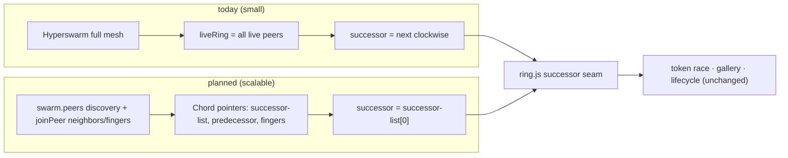

# HyperWave — Scalable Topology (design / plan)

**Status:** Phases 1–4 implemented (DHT discovery; pin successor-list + predecessor + finger table via `joinPeer`; stabilize + churn cooldown + slim pointer-exchange gossip); Phase 5 planned. This is the design for making HyperWave scale
from a handful of peers to a large, global swarm by aligning our logical ring with the
physical Hyperswarm connection graph — the "make the ring drive connections" idea.

Read [`protocol.md`](./protocol.md) and [`architecture.md`](./architecture.md) first.

## 1. Problem

Today the ring is a **pure logical overlay**: `angle = f(pubkey)` over *all* peers, with no
relationship to Hyperswarm's actual connection graph. It works only because Hyperswarm
**fully meshes small swarms**, so every successor edge happens to be a physical connection.

Past the mesh limit Hyperswarm connects each peer to an arbitrary *subset*, and the overlay
and the physical graph **diverge**: the token can only be forwarded to a *reachable*
successor, so the ring silently degrades to "next *reachable* clockwise" — skipping peers,
approximate order. Root cause: **the overlay doesn't influence which peers we connect to.**

## 2. Goal & principles

Make the wave work at large scale **without a full mesh**, while keeping the token race,
gallery, and lifecycle unchanged behind the existing `successor` seam (`ring.js`).

- **The ring drives connections (Chord).** Each peer deliberately connects to its
  successor(s), predecessor, and O(log N) *fingers* — not to everyone.
- **Reuse Hyperswarm.** `swarm.peers` (DHT discovery) for ring membership; `swarm.joinPeer(key)`
  to make ring edges physical; `conn.remotePublicKey` for identity (already used).
- **Isolate the change.** All of it lives behind `successor` / a new `chord` module; the
  wave engine (`wave.js`) keeps calling "who is my successor?".

## 3. Two axes of scale (be honest about both)

Scaling has **two independent axes**; this plan's primary focus is (A).

**(A) Connectivity, discovery, routing → Chord.** You cannot full-mesh 10k peers. This is
the concrete work below: O(log N) connections + lookup.

**(B) Propagation *time* → deterministic sweep (a decision, not built here).** A *serial*
token lap is inherently `O(N × HOP_DELAY_MS)` — at N=10,000 and 1.2s dwell that's hours,
which defeats "a wave." Chord fixes connectivity, **not** lap time. For a truly global,
near-instant wave the propagation model should become the **deterministic angular sweep**
from the original design: publish `(waveStartTime, angularSpeed, direction)`, and every
peer *independently* computes when the wave reaches its seat
(`trigger = start + (angleFromStart / angularSpeed)`), lighting the whole ring in one sweep
regardless of N — O(1) per peer, no serial passing.

Trade-off: the deterministic sweep drops the **interlocked receipt chain** (each receipt
depends on the predecessor's), because there's no serial hand-off. That's compatible with
the **fixed-per-participant** payment model (validator pays each valid, independently-signed
proof) rather than the interlocked-chain model — see `ideas/final-idea.md`. **Decision to
make when we get there:** keep the serial token (interlocked chain, small/medium waves) vs.
adopt the deterministic sweep (instant at any N, independent proofs). We can support both:
serial for intimate waves, sweep for stadium/global moments.

## 4. Chord design (axis A)

### 4.1 Identifier space
`nodeId(pubkey)` = top 8 bytes of the key as an unsigned 64-bit integer; the ring is
`mod 2^64`. (`angle` stays for display, derived from the same bytes.) 64 bits gives finger
headroom without BigInt-heavy math getting silly; revisit if collisions matter at extreme N.

### 4.2 Membership discovery
- Seed the peer set from **`swarm.peers`** (PeerInfo public keys on the topic) and refresh
  on `swarm.on('update')` — DHT discovery gives ring members before/without gossip.
- Keep a light **presence** to neighbors for liveness + country (or let country travel only
  with the selfie). Drop the O(N) full `peers` snapshot (§4.6).

### 4.3 Pointers & connections (the core change)
Maintain, per node:
- **successor list** — the next `k` nodes clockwise (k≈3) for fault tolerance;
- **predecessor**;
- **finger table** — `finger[i]` = first node ≥ `(nodeId + 2^i) mod 2^64`, for i in 0..63.

`swarm.joinPeer()` the successor(s), predecessor, and fingers → **O(log N) connections**.
Stop depending on Hyperswarm's incidental meshing for the ring.

### 4.4 Stabilization (Chord)
- **stabilize** (periodic): ask successor for its predecessor `x`; if `x` is between me and
  my successor, adopt `x` as successor; then notify the successor of me.
- **fixFingers** (periodic): refresh one finger per tick via `findSuccessor`.
- **checkPredecessor**: drop a dead predecessor.
- **churn:** on a connection close, promote the next successor-list entry and re-stabilize.

### 4.5 Routing / lookup
`findSuccessor(id)` = standard Chord lookup via fingers, O(log N) hops. Uses:
- placing where the token starts / where a joining node inserts;
- routing a control message to a specific seat if ever needed.
The token still walks successor→successor for the *visual* wave (axis B caveat applies).

### 4.6 Gossip slimming
Replace the O(N) `peers` snapshot with **pointer exchange** (successor-list + predecessor),
O(k + log N). `presence` goes only to neighbors. `wave-*` / `add-writer` still broadcast to
direct neighbors (now the ring/finger set), and **`wave-sync` on connect** stays essential.

### 4.7 Gallery replication over a partial mesh (must verify)
Today `Corestore.replicate(conn)` on every connection replicates the gallery Autobase; a
full mesh means everyone is connected to the originator (host) and replicates directly. In a
**partial mesh**, a peer may not be directly connected to the host — Hypercore/Autobase
replication forwards along *connected paths* where intermediate peers also hold the core, so
it should propagate along ring/finger edges **if participants keep the gallery open**. Verify
this empirically; if it lags, designate the originator (or a validator) as a well-connected
seed, or replicate the gallery specifically across finger connections.

## 5. Migration behind the seam

`ring.js` keeps exposing "successor"; only *how it's computed* changes (full-ring sort →
Chord pointer). `pickReachable` collapses to "the successor pointer" (reachable by
construction). `wave.js` is untouched.

## 6. Phases (each shippable + testable)

1. **Discover via `swarm.peers`** — seed the peer map from DHT discovery (additive, low
   risk; ring converges faster, less gossip). **✅ Done:** `wave.js` `seedFromSwarm()` walks
   `swarm.peers` (PeerInfo keyed by hex key) into the ring, fired on `swarm.on('update')`,
   after `discovery.flushed()`, and each `RINGUPDATE_MS` tick; peers are refreshed while
   discoverable and TTL-pruned once Hyperswarm GCs them. Forwarding still targets only
   *connected* peers (`pickReachable ∩ senders`), so it's purely additive.
2. **`joinPeer` successor + predecessor (+ successor-list)** — make ring edges physical;
   keep full-ring gossip as a fallback initially. **✅ Done:** pure `workers/lib/chord.js`
   (`nodeId`/`successors`/`predecessor`/`connectionTargets`, brittle-tested in
   `chord.test.js`) computes the target neighbour set; `wave.js` `maintainNeighbours()`
   diffs it against a `pinned` set and `swarm.joinPeer`/`leavePeer`s the delta on every
   topology refresh (k=3 successors + predecessor). `leavePeer` only drops the explicit
   pin, so the topic-driven full mesh remains as the fallback until Phase 3.
3. **Finger table + `findSuccessor` + `fixFingers`** — O(log N) connections; drop full-mesh
   reliance. **✅ Done:** `chord.js` adds `findSuccessor(ids, target)` (first node clockwise
   of a keyspace position) and `fingers(ids, myId)` (finger[i] = successor of `myNid + 2^i`,
   i in 0..63, deduped to O(log N) distinct nodes), composed into `pinTargets` = successor-
   list ∪ predecessor ∪ fingers. `wave.js` `maintainNeighbours()` now pins `pinTargets`;
   recomputing the fingers on each topology refresh *is* `fixFingers`. Brittle-tested in
   `chord.test.js`. The finger set spans the ring so reachability no longer depends on the
   incidental mesh (which remains only until gossip is slimmed in Phase 4).
4. **`stabilize` + churn handling + slim gossip** — remove the O(N) `peers` snapshot.
   **✅ Done:** the O(N) `peers` snapshot is gone; membership is DHT-discovery-first
   (`swarm.peers`) plus a compact **`pointers`** advert (successor-list + predecessor,
   O(k + log N)) sent only to pinned neighbours, and `presence` is neighbour-scoped too.
   `chord.js` adds `inOpenInterval` + `stabilizeStep` (brittle-tested); a `pointers` from
   my current successor whose predecessor sits between us triggers an immediate re-pin
   (nextClockwise then adopts the closer successor). Churn: on a pinned-neighbour close we
   re-pin immediately (successor-list failover / finger repair), and a `goneUntil` cooldown
   stops DHT re-seeding from resurrecting a just-dead peer. Verified end-to-end on the local
   DHT: 4 peers converge + gallery replicates with the slim gossip; killing a node mid-wave
   heals (token skips it, `wave` completes, gallery minus the dead peer) with no ghost seat.
5. **(decision) Propagation at scale** — deterministic angular sweep for stadium/global
   waves (axis B), with independent proofs; keep the serial token for small waves.

## 7. Testing

- **Pure unit tests (brittle):** `nodeId` from key; finger targets; `findSuccessor` over a
  synthetic node set; one `stabilize` step; successor-list failover. Put Chord math in a
  pure module (`workers/lib/chord.js`) so it's unit-testable without a swarm.
- **Local DHT integration** (`bootstrap.js`): N processes; assert the ring converges (every
  peer's successor is correct), a token completes a full lap visiting all seats, and the
  gallery replicates across the partial mesh.
- **Churn:** kill a node mid-wave; assert successor-list failover + stabilize repair; the
  wave heals (existing §7.3) and continues.

## 8. Risks / unknowns

- `swarm.joinPeer` semantics + Hyperswarm connection limits at scale.
- Autobase/Corestore replication over a partial mesh (§4.7) — path-dependent.
- Serial token lap time at large N (§3B) — may force the sweep decision sooner.
- Complexity: Chord is real code — keep it isolated and pure where possible, behind the
  successor seam, so a bug can't destabilize the wave logic.

## 9. Wow factor

A wave that is genuinely global: **thousands of peers, no servers**, a ⚽ (or an instant
sweep) racing a worldwide ring, selfies flooding a shared gallery, flags lighting a **world
map** as they arrive — and (with the payment layer) real self-custodial micro-payments at
every hop. Chord is what makes "the whole planet in one wave" technically real rather than a
demo of five laptops.
