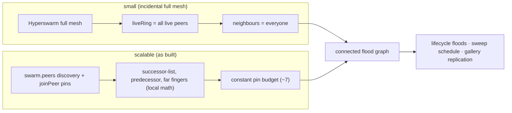

# HyperWave — Scalable Topology (design / plan)

**Status:** Phases 1–4 implemented (DHT discovery; pin successor-list + predecessor + capped far fingers via `joinPeer`; churn cooldown + a liveness-only heartbeat — the stabilize/pointer exchange was later removed, §4.4), **plus control-plane flooding** (lifecycle `wave-*` relayed with dedup, §4.6) and **the deterministic sweep** (§3B / Phase 5 — it **replaced** the serial token). The distributed `findSuccessor` routing (§4.5) was built, verified, and then **retired** along with the token walk. See §8 for remaining items. This is the design for making HyperWave scale
from a handful of peers to a large, global swarm by aligning our logical ring with the
physical Hyperswarm connection graph — the "make the ring drive connections" idea.

Read [`protocol.md`](./protocol.md) and [`architecture.md`](./architecture.md) first.

## 1. Problem

Originally the ring was a **pure logical overlay**: `angle = f(pubkey)` over _all_ peers,
with no relationship to Hyperswarm's actual connection graph. It worked only because
Hyperswarm **fully meshes small swarms**, so every successor edge happened to be a physical
connection.

Past the mesh limit Hyperswarm connects each peer to an arbitrary _subset_, and the overlay
and the physical graph **diverge**: the (then-serial) token could only be forwarded to a
_reachable_ successor, so the ring silently degraded to "next _reachable_ clockwise" —
skipping peers, approximate order. Root cause: **the overlay doesn't influence which peers
we connect to.**

## 2. Goal & principles

Make the wave work at large scale **without a full mesh**, while keeping the wave mechanic,
gallery, and lifecycle behind clean seams (`ring.js` geometry, `chord.js` pointer math).

- **The ring drives connections (Chord).** Each peer deliberately connects to its
  successor(s), predecessor, and a capped set of long-range _fingers_ — not to everyone.
- **Reuse Hyperswarm.** `swarm.peers` (DHT discovery) for ring membership; `swarm.joinPeer(key)`
  to make ring edges physical; `conn.remotePublicKey` for identity (already used).
- **Isolate the change.** All of it lives behind `successor` / a new `chord` module; the
  wave engine (`wave.js`) keeps calling "who is my successor?".

## 3. Two axes of scale (both matter)

Scaling has **two independent axes**; this plan's primary focus is (A).

**(A) Connectivity, discovery, routing → Chord.** You cannot full-mesh 10k peers. This is
the concrete work below: O(log N) connections + lookup.

**(B) Propagation _time_ → deterministic sweep — IMPLEMENTED (it replaced the token).** A
_serial_ token lap is inherently `O(N)` — each hop adds a network round-trip, so at
N=10,000 the lap takes many seconds even at network speed, which defeats "a wave." Chord
fixes connectivity, **not** lap time. So the propagation model is now the **deterministic
angular sweep** from the original design: `wave-start` floods `(roster, t0, lapMs)` and
every peer _independently_ derives the identical angle-ordered schedule (`sweep.js`:
dedupe, sort by angle with id tie-break, `slot = t0 + round(rank/count × lapMs)`) and
self-triggers at its own slot — the whole ring lights up in one fixed-duration lap
regardless of N, O(1) per peer, no serial passing, no healing (a dead peer's slot simply
passes).

Trade-off (accepted): the sweep drops the **interlocked receipt chain** (each receipt
depended on the predecessor's), because there is no serial hand-off. With sponsor rewards
removed this no longer affects payments (there are none) — the gallery write-gate is now an
independent per-seat proof (the signed **join attestation**, `protocol.md` §2.2), and the
receipt/accumulator machinery was deleted along with the token. The earlier "keep serial
for small waves, sweep for global" option was **not** kept — the sweep is the only
propagation model (one code path; a small roster just gets a `MIN_LAP_MS` floor so the lap
stays visible).

Note the sweep's `(t0, lapMs, roster)` params are exactly what the **control-plane flood**
(§4.6) delivers to every seat — the flood is the kickoff's delivery mechanism, and the only
in-race traffic the wave needs at all.

## 4. Chord design (axis A)

### 4.1 Identifier space

`nodeId(pubkey)` = top 8 bytes of the key as an unsigned 64-bit integer; the ring is
`mod 2^64`. (`angle` stays for display, derived from the same bytes.) 64 bits gives finger
headroom without BigInt-heavy math getting silly; revisit if collisions matter at extreme N.

### 4.2 Membership discovery

- Seed the peer set from **`swarm.peers`** (PeerInfo public keys on the topic) and refresh
  on `swarm.on('update')` — DHT discovery gives ring members before/without gossip.
- Liveness + country ride the **`heartbeat`** to pinned neighbours (no separate presence
  message; it carries no ring structure — see §4.4). Drop the O(N) full `peers` snapshot (§4.6). (There is no `role` field — every peer
  is equal; see §4.7.)

### 4.3 Pointers & connections (the core change)

Maintain, per node:

- **successor list** — the next `k` nodes clockwise (k≈3) for fault tolerance;
- **predecessor**;
- **finger table** — `finger[i]` = first node ≥ `(nodeId + 2^i) mod 2^64`, for i in 0..63.

`swarm.joinPeer()` the successor(s), predecessor, and long-range fingers. Stop depending on
Hyperswarm's incidental meshing for the ring.

**Implemented refinement — capped far-finger set (constant pins).** The sweep's control
plane only needs a **connected flood graph with small diameter** (§4.6), not Chord-precise
routing — and the near fingers mostly collapse into the successor-list. So instead of
pinning all O(log N) distinct fingers, `chord.js` pins only the `FAR_FINGERS = 3`
**farthest** distinct fingers by clockwise ring distance (~half-ring, ~quarter-ring,
~eighth-ring edges): `pinTargets` = successor-list (k=3) + predecessor + 3 far fingers — a
**constant pin budget (~7)** whose small-world long edges keep the flood diameter
near-logarithmic. Pure ring-only pinning (no fingers) was considered and rejected: flood
diameter degrades to O(N/k) hops and a contiguous run of k+1 failures cuts the flood graph
— reintroducing exactly the fragility the fingers exist to remove.

### 4.4 Stabilization — **removed (the sweep needs none)**

Chord's stabilize/notify protocol (and the succ/pred pointer advert that carried it) was
built, then **removed with the token walk**: pointer _precision_ only mattered while a
serial token had to find its true successor. As built now:

- pins are recomputed on every topology refresh purely from **DHT discovery + live
  connections** (`pinTargets` inside `maintainNeighbours`) — that recompute is the only
  "fixFingers"-like step, and it needs no gossip;
- the `heartbeat` carries **no ring structure** (liveness + country only);
- **churn:** on a pinned connection's close, re-pin immediately (the next successor-list
  entry and a recomputed far-finger set take over).

### 4.5 Routing / lookup — **retired (built, verified, then removed with the token)**

`findSuccessor(target)` = standard Chord lookup: route the query through fingers,
O(log N) hops, so it resolves to the correct successor **even when no single peer knows the
whole ring**. This existed to make the _serial token walk_ correct under partial membership
knowledge — a forwarder had to know its true successor precisely.

It **was built and verified**: a pure per-hop `findSuccessorStep` in `chord.js`, a
`find-succ`/`find-succ-reply` transport RPC (`chord-routing.js`), join-time self-placement
(`findSuccessor(me + 1)` through a seed) and periodic successor repair — tested over
simulated 64-node partial-knowledge networks and end-to-end on the local DHT.

Then the **sweep replaced the token** (§3B), and successor precision stopped mattering:
every peer computes its own slot from the flooded canonical roster, so nothing is ever
routed to "the successor" at all. The control plane only needs a connected flood graph
(§4.3/§4.6). So `chord-routing.js`, the `find-succ`/`find-succ-reply` messages, join-time
self-placement, and the periodic successor repair were **deleted**. `chord.js` keeps the pointer math
(ringOrder/successors/predecessor/fingers/farFingers) that drives pinning purely from
local knowledge (DHT discovery + live connections).

### 4.6 Gossip slimming & flooding

Two changes, both implemented:

- **Slim the membership plane.** The O(N) `peers` snapshot became a pointer exchange,
  which was then slimmed again to a bare **`heartbeat`** (id + country, O(1), to pinned
  neighbours only) once the sweep removed the need for pointer precision (§4.4).
  Membership is DHT-discovered but **liveness-gated** — `swarm.peers` drives
  _who we dial_ (pinning), while a ring **seat** requires a real connection or direct gossip,
  so a stale announce can't become a ghost seat.
- **Flood the lifecycle plane.** The one-hop broadcast that §4.6 originally kept for `wave-*`
  only works on a full mesh — past the mesh limit an announce would reach ~1% of a partial
  random mesh. So `wave-announce` / `wave-join` / `wave-start` are **flooded**: each carries
  a unique `mid`, and a peer relays it to its other neighbours **on first sight**, dropping
  repeats (pure `flood.js`, verified for reach over synthetic partial meshes in
  `flood.test.js`; at the `GOSSIP_SEEN_CAP` the dedup set evicts **oldest-first** instead of
  wholesale clearing). On the random mesh (diameter ≈ log N / log degree) this blankets
  every seat in a few relay rounds. `wave-join` doubles as the gallery-admission request
  (writer key + join attestation + burn ride it to the initiator, which batch-admits at
  lobby close) — it's authenticated by its carried join signature, so relaying is sound.
  The token-era `wave-pos`, `wave-end`, and flooded `add-writer` messages no longer exist
  (§3B): the ball animates from the local schedule, the wave ends on a local deterministic
  timer, and admission is an Autobase op the initiator appends locally.

**`wave-sync` on connect** stays essential as the catch-up path for a peer that joins after a
flood has already passed.

### 4.7 Gallery replication over a partial mesh — **reach verified; persistence held by the initiator**

`Corestore.replicate(conn)` runs on every connection, and the gallery Autobase is opened by
essentially every peer that sees the wave (the gallery session opens on `wave-announce` —
peers need it open in the lobby to join with a writer credential — and again on
`wave-start` / `wave-sync`, spectators included) — so intermediate peers hold the cores and
can re-serve them. Selfie images are **inline** (JSON dataURL, no separate Hyperblobs), so
this is the only core set to propagate.

**Transitive reach is now proven** (`gallery.replication.test.js`): over a **line** topology
A—B—C wired A↔B and B↔C but _not_ A↔C, C becomes a writer and converges to A's selfie **purely
through B**, and A receives C's selfie through B. So Hypercore/Corestore does forward the
gallery along connected (ring/finger) paths when intermediates keep it open — no full mesh
required.

**Persistence — held by the wave's initiator.** There are **no peer roles** (no validator/seed
archivist hub). Every peer is equal and wipes its store per run, so a gallery only survives as
long as a peer keeps it open. The one per-wave asymmetry belongs to the **initiator** of a
wave: the peer that kicks it off keeps _that_ wave's gallery open and retains it (archivist for
its own wave only), so it can keep serving that gallery to latecomers after other participants
disconnect. Verified in `gallery.replication.test.js`: a latecomer connected _only_ to the
initiator gets the full gallery after other participants have left. **Accepted simplification:**
if the initiator goes offline its wave's gallery isn't archived anywhere else (no dedicated hub
pins/retains it), and nothing persists across runs. (Convergence _lag_ at large depth remains
unmeasured.)

## 5. Migration behind the seam

`ring.js` keeps exposing the geometry (`angleOfId`, `nextClockwise` for display); the wave
itself no longer consumes a successor at all — the sweep derives every slot from the
flooded roster, so the topology's only job is to keep the flood graph connected and the
gallery cores replicating.

## 6. Phases (each shippable + testable)

1. **Discover via `swarm.peers`** — seed the peer map from DHT discovery (additive, low
   risk; ring converges faster, less gossip). **✅ Done:** `wave.js` `discoveredIds()` walks
   `swarm.peers` (PeerInfo keyed by hex key) into the ring (consumed by
   `maintainNeighbours()`), fired on `swarm.on('update')`,
   after `discovery.flushed()`, and each `RINGUPDATE_MS` tick; peers are refreshed while
   discoverable and TTL-pruned once Hyperswarm GCs them. (At the time, token forwarding
   still targeted only _connected_ peers, so this was purely additive.)
2. **`joinPeer` successor + predecessor (+ successor-list)** — make ring edges physical;
   keep full-ring gossip as a fallback initially. **✅ Done:** pure `lib/chord.js`
   (`nodeId`/`successors`/`predecessor`/`connectionTargets`, brittle-tested in
   `chord.test.js`) computes the target neighbour set; `wave.js` `maintainNeighbours()`
   diffs it against a `pinned` set and `swarm.joinPeer`/`leavePeer`s the delta on every
   topology refresh (k=3 successors + predecessor). `leavePeer` only drops the explicit
   pin, so the topic-driven full mesh remains as the fallback until Phase 3.
3. **Finger table + `fixFingers`** — long-range edges; drop full-mesh reliance. **✅ Done
   (now capped):** `chord.js` adds `fingers(ids, myId)` (finger[i] = successor of
   `myNid + 2^i`, i in 0..63, deduped to O(log N) distinct nodes) and `farFingers` (the
   `FAR_FINGERS = 3` farthest by clockwise ring distance), composed into `pinTargets` =
   successor-list ∪ predecessor ∪ far fingers (§4.3 — a constant pin budget). `wave.js`
   `maintainNeighbours()` pins `pinTargets`; recomputing the fingers on each topology
   refresh _is_ `fixFingers`. Brittle-tested in `chord.test.js`. The far-finger set spans
   the ring so flood reach no longer depends on the incidental mesh.
4. **`stabilize` + churn handling + slim gossip** — remove the O(N) `peers` snapshot.
   _(Historical: the pointer advert + stabilize step built here were themselves removed
   after the sweep landed — the heartbeat is now liveness-only, §4.4.)_
   **✅ Done:** the O(N) `peers` snapshot is gone; membership is DHT-discovery-first
   (`swarm.peers`) plus a compact **`pointers`** advert (successor-list + predecessor,
   O(k + log N)) sent only to pinned neighbours — it doubles as the liveness heartbeat.
   `chord.js` added `inOpenInterval` + `stabilizeStep` (brittle-tested); a `pointers` from
   my current successor whose predecessor sits between us triggers an immediate re-pin
   (nextClockwise then adopts the closer successor). Churn: on a pinned-neighbour close we
   re-pin immediately (successor-list failover / finger repair), and a churn cooldown
   stops DHT re-seeding from resurrecting a just-dead peer. Verified end-to-end on the local
   DHT: 4 peers converge + gallery replicates with the slim gossip; killing a node mid-wave
   leaves no ghost seat (at the time, the token healed around it; today its slot simply
   passes).
5. **Propagation at scale — the deterministic angular sweep.** **✅ Done (it replaced the
   serial token):** `sweep.js` derives the identical angle-ordered schedule on every peer
   from the flooded `(roster, t0, lapMs)`; each peer self-triggers at its own slot, the ball
   animates from the local schedule, and the wave ends on a local deterministic timer
   (§3B; `protocol.md` §6). The token walk, receipts/accumulator, healing, `wave-pos`,
   `wave-end`, and the distributed `findSuccessor` routing (§4.5) were deleted with it.

## 7. Testing

- **Pure unit tests (brittle):** `nodeId` from key; finger targets + the far-finger cap;
  successor-list/predecessor/pin targets. Put the ring math in a
  pure module (`packages/hyperwave-engine/lib/chord.js`) so it's unit-testable without a swarm.
- **Partial-topology flood harness** (`flood.test.js`): drives the real per-node flood
  decision (`flood.js`) over synthetic graphs (line, ring, star, random partial mesh,
  disconnected) — Hyperswarm full-meshes small swarms, so this is how we prove **relay
  reach** without the transport. Asserts full reach in the connected component, exactly-once
  dedup, sends ≤ 2·|E|, and diameter-ish rounds (the N=200 partial mesh asserts full reach
  within a ≤ 20-round bound; a disconnected component is correctly _not_ reached).
- **Line-topology gallery replication + initiator persistence** (`gallery.replication.test.js`):
  real Corestores/Autobases with no swarm. (1) A↔B, B↔C (no A↔C) — the gallery replicates
  _transitively_ (C converges to A's writes through B). (2) the wave initiator retains its own
  gallery, other participants leave, a latecomer connected _only_ to the initiator still gets
  the full gallery. The §4.7 reach + persistence tests.
- **Local DHT integration** (`dht-local.js` + the e2e harness): N processes; assert the ring
  converges, a wave's roster converges, every roster member's sweep slot fires, and the
  gallery replicates across the partial mesh.
- **Churn:** kill a node mid-wave; assert re-pin failover; the
  sweep is unaffected (the dead peer's slot passes) and the wave still ends on time.

## 8. Remaining work / risks

Everything structural is built: Phases 1–4, the control-plane flood, the capped far-finger
pin budget (§4.3), **and the sweep** (§3B / Phase 5 — the O(N) serial token is gone, so
wave duration is a chosen constant at any N). Gallery reach + per-wave persistence are
covered too (§4.7). What remains is validation and a few bounded refinements:

1. **Unpin hysteresis.** The `maintainNeighbours` "never unpin a live channel" rule folds
   every live connection back into the pin set (deliberate — pin flapping is what broke the
   old token walk), so at small/medium N the pinned graph is effectively the whole
   topology. A truly bounded neighbour count at large N needs hysteresis on unpinning
   (drop a stale pin only after it has been out of `pinTargets` for a while), not just the
   constant target set.
2. **Large-N churn/flood validation.** The flood harness proves reach over synthetic
   partial meshes, and a 128-peer local run validated the lifecycle at that scale under the
   token era — **re-run the 128-peer dispatch on the sweep build** (roster convergence,
   every slot fires, deterministic end) and push N/churn further. Real partial-mesh
   behaviour (Hyperswarm connection caps + churn) can't be fully forced locally.
3. **Replication-lag measurement (§4.7).** Transitive gallery reach is proven; convergence
   _lag_ at depth/scale is unmeasured (how long until a far peer's gallery settles, and how
   `ADMIT_TIMEOUT_MS` behaves near it).
4. **No late admission — deliberate.** A peer whose join misses the lobby close is a
   spectator; the batch-at-lobby-close model has no re-admission path (the old flooded
   `add-writer` retry loop was deleted with the token). A late-admission fallback was
   considered and **deliberately dropped** for the MVP — one admission moment keeps the
   writer set, the schedule, and the paid gate all derived from the same roster snapshot.

Secondary: no explicit periodic `checkPredecessor` (conn-close covers it today); and Chord
remains real code — keep the pointer math isolated and pure (`chord.js`) so a bug can't
destabilize the wave logic.

## 9. Wow factor

A wave that is genuinely global: **thousands of peers, no servers**, a ⚽ sweeping a
worldwide ring in one fixed-length lap, selfies flooding a shared gallery, flags lighting a
**world map** as they arrive — and (with the payment layer) real self-custodial
micro-payments riding it. Chord-over-Hyperswarm plus the deterministic sweep is what makes
"the whole planet in one wave" technically real rather than a demo of five laptops.
