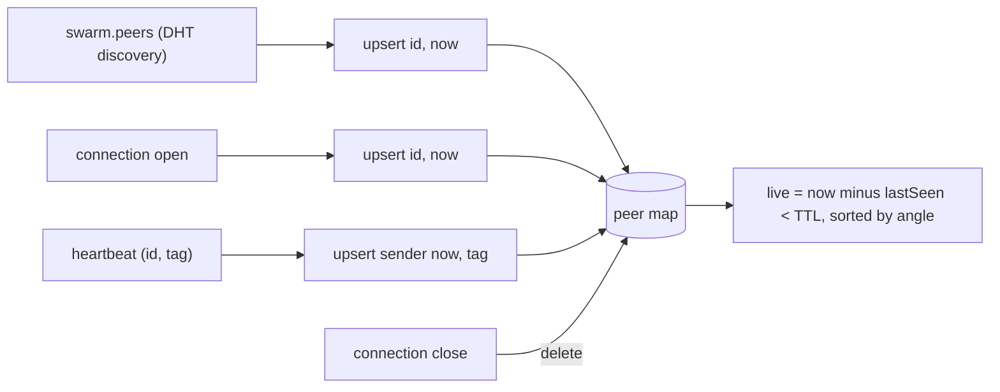
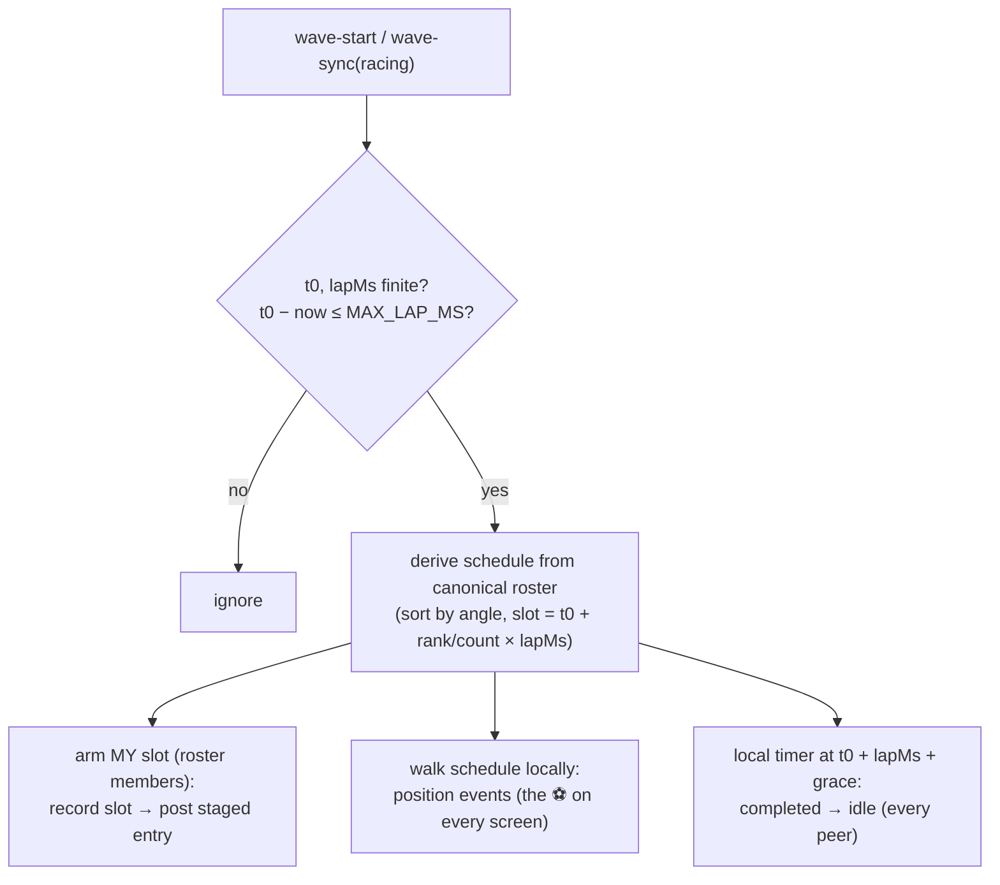
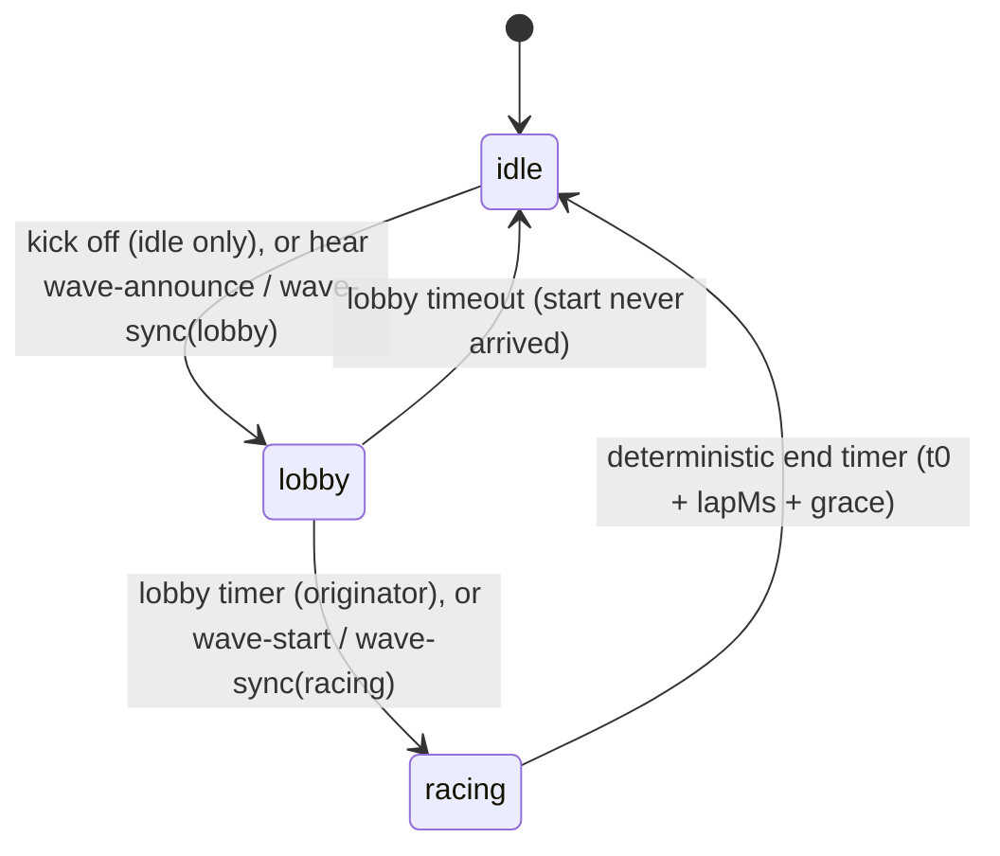
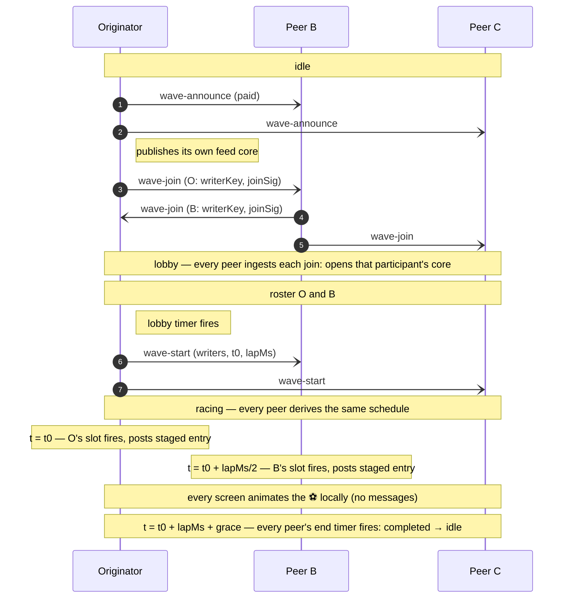
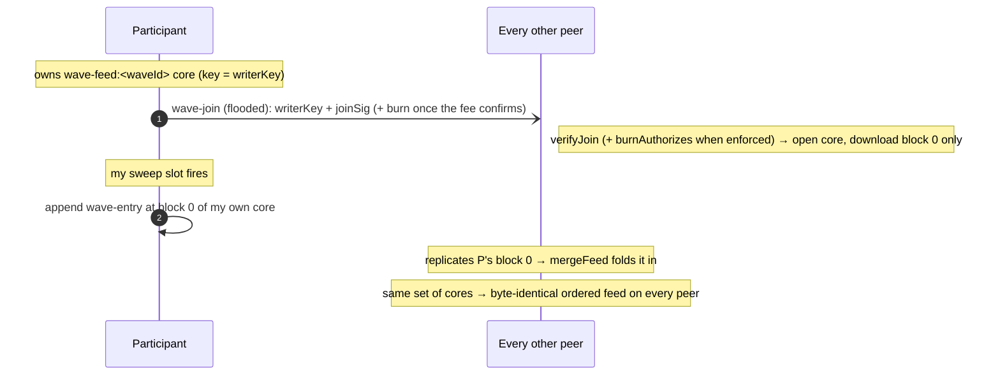

# HyperWave — Protocol & State Machine

A specification of the **on-wire protocol** and the per-peer **state machine**, detailed
enough to implement a compatible client in another language/framework. Everything here is
what peers exchange over the network; the Electron/renderer split (see
[`architecture.md`](../../../apps/docs/hosting.md)) is one implementation and is **not** part of the
protocol.

Reference implementation:
`packages/hyperwave-engine/lib/{wave,ring,sweep,attest,feed,feed-crdt}.js`.

> **The protocol is theme-agnostic.** It carries generic concepts — a **wave** that
> **sweeps** a **ring**, an **entry** whose `payload` is **opaque** to the protocol, in a
> per-wave **feed**, plus a cosmetic per-peer **tag**. The "stadium wave" is the reference
> _application_ (`apps/desktop`), which fills the entry payload with a `{image, caption}`
> selfie and uses the tag as a country code. Any turn-taking / coordinated-snapshot app can
> speak this same protocol.

---

## 1. Concepts & roles

- A **topic** is a swarm identified by a `topicId` string. Everyone on the same topic is
  on one **ring**.
- A **peer**'s cryptographic identity (an Ed25519 key pair) determines its fixed **seat**
  on the ring (an angle derived from its public key). The key pair is derived from a seed
  persisted at `<storage>/swarm.seed`, so a peer keeps the **same seat and identity across
  restarts** (independent of the wallet seed for key isolation — a leaked wallet seed shouldn't
  also compromise the ring signing identity. Note this is not unlinkability: a fee burn already
  ties the wallet address to the `peerId` on-chain via its `hyperwave:<waveId>:<peerId>` memo).
- A **wave** is a single, one-at-a-time event with a random `waveId`. Its lifecycle is
  **idle → lobby → racing → idle**. An **originator** announces it; peers **opt in** during
  the lobby (the **roster**) — each `wave-join` **publishes that peer's own feed core**
  (its writer key, self-certified by a join attestation). Every peer ingests every join it
  sees, so there is no admission and no coordinator. At lobby close the originator floods
  `wave-start` carrying **every participant's core credential** (`writers` — the roster is
  derived from it) plus the sweep parameters (`t0`, `lapMs`); then the wave **sweeps**: every peer derives the
  identical angle-ordered schedule locally and self-triggers at its own slot. There is no
  passed token — the wave is choreography, not an object — and the wave ends
  **deterministically** on every peer at `t0 + lapMs + END_GRACE_MS`, with no end message.
- Each roster member may post an **entry** to the wave's **feed** (a multicore CRDT — one
  Hypercore per participant, merged locally into one ordered view), gated by its signed **join
  attestation**.

There is no server and no coordinator beyond the per-wave originator. All peers run the
same logic.

## 2. Cryptographic primitives

| Primitive                              | Algorithm                     | Encoding on the wire      |
| -------------------------------------- | ----------------------------- | ------------------------- |
| Key pair                               | Ed25519                       | —                         |
| Peer id (`peerId`, `id`, `by`)         | Ed25519 public key (32 bytes) | lowercase hex (64 chars)  |
| Hash (`crypto.hash`)                   | BLAKE2b-256 (32 bytes)        | lowercase hex (64 chars)  |
| Signature (`joinSig`, `sig`)           | Ed25519 sign/verify           | lowercase hex (128 chars) |
| `waveId`                               | 16 random bytes               | lowercase hex (32 chars)  |
| `timestamp`, `hopCount`, `t0`, `lapMs` | integers                      | JSON numbers (base-10)    |

Hex is lowercase throughout. Byte concatenation is raw bytes (not hex strings).

### 2.1 Ring angle (seat)

Given a 32-byte public key `K`:

```
n     = K[0]*256^5 + K[1]*256^4 + K[2]*256^3 + K[3]*256^2 + K[4]*256 + K[5]   // top 6 bytes, big-endian
angle = (n / 2^48) * 360      // degrees in [0, 360)
```

Angle is **always derived locally** from a peer's id; it is never trusted from the wire.

> Why is the angle derived this way? It's a deterministic, uniform hash-to-circle: take enough high-order key bits to make collisions negligible, but few enough (48) to stay within JavaScripts's exact-integer range (53 bits), normalize to [0,1), scale to degrees. Uniform placement, no coordination, no trust, and cheap pure-integer math.

> One nuance worth noting: it uses only the top 6 of 32 bytes for the angle, but identity/ordering still uses the full key elsewhere — so the truncation is purely about the visual/ring geometry, not about security.

### 2.2 Join attestation

A peer's signed opt-in to a wave, binding its ring identity to the feed **core** it owns
and publishes:

```
joinHash(waveId, peerId, writerKey)
    = BLAKE2b-256( utf8( "join|" + waveId + "|" + peerId + "|" + writerKey ) )

joinSig = hex( Ed25519_sign( joinHash, mySecretKey ) )
verify  = Ed25519_verify( joinHash, fromHex(joinSig), fromHex(peerId) )
```

It rides `wave-join` (which **publishes** the participant's feed core; §8.2) and every
feed entry (the write-gate in `mergeFeed()`, §8.2). Covering `writerKey` matters: it is
what makes each core key **self-certifying** — without it, a relay could substitute its own
core key under someone else's `peerId` and hijack that peer's one feed seat. There is no
shared feed key to sign; this attestation is the only credential the feed needs. This is
authenticity, not uniqueness — one-entry-per-peer and the byte caps bound what a seat can do.

### 2.3 Fee-burn attestation

The signed proof binding a peer's ring identity to its on-chain fee burn (schema and
verification in §9.0):

```
burnHash(waveId, peerId, reason, amount, txHash, tronAddress, burnTs)
    = BLAKE2b-256( utf8( waveId + "|" + peerId + "|" + reason + "|" + amount + "|"
                         + txHash + "|" + tronAddress + "|" + burnTs ) )

sig = hex( Ed25519_sign( burnHash, mySecretKey ) )
```

## 3. Transport

- **Topic:** `topic = BLAKE2b-256( utf8(topicId) )` (32 bytes). Join the Hyperswarm DHT
  with `join(topic, { server: true, client: true })`. Default `topicId` in the reference
  build is `"hyperwave:demo:v1"`.
- **Per connection** (Noise-encrypted duplex stream from Hyperswarm):
  1. `Corestore.replicate(conn)` — replicates the per-participant feed cores (see §8).
  2. A **Protomux** channel with protocol id `"hyperwave/gossip"`, carrying a single
     message type whose encoding is `compact-encoding` **`string`** (length-prefixed
     UTF-8). Each message is a **JSON object** with a `kind` field.
- **Broadcast** = send a message on every open gossip channel. **Direct** = send only on
  a specific peer's channel (used for `wave-sync` to a newcomer).
- The gossip channel and the Corestore replication share the same underlying stream
  (Protomux multiplexes them).

**Wire encoding — JSON, and when to revisit.** Gossip messages are JSON (a baked-in design
rule). This is deliberate and, today, correct: the five kinds are tiny and infrequent (hex ids,
one signature, a few integers — the only large payload, the selfie, rides a Hypercore block, not
gossip), so a binary encoding would save almost nothing on the wire; JSON stays trivially
loggable for debugging a flooded mesh; and signature safety is **independent of the wire** —
attestations sign a canonical `|`-delimited tuple hash (`attest.js`), never the JSON envelope, so
JSON's non-canonicity (key order/whitespace) never touches verification. The one benefit a
versioned binary encoding (e.g. `hyperschema`/`compact-encoding`) would add that JSON lacks is
**append-only cross-version wire compatibility** — but that only pays off once there is real
version skew on a shared topic: **independent client implementations, or rolling upgrades across a
long-lived (non-per-match) topic**. That is the trigger to revisit. Until then the codegen build
step, the loss of loggability, and reopening the one-encoding rule outweigh it. Even when
revisited, only the message **envelope** would change encoding; the signed attestation tuple in
`attest.js` stays its own canonical format regardless. (The internal app IPC made the opposite
call for the opposite reason — it adopted `bare-rpc` but kept JSON, because a single-build IPC has
no version skew for a schema to solve; see Appendix A.)

All timing constants are in §10.

### 3.1 Message propagation & relay rules

Past Hyperswarm's mesh limit a large swarm is only a **partial random mesh** — each peer
is directly connected to ~its connection-limit's worth of a random subset, so a plain
one-hop broadcast reaches only a fraction of the swarm. Different message classes are
propagated differently to match what each needs:

| Class                       | Messages                                   | Fanout                                     |
| --------------------------- | ------------------------------------------ | ------------------------------------------ |
| **Flood (relayed + dedup)** | `wave-announce`, `wave-join`, `wave-start` | every peer                                 |
| **One-hop broadcast**       | `heartbeat`                                | every direct connection (no relay)         |
| **Unicast**                 | `wave-sync`                                | one specific peer (a newcomer, on connect) |

**Flood (epidemic broadcast).** The wave _lifecycle_ messages must reach every seat, so they
are relayed hop-to-hop:

- The originator stamps the message with a unique `mid` (random message id) and broadcasts it to all
  direct connections.
- On **first** receipt of a given `mid`, a peer records it, **re-broadcasts** to its other
  neighbours (everyone except the sender), and then processes it locally. On any **repeat**
  `mid` it does nothing (drops the duplicate) — this dedup (de-duplication) is what stops loops and bounds the
  flood.
- On the partial random mesh (average degree ≈ connection limit, diameter ≈ log N / log
  degree ≈ a few hops) this blankets the whole swarm in ~2–3 relay rounds — hundreds of ms,
  far inside the lobby — and is robust to peer/link loss thanks to the many redundant paths.
- Cost is O(edges) message-sends per flood; fine for the handful of small, infrequent
  lifecycle messages. Seen-`mid`s are capped (`GOSSIP_SEEN_CAP`); at the cap the **oldest** id
  is evicted first, so under pressure the dedup set forgets the ids least likely to still be
  in flight rather than the recent ones.

**Unicast.** **`wave-sync`** is sent point-to-point to a newcomer on connect (§7.4) — the
catch-up path for a peer that joins after a flood has already passed.

**Membership** is **DHT-discovered but liveness-gated.** `swarm.peers` (Hyperswarm's PeerInfo
set on the topic) drives the host's start gating (the `discovered` count), not the visible
ring — a DHT announcement alone is just "this key advertised the topic once", so a stale
announce from a since-closed instance is never shown as a seat. A **seat requires real
liveness**: a live connection or direct gossip. The only membership gossip is the
**`heartbeat`** (a peer's own `id` + `tag`, sent one hop to every direct connection
every `HEARTBEAT_MS`): it refreshes `lastSeen` and carries the cosmetic tag — nothing
else. There is **no pointer exchange**: peers do not gossip ring structure — the sweep
needs no successor precision.

**The topology is Hyperswarm's own topic mesh — nothing is pinned.** Peers dial whoever
the DHT surfaces for the topic (up to `maxPeers`), and the flood rides those incidental
connections. The sweep needs only a **connected flood graph** with small diameter, and a
random mesh of degree ≈ `maxPeers` has one with overwhelming probability (validated at
128 peers over a local DHT: the incidental mesh alone gathered the full lobby). The
accepted trade-off: flood connectivity depends entirely on the transport's mesh quality.
**`wave-sync`** is the catch-up path for a peer that connects (or subscribes) after a
flood has passed.

**Directory vs subscribed scoping (scaling.md Phases 2–3).** The shared topic is a
**directory**: everyone on it exchanges `heartbeat` (liveness) + `wave-announce` (the
browse surface), and a peer connecting late gets a unicast **`catchup` re-announce** for
every wave the neighbour knows. A wave's **heavy control gossip (`wave-join`/`wave-start`/
`wave-sync`)** is scoped to its **subscribers**: each peer advertises its subscription set
in a one-hop **`subs`** message, and a wave's join/start is forwarded only to neighbours
whose set contains it — so a peer's control-plane traffic is **O(subscribed)**, not
O(topic). Subscribing also joins the wave's own sub-topic `hash("hyperwave:wave:" +
topicId + ":" + waveId)` so its participants discover each other off the O(N) directory
mesh. **Feed replication auto-scopes**: a peer opens (hence replicates) a wave's cores only
while subscribed. All of this rides **one Protomux channel per connection** — the scoping
is a send-side filter, not separate channels (per-wave sub-channels were tried but their
dynamic-open pairing races the first flood; the `subs` filter self-heals via a sync on
mutual subscription).

## 4. Peer map (membership & liveness)

Each peer maintains a map of **other** peers (never itself), keyed by id:
`id -> { id, angle, lastSeen, tag }`. `angle` is derived from `id` (§2.1) — never
trusted from the wire; `tag` is a cosmetic short string (or null — the reference app uses an ISO-3166-1 alpha-2 country code).

Inputs that build the map:

| Event                                                                            | Effect                                                                                                               |
| -------------------------------------------------------------------------------- | -------------------------------------------------------------------------------------------------------------------- |
| **DHT discovery** (`swarm.peers`, refreshed on `swarm.on('update')` + each tick) | `upsert(id, now)` for every discovered PeerInfo — the primary membership source.                                     |
| connection **open**                                                              | `upsert(remoteId, now)`; lift any churn cooldown. A direct connection is authoritative liveness.                     |
| connection **close**                                                             | delete the peer; set a churn cooldown (`PEER_STALE_MS`) so DHT re-seeding can't immediately resurrect the dead peer. |
| `heartbeat { id, tag }`                                                          | `upsert(id, now, tag)` — refresh the sender's seat + tag.                                                            |

```
upsert(id, lastSeen, tag):
  if id == me: return
  cur = map[id]
  if cur is missing OR lastSeen > cur.lastSeen:
      map[id] = { id, angle: angleOf(id), lastSeen, tag: tag ?? cur?.tag ?? null }
  else if tag is set:
      cur.tag = tag          # tag always tracks the latest report
```

So `lastSeen` is **monotonic per peer** (only advances) and `angle` is always recomputed
from the id.

**Liveness and the ring.** A peer is **live** if `now − lastSeen < PEER_STALE_MS`. The
**ring** is the live peers sorted by angle. A direct disconnect removes a peer
immediately; the TTL expires peers known _indirectly_ (a `swarm.peers` entry that has
since gone) once they stop being refreshed.

Note the peer map serves **topology and display**, not the sweep: the sweep's schedule is
derived from the flooded `wave-start`'s `by`/`writers` (§6), so all peers agree on it even
if their live-ring views differ.



On connect, a peer **greets** the newcomer with its `heartbeat` and — if a wave is active —
a `wave-sync` (§7.4), so the newcomer's map _and_ wave state converge immediately.

## 5. Gossip message catalog

The protocol has **six** message kinds, all JSON objects on the one `hyperwave/gossip`
channel per connection. Unknown `kind`s are ignored. `wave-announce` floods the whole
directory; `wave-join`/`wave-start` flood only a wave's subscribers (§3, scaling.md
Phase 3); `heartbeat`/`subs`/`wave-sync` are one-hop.

### 5.0 Uniform message envelope (planned)

> **Status: planned, not yet implemented.** The per-message schemas below document the wire
> format **as built**, which is inconsistent: the author field is variously `id` (`heartbeat`),
> `by` (`wave-announce`/`wave-start`/`wave-sync`), or `peerId` (`wave-join`); only some
> messages carry a signature; and there is no uniform per-message timestamp. The target is a
> single envelope shared by **every** gossip message. Tracked in `TODO.md` (Adversarial
> hardening).

Every message will carry these three envelope fields in addition to its `kind` and payload:

```jsonc
{
  "kind": "<message-kind>",
  "origin": "<peerId>", // one convention everywhere for who authored the message
  // (replaces id / by / peerId)
  "ts": 1719705612080, // origin timestamp (ms) — when the author created the message
  "sig": "<hex64>" // Ed25519 signature by origin's ring key over the canonical
  // serialization of the whole message minus `sig`
  // …kind-specific payload fields…
}
```

- **`origin`** — the single authorship field on every message. `angle` is still derived from it
  locally (§2.1), never trusted from the wire; the identity binding of §11.2 (self-describing id
  must match the Noise connection id, where the message came direct) becomes **one shared check**
  instead of a per-kind one.
- **`sig`** — an Ed25519 signature by `origin`'s ring key covering **all** fields (canonical
  serialization of the message with `sig` removed). Any relay or recipient can verify authenticity
  before acting or re-flooding, so authenticity no longer depends on the connection a flooded
  message arrived over. This **generalizes** today's ad-hoc signatures (the join `joinSig`,
  the burn attestation `sig`) rather than replacing their _semantics_: those domain signatures
  still bind their specific tuples (join, burn), but the envelope `sig` additionally
  authenticates the message as a whole.
- **`ts`** — the origin timestamp, enabling **age-based relay decisions**: a peer refuses to
  accept or re-flood any message older than a max-lifetime bound (`GOSSIP_MAX_AGE_MS`, TBD). This
  is a **hard cap on how long any flooded message can circulate** — independent of `mid` dedup — so
  a routing loop or a dedup-set bug cannot amplify into unbounded flooding; a message simply dies
  once it is too old. Requires generous clock-skew tolerance (peers are not time-synchronized).

Until implemented, treat the individual schemas below as authoritative.

**Shape enforcement.** The schemas below are code, not just documentation: `lib/messages.js`
defines one factory per kind (every send site builds through it) and one shape validator per
kind, run once at the receive edge before any signature or state work. An unknown kind, a
missing required field, or a mistyped field drops the message; unknown extra fields are
tolerated (forward compatibility). Flooded kinds must carry their `mid`. Validation is shape
only — signatures, the paid gate, and hostile-value clamps remain in the handlers.

### heartbeat — one hop to every connection, every `HEARTBEAT_MS`

```json
{
  "kind": "heartbeat",
  "id": "<peerId>",
  "tag": "BR" | null
}
```

Pure liveness + cosmetic tag, sent one hop to every direct connection (not relayed).
Receiver upserts the sender (`lastSeen = now`, `tag`). It carries **no ring
structure** — the sweep needs no successor precision. Every peer is equal
— the heartbeat carries no role and no peer is special. Primary membership comes from DHT
discovery (`swarm.peers`); the heartbeat is liveness, not the authoritative peer set.

### subs — my subscription set, one hop (on connect + on change)

```json
{
  "kind": "subs",
  "subs": ["<waveId>", "..."]
}
```

The waves this peer is subscribed to (holds cores for). Sent on connect and whenever it
subscribes/unsubscribes (scaling.md Phases 2–3). A neighbour records it and forwards a
wave's `wave-join`/`wave-start` here **only if** the set contains that wave — the send-side
scoping that makes control traffic O(subscribed). On learning a **newly-mutual**
subscription, the peer unicasts a `wave-sync` to catch the neighbour up (so a late
subscribe or a flood that raced the subscription is always recovered). Not relayed; carries
no `mid`.

The three `wave-*` lifecycle messages below are **flooded** (§3.1): each carries a unique
`mid` (random hex id); receivers relay on first sight and drop repeats.

### wave-announce — flooded (originator, on start)

```json
{
  "kind": "wave-announce",
  "mid": "<hex8>",
  "waveId": "<hex16>",
  "by": "<peerId>",
  "lobbyMs": 15000,
  "paid": {
    /* start attestation, §9.0 — present when the paid-wave gate is enforced */
  }
}
```

Opens the lobby. Receivers that accept it (§7.1 adoption) enter `lobby` for `waveId` (as
merely **aware** — no cores open until they subscribe/join, §7.2). A fresh announce floods
the whole directory. On connect, a peer also **unicasts** a re-announce for every wave it
knows, marked `"catchup": true` (fresh `mid`), so a peer that joined the swarm after the
original flood can still discover the wave — a catch-up is processed but **not** re-flooded
(it's directed, not a fresh flood).

**No shared feed key.** There is no shared per-wave feed core and no feed key to
carry or sign — each participant owns its own feed core (§8). The originator is a participant too: right
after announcing it floods **its own** `wave-join` publishing its core (`floodMyFeedCore`),
exactly as every joiner does.

**Paid-wave gate (anti-spam).** When enforced (every instance has a wallet), the initiator
**does not announce until it has burned the start fee and confirmed it on-chain** — the
announce then carries `paid`, the start `burn-proof`. A peer **ignores any announce whose
`paid` proof is missing or not validly signed** (an unpaid/spam wave is invisible), and before
it will **join** (and pay its own fee) it verifies the burn **on-chain** (`verifyBurnTx`:
`to == ` the black hole, `amount ≥ fee`, memo commits `waveId`). `join()` is refused until the
start is `verified`. So no peer ever pays into a wave the initiator hasn't paid for. The
same `paid` proof rides `wave-sync`, so a mid-lobby newcomer can verify too. (Without wallets
— headless/tests — enforcement is off and waves announce immediately, unpaid.)

### wave-join — flooded (a peer opting in during lobby)

```json
{
  "kind": "wave-join",
  "mid": "<hex8>",
  "waveId": "<hex16>",
  "peerId": "<peerId>",
  "writerKey": "<coreKeyHex>",
  "joinSig": "<hex64>",
  "burn": {
    /* the joiner's fee-burn attestation, §9.0 — once its join fee confirms */
  }
}
```

**The join publishes the peer's feed core.** `writerKey` is the joiner's own Hypercore key
for this wave's feed (§8), and `joinSig` is its join attestation over
`(waveId, peerId, writerKey)` (§2.2). **Every peer** that sees the join (during the lobby)
verifies `joinSig`, adds `peerId` to the `writers` map, and opens+downloads that core
(block 0 only, §8.2) — there is no admission and no coordinator. A joiner whose join fee
confirms mid-lobby **re-floods** its `wave-join` with the `burn` attestation attached (paid
gate). A join without a credential is ignored — the `writers` map is the roster, so a seat
that can never post would only stretch the schedule with a guaranteed-empty slot.

Flooded so it reaches every peer (and the initiator, which assembles the roster) even across
a partial mesh. `wave-join` is authenticated by its carried `joinSig` (bound to `peerId` +
wave + writer key), not by the connection — it is relayed, so at relay hops its `peerId` is a
third party. **Paid gate:** when enforced, **every peer** ignores a direct `wave-join` whose
`burn` doesn't authorize `peerId` for `waveId` (`burnAuthorizes`, §9.2) before ingesting it
— the check that was once the initiator's alone at admission.

### wave-start — flooded (originator, when the lobby closes)

```json
{
  "kind": "wave-start",
  "mid": "<hex8>",
  "waveId": "<hex16>",
  "by": "<peerId>",
  "writers": [{ "peerId": "<peerId>", "writerKey": "<coreKeyHex>", "joinSig": "<hex64>" }, ...],
  "t0": 1719705612080,
  "lapMs": 8000,
  "paid": { /* start attestation, §9.0 — present when the paid-wave gate is enforced */ }
}
```

Finalizes the roster and starts the sweep. The **canonical roster is derived, not carried**:
`{by} ∪ writers[].peerId` — the initiator plus every credentialed joiner (no separate
roster field travels; `writers` is the single membership source).
`t0` is the epoch-ms moment the sweep begins
(`now + SWEEP_LEAD_MS` at the initiator — a short lead so the flooded start blankets the
swarm before the first slot fires); `lapMs` is the lap duration,
`clamp(rosterSize × SLOT_MS, MIN_LAP_MS, MAX_LAP_MS)`. Every receiver derives the identical
schedule from `(by + writers, t0, lapMs)` (§6). Receivers clamp hostile values: `lapMs` is capped
at `MAX_LAP_MS`, and a start whose `t0` is more than `MAX_LAP_MS` in the future is ignored
(§11.2).

**`writers` makes the start self-contained.** It carries every participant's feed-core
credential (`{peerId, writerKey, joinSig}` — the same tuple `wave-join` published), so a peer
that adopts via `wave-start` **without having seen the lobby's `wave-join`s** still learns
every core and can render the full feed. Each entry is re-verified (`verifyJoin`) before
its core is opened. The `burn` is **omitted** here (the writers were pre-vetted by the
initiator during the lobby; the wave itself is gated by the start `paid` proof). This
grows `wave-start` to O(N) in the roster — an extension of the existing O(N)-roster scale
concern (the broader path to thousands of peers is the **concurrent-waves sharding model** in the
[scaling design note](./scaling.md), which bounds each wave's roster rather than growing one).
If ever compressed at large N, it must preserve **both** self-containment and
determinism: lossless framing (deflate the frame — see §3) does, and roughly halves the
hex+JSON writers array (~256 B/entry → ~130 B, the crypto-entropy floor of
peerId+writerKey+joinSig). A lossy scheme that ships only peerId **prefixes** and resolves
`writerKey`/`joinSig` from each peer's locally-cached `wave-join`s does **not**: it reinstates
the non-self-containment `writers` exists to remove (a peer that missed a join can't resolve
its prefix), and prefix resolution against per-peer-divergent id sets is ambiguous and
grindable (peerIds gate feed writes + tips). Deriving the roster from received `wave-join`s
instead of carrying `writers` fails for the same determinism reason as below. When the paid-wave gate is enforced, `wave-start` also carries the start `paid`
proof and is gated on it (§11); carrying it also lets a peer that adopted via `wave-start`
re-authenticate a later `wave-sync` to a newcomer. Receivers transition `lobby → racing`.

The derived roster is the initiator-finalized answer to "who is actually in this wave?" —
flooded (inside `writers`) so (a) everyone agrees on membership despite the lobby's flooded,
partial-mesh joins (it is the **canonical input to the schedule**: all peers must compute the
same slots), and (b) each peer knows whether it has a slot (roster member) or merely watches
(spectator).

### wave-sync — DIRECT to a newly-connected peer (join-time state)

```json
{
  "kind": "wave-sync",
  "waveId": "<hex16>",
  "phase": "lobby" | "racing",
  "by": "<peerId>",
  "writers": [{ "peerId": "<peerId>", "writerKey": "<coreKeyHex>", "joinSig": "<hex64>" }, ...],
  "t0": 1719705612080,
  "lapMs": 8000,
  "lobbyMsLeft": 8000
}
```

Lets a peer joining mid-wave sync (§7.4). Like `wave-start`, it carries the `writers` array —
every participant's feed-core credential — so a newcomer (in either phase) learns every
core without needing to have seen the lobby's `wave-join`s; each is re-verified (`verifyJoin`)
before its core is opened. `t0`/`lapMs` (racing phase) let a mid-race newcomer derive the
schedule, animate the ball from the right point, and end at the same deterministic moment as
everyone else. When the paid-wave gate is enforced, a `wave-sync` must carry the start
`paid` proof (§9.0) **for either phase** — including `racing` — and is adopted only if it
verifies (§11), so a fabricated racing sync can't push a newcomer into a bogus wave. (`paid`
is omitted from the schema line above for brevity.)

## 6. The sweep

The wave's propagation is a **deterministic angular sweep** — pure local computation from
the flooded `wave-start`, no per-hop messages, no passed object.

### 6.1 Schedule derivation

Every peer computes the identical schedule from the canonical inputs — the derived roster
(`{by} ∪ writers[].peerId`) plus `(t0, lapMs)`:

```
seats  = dedupe(rosterIds), each with angle = angleOf(id)            // §2.1
sort seats by (angle asc, id asc)                                    // id breaks angle ties
count  = |seats|
slot[rank] = { id, angle, rank, at: t0 + round((rank / count) × lapMs) }
```

`rank` (0-based, angle order) is the entry's **`hopCount`** — still the feed ordering key
(§8.3). Because the inputs are the flooded `by`/`writers` and two integers, all honest
peers derive byte-identical schedules; nothing about the sweep depends on any peer's local
ring view.

### 6.2 Slot firing (my moment)

A roster member arms a local timer for its own slot. When it fires:

- Record the slot (`waveId`, `hopCount = rank`) into the entry pipeline. The pipeline pairs
  it with the entry **staged during the lobby** and posts the feed entry (§8.2) —
  whichever half arrives second triggers the post, exactly once per wave.
- Emit the local `holding` event (UI: "the wave is at my seat").

Posting is immediate — the peer **owns** its feed core (§8.2), so there is no admission
and nothing to wait for; it appends its one entry at block 0. The wave itself never waits on
anything either.

**The entry is captured up-front, in the lobby.** The sweep must never wait on a human, so
capture and posting are split: when a peer opts in, the renderer opens the camera and shows a
countdown; the captured frame is **staged** to the worker (`stage-entry`), and posted at the
peer's slot. Everyone captures around the same moment, at a relaxed pace — independent of
ring size.

### 6.3 Ball animation (position events)

Every peer — roster member or spectator — walks the schedule locally and emits a `position`
event as each slot's time passes (`{ holder, angle, hopCount }`). The ⚽ on every screen is
rendered from this local walk; **there is no position gossip**. A mid-race newcomer that
adopts via `wave-sync` flushes the already-past slots at once and animates from the current
point.

### 6.4 Deterministic end

Every peer ends the wave at `t0 + lapMs + END_GRACE_MS` on its **own local timer**, emitting
`completed { waveId, hops: scheduleLength, angle: originatorAngle }`. There is no end
message: completion needs no trust and cannot be lost in the mesh, and every peer finishes
together (modulo clock skew).

### 6.5 Dead peers

A dead or unreachable roster member's slot **simply passes** — nobody waits, nothing stalls,
no healing is needed. The cost is one empty beat in the choreography (and one missing
feed entry); the wave's duration is fixed regardless.

### 6.6 Receiver-side clamps

A hostile or buggy `wave-start` (or racing `wave-sync`) can't wedge a wave open:

- `lapMs` is clamped to `MAX_LAP_MS` (and must be a positive finite number);
- a start whose `t0` is more than `MAX_LAP_MS` in the future is ignored;
- `t0`/`lapMs` must be finite numbers or the start is ignored.

So the longest any adopted wave can occupy a peer is bounded by
`MAX_LAP_MS (horizon) + MAX_LAP_MS (lap) + END_GRACE_MS`.



## 7. Wave lifecycle state machine

Each peer holds at most one `wave = { id, phase, by, writers:Map, joined:bool }` (or
`null` = **idle**), plus `endedWaves:Set` (finished ids).



A full wave, three peers (angle order O → B → C):



(Open arrows = **flooded** gossip. C never joined, so it has no slot — it watches the same
sweep and ends at the same moment.)

### 7.1 Adoption (`canAdopt(waveId)`)

- If `waveId ∈ endedWaves` → **reject** (a finished wave never restarts).
- Otherwise → **accept**.

**Concurrent waves** (scaling.md Phase 1): the wave FSM is multiplexed — the engine holds a
`Map<waveId, WaveState>` and runs `lobby → racing → idle` **per wave**, so several waves can be
engaged at once on the one topic. The former singleton rule (one wave at a time) and its
lower-`waveId`-wins tie-break are **gone** — they existed only to collapse concurrent starts onto a
single wave (`shouldAdopt` → `canAdopt`). Nothing is superseded on a new start; each wave lives and
ends on its own timers. The gossip wire is unchanged (already keyed by `waveId`).

### 7.2 Awareness, subscription, and roles

Being **aware** of a wave (you accepted its `wave-announce`) is distinct from
**subscribing** to it (scaling.md Phase 2). An aware peer tracks the wave's existence
(roster count) for the browse list and relays its announce, but opens **no cores**.
`subscribe()` opens the wave's feed (my own core + the roster's) and joins its sub-topic;
`unsubscribe()` closes them. `join()` implies subscribe. `autoSubscribe` (default true)
subscribes on awareness — the single-wave demo UX; false gives browse-then-pick. This bounds
a peer's core budget to **O(subscribed)**, not O(all announced waves).

Among **subscribed** peers there are still no lasting roles:

- **Originator:** the peer that called `startWave` — sends `wave-announce`, publishes its own
  feed core (`floodMyFeedCore`), runs the lobby timer, and sends `wave-start` with
  `writers` and the sweep parameters. It is otherwise an **ordinary participant** with no
  lasting asymmetry: its slot is wherever its angle falls, it posts its own entry, and there
  is no indexer, admission, or retention role. (Every _subscriber_ holds every core during
  the wave — §8 — so a departing peer's entry survives; a subscribed wave's feed stays open
  until `unsubscribe()` or `close()` — the post-race idle gallery + latecomer replication rely
  on it; it is **not** auto-closed at wave-end, since final-slot entries keep replicating past
  the deterministic end.)
- **Joiner (roster):** subscribed **and** opted in during the lobby (`wave-join` publishes its
  feed core); gets an entry prompt and a slot in the schedule.
- **Spectator:** subscribed but not in the roster — holds the feed and animates the same sweep,
  ends at the same moment, but has no slot and never posts. **A peer whose join misses the
  lobby is a spectator**: the roster freezes into the schedule at lobby close, so a late join
  can't take a slot it could never fill.

### 7.3 Catch-up sync

Lifecycle floods fire once, so a peer connecting or subscribing mid-wave would miss them. Two
catch-up paths converge state: a **`catchup` re-announce** on connect (directory; makes a
newcomer _aware_, §5 wave-announce), and a **`wave-sync`** exchanged when two peers become
mutually subscribed (each learns the other's subscription from a `subs` message and unicasts
a sync). The subscriber receiving a `wave-sync`:

- `phase: lobby` → enter the lobby (join window with `lobbyMsLeft` remaining), ingest every
  credential in `writers` (open each participant's core) — then it can flood its own
  `wave-join` and join.
- `phase: racing` → ingest `writers` (open every participant's core), derive the schedule from
  `(by + writers, t0, lapMs)`, and go straight to `racing` as a spectator — animating from the
  current point and ending at the same deterministic moment.

Because the sync fires on **mutual subscription** (not merely on connect), a join or start
flood that raced the subscription is always recovered.

### 7.4 Ending & anti-revival

A wave ends on every peer's own deterministic end timer (`t0 + lapMs + END_GRACE_MS`), or —
if the start never arrives — a lobby-timeout fallback. On ending: add `waveId` to
`endedWaves`, return to idle. Because `endedWaves` blocks re-adoption, a straggler flood
can't revive a finished wave.

## 8. Feed (multicore CRDT)

Each wave has its own feed: a **conflict-free replicated data type** built from many
single-writer Hypercores — **one per participant** — merged locally into one ordered view.
There is **no indexer, no linearizer, and no shared "feed key"**: the same set
of cores produces a byte-identical feed on every peer, so convergence is purely epidemic
("have I replicated core X?"). (`feed-crdt.js` `CrdtFeed` + the pure `mergeFeed()` in
`feed.js`.)

### 8.1 Per-participant cores

- **Each participant owns one Hypercore** in the per-wave namespace `wave-feed:<waveId>` —
  a **named** (deterministic) core, so no key needs to be shared out-of-band. That core's key
  **is** the participant's `writerKey`. It starts empty per wave (the namespace is keyed by
  the random `waveId`).
- **The join publishes the key.** A participant floods its `writerKey` on its own `wave-join`
  (§5), self-certified by the join attestation `joinSig` over `(waveId, peerId, writerKey)`
  (§2.2). The originator is a participant too and floods its own `wave-join` right after
  announcing. There is no signed feed key because there is no shared core to sign — each
  core key stands on its own join attestation, so a relay can neither forge nor substitute one.
- Cores replicate over the existing `Corestore.replicate(conn)` on each connection. Entry
  payloads are **inline JSON** (the reference app's images are dataURLs), so these cores are the only set to
  propagate.
- `valueEncoding`: JSON. Each core holds **exactly one** op — the participant's `wave-entry`
  at block 0.

### 8.2 Ingest, merge, and the write-gate

There is no admission: a peer doesn't grant writers, it just **learns and replicates** them.

- **Every peer ingests every `wave-join` it sees** during the lobby (`CrdtFeed.addWriter`):
  it verifies `joinSig` (`verifyJoin` — binds `peerId` to this wave **and** that core key, so
  a relayed join stays sound and nobody can substitute a core key under someone else's
  `peerId`), records `peerId → writerKey`, opens that core by key, and **downloads only block
  0** (`download({start:0, end:1})`). Downloading just block 0 is what bounds spam to **one
  entry per peer** — extra blocks a malicious writer appends are never fetched. `wave-start` /
  `wave-sync` carry the same credentials in `writers`, so a late adopter is self-contained.
- **Paid gate, per peer.** When enforced, every peer checks `burnAuthorizes(burn, peerId,
waveId)` (§9.2) on a **direct** `wave-join` before ingesting it — a signature-only
  check, run identically by everyone. (The `writers` on
  `wave-start`/`wave-sync` omit the burn: they were pre-vetted by the initiator during the
  lobby, and the wave as a whole is gated by the start `paid` proof.) No on-chain call is on
  the ingest path — that would be O(N) REST reads per peer. The burn is verified where it has
  value: by **tippers/auditors** at their own pace via the entry's `burnTx`.
- **Posting is local and immediate.** A participant appends its one op at block 0 of **its
  own** core (`postEntry`) when its sweep slot fires — no admission, no writable-wait.
- **The view is a pure merge.** `mergeFeed(rawEntries)` folds the block-0 op of every held
  core into the ordered feed with one deterministic gate over the whole bag at once:
  - drop any op whose `joinSig` doesn't verify over `(waveId, peerId, writerKey)` by `peerId`
    (§2.2), or whose serialized `payload` exceeds `MAX_PAYLOAD_BYTES` (oversized dropped);
  - keep the tip **`address` only if a signed burn backs it** (`burnAuthorizes` +
    `tronAddress === address`, else blanked);
  - verify-for-address then **drop the bulky `burn`**, keeping only `burnTx`;
  - **one entry per peer** + hop order (`buildFeed`).

  Same set of ops in → byte-identical feed out on every peer. That determinism (no
  consensus, no indexer) is what makes the feed a CRDT.



> **What each layer guarantees.** `mergeFeed`'s checks are **deterministic** (no network
> I/O), so every peer independently drops unsigned/impersonated/oversized entries and dedupes
> to one per peer — that, plus the block-0-only download, bounds the feed. The **on-chain
> burn** is proof-of-payment but it's checked **lazily, off the ingest path** (anyone via
> `burnTx`), so a feed seat is cheap to take but its _value_ (being worth a tip) still
> requires a real burn — a deliberate scale trade-off. When enforcement is off (no wallet /
> tests) ingest is join-attestation-only and addresses are empty.

### 8.3 `wave-entry` op (core entry)

```json
{
  "type": "wave-entry",
  "waveId": "<hex16>",
  "peerId": "<peerId>",
  "hopCount": 3,
  "writerKey": "<coreKeyHex>",
  "joinSig": "<hex64>",
  "tag": "BR",
  "payload": {/* opaque application content — the host owns its shape */},
  "address": "T…",
  "burn": {/* the poster's §9.0 attestation — verified then dropped */},
  "burnTx": "<tron-tx-hash>" /* kept from the burn so the on-chain burn is locatable */,
  "timestamp": 1719705650000
}
```

The op lives at **block 0** of the poster's own core. `hopCount` is the poster's **sweep
rank** (its slot index in the schedule, §6.1) — the feed ordering key, so entries present
in ring order. `writerKey` + `joinSig` are the write-gate credential `mergeFeed()` verifies
(§8.2). `payload` is **opaque to the protocol** — arbitrary JSON the host owns, transported
and byte-capped but never interpreted (the reference app puts a `{image, caption}` selfie,
where `image` is an inline JPEG data-URL thumbnail; Hyperblobs is the scaling path). `tag`
is a cosmetic short string (the reference app uses an ISO country code). `address` is the poster's Tron (TRX) wallet, carried so a
viewer can **tip** this entry with a real testnet transfer (renderer `tip` → worker
`pay.send(address, amount)`; §WDK) — but only if `mergeFeed()` finds it backed by the
`burn` (§8.2), so a tip always reaches the wallet that paid in. Merged form: one entry per
`(waveId, peerId)`, the bulky `burn` stripped (its `txHash` kept as `burnTx` for audit),
sorted by `hopCount` then `timestamp`.

## 9. Participation fees — burning & verification

The money layer is **burned fees** (anti-spam / skin in the game) and **feed tips** (§8.3).
Each burn does real work: the **start** burn gates whether a wave is adoptable at all (the
paid-wave gate, §9.3), and a **join** burn gates whether peers will ingest that participant's
feed core (the ingest gate, §8.2). (Wire details: the paid-wave gate on
`wave-announce`/`wave-start`/`wave-sync` §5; the ingest gate rides `wave-join` §8.2.)

### 9.0 Fee-burn attestation

A fee burn is attested by a signed proof. The **start** attestation is carried as the
`paid` field on `wave-announce` / `wave-start` / `wave-sync`; a **join** attestation is
carried as the `burn` field on `wave-join` (§8.2). It is **not** an on-wire feed entry:

```json
{
  "waveId": "<hex16>",
  "peerId": "<peerId>",
  "reason": "start" | "join",
  "amount": 1,
  "txHash": "<tron-tx-hash>",
  "tronAddress": "T…",
  "burnTs": 1719705612080,
  "sig": "<hex128>"
}
```

Two independent bindings make it verifiable (the Tron key that signs the burn is a different
keypair from the ring identity, so both are needed):

1. **On-chain memo.** The burn tx carries `data = "hyperwave:<waveId>:<peerId>"` (readable via
   `gettransactionbyid`). The burn _itself names the wave_ — a third party can confirm it
   from-chain, and it can't be an old burn replayed for another wave (each carries its own
   random `waveId`, unguessable in advance).
2. **Ring attestation.** `sig` = Ed25519 by `peerId` over
   `(waveId, peerId, reason, amount, txHash, tronAddress, burnTs)` (§2.3) — binds the ring
   participant to the on-chain tx. `validKickoff` admits the proof only if `sig` verifies,
   and a peer then cross-checks the `txHash` on-chain before joining (§9.2).

### 9.1 The mechanism: fees are burned, not paid

Starting a wave (**start fee**) and opting into one (**join fee**) each cost a fixed
amount (1 TRX in the reference build), and the payment is **burned**: sent to Tron's
black-hole address

```
T9yD14Nj9j7xAB4dbGeiX9h8unkKHxuWwb        (base58check of the all-zero EVM address)
```

for which no private key exists — the funds are provably unspendable by _anyone_. This is
deliberate: the fee creates **skin in the game with no beneficiary** — nobody, not even the
wave's initiator, profits from a fee. (Tron rejects zero-amount transfers, so a burn is a real
small transfer; Tron also burns tx fees at the protocol level.) Spamming waves or Sybil-joining
costs real, irrecoverable value.

### 9.2 Binding a burn to its wave and its peer

A raw burn tx only proves "someone sent TRX to the black hole." The **on-chain memo** makes
it _"peer P burned specifically for wave W"_: every fee burn carries
`data = "hyperwave:<waveId>:<peerId>"`, readable via `gettransactionbyid`. Replay across waves
is impossible — each `waveId` is 16 random bytes, unguessable before the wave exists, and the
memo is part of the signed tx.

A second binding ties the burn to the ring identity, since the Tron key that signs the tx is a
**different keypair** from the peer's Ed25519 ring identity: the peer signs the attestation of
§9.0 with its ring key. Both fees carry it — the **start** one as the `paid` proof (so
peers can gate wave adoption), the **join** one as the `wave-join` `burn` field (so **every
peer** can gate whether it ingests that participant's feed core — §8.2).

### 9.3 Verification (who checks what, when)

- **Before joining (every peer):** a `wave-announce` must carry the initiator's start
  attestation (§9.0), validly signed — otherwise the announce is **ignored** (an unpaid wave
  is invisible). Before a peer joins (and pays its own fee), it verifies the start burn
  **on-chain** — `verifyBurnTx`: the tx exists, is a `TransferContract` **to the black
  hole**, from the attested address, `amount ≥ fee`, and the **memo commits this `waveId`**.
  `join()` is refused until this passes, so no peer ever pays into a wave the initiator
  hasn't paid for. The initiator, symmetrically, does not announce until its own burn is
  readable on-chain.
- **On each `wave-join` (every peer):** only the join's burn attestation **signature** is
  checked locally (`burnAuthorizes`, bound to peerId + wave) before ingesting that
  participant's feed core — ingest is **optimistic**, with deliberately **no on-chain call
  on the ingest path** (§8.2). The burn is verified on-chain where it has value: by
  tippers/auditors via the entry's `burnTx`.
- **Anyone, later:** because every fee's memo is on-chain, a third party can audit the fees
  of any wave with nothing but a Tron node — no trust in anyone's bookkeeping required.

Enforcement is active whenever an instance has a wallet; walletless test/headless runs skip
the gate (waves announce immediately, unpaid).

## 10. Constants (reference build)

| Constant            | Value  | Meaning                                                                        |
| ------------------- | ------ | ------------------------------------------------------------------------------ |
| `HEARTBEAT_MS`      | 2000   | heartbeat cadence (liveness + tag)                                             |
| `RINGUPDATE_MS`     | 4000   | seat-staleness + feed-pull maintenance cadence                                 |
| `PEER_STALE_MS`     | 12000  | a peer with no heartbeat within this window is stale (dropped)                 |
| `LOBBY_MS`          | 15000  | lobby / opt-in window                                                          |
| `SWEEP_LEAD_MS`     | 3000   | wave-start lead: `t0 = now + lead`, so the flooded start beats slot 0          |
| `SLOT_MS`           | 400    | per-roster-member slot spacing target (`lapMs ≈ rosterSize × SLOT_MS`)         |
| `MIN_LAP_MS`        | 4000   | lap floor (a tiny roster still sweeps visibly)                                 |
| `MAX_LAP_MS`        | 60000  | lap cap; also the receiver's `t0` horizon clamp (§6.6)                         |
| `END_GRACE_MS`      | 2000   | after the last slot, before every peer returns to idle                         |
| `PAY_TIMEOUT_MS`    | 60000  | initiator abandons the wave if its start burn never confirms                   |
| `GOSSIP_SEEN_CAP`   | 4096   | flood-dedup id cap (oldest evicted first)                                      |
| `MAX_PAYLOAD_BYTES` | 262144 | per-entry serialized payload cap (bounds writes under optimistic ingest, §8.2) |

These are timing/UX tunables, not wire-format; a compatible client should keep them in the
same ballpark for interop but exact values aren't required to match. The exceptions are the
receiver-side clamps (`MAX_LAP_MS` as lap cap + `t0` horizon), which are enforcement, not
tuning.

## 11. Security & trust notes

### 11.1 Foundations

- **Angle/seat** is bound to the public key and can't be forged without grinding keys.
- **Join attestations** authenticate each feed entry to a peer identity and to the writer
  core it posted from (§2.2); the **schedule** is derived by every peer from the same flooded
  `by`/`writers`, so all honest peers agree on who fires when without trusting each other.
- The **feed write-gate** is authenticity, not proof-of-participation (§8.2). A malicious
  fork can drop/ignore anything locally (open P2P); the protocol keeps _honest_ peers
  consistent. There are **no sponsor rewards**, so there is nothing to steal by faking
  participation — the only money flows are burned fees (nobody profits) and voluntary tips
  (paid directly, peer to peer). This removes the whole class of reward-gaming attacks.
- **Completion needs no trust.** The wave ends on every peer's own timer at
  `t0 + lapMs + END_GRACE_MS` — there is no end message to forge, lose, or suppress.
- Country is cosmetic and self-reported.

### 11.2 Adversarial hardening (against a modified client)

The transport (Noise over Hyperswarm) authenticates _who_ a message came from, but the
application logic must actually **use** that rather than trust self-reported fields. The
following guards keep a hostile peer running a modified app from disrupting honest peers:

- **Identity binding.** For a message that describes its own sender and arrives direct —
  `heartbeat.id` — the claimed id must equal the authenticated connection id it arrived on,
  else it's dropped. This blocks peer-map/ring pollution under spoofed ids. The flooded
  `wave-*` messages are deliberately **not** connection-bound: they are relayed, so their
  `by`/`peerId` is a third party at relay hops — they are authenticated by the signatures
  they carry instead (start attestation, `joinSig`).
- **Self-certifying feed cores.** A `wave-join`'s credential is signed over
  `(waveId, peerId, writerKey)` (§2.2), so a relay can't forge or substitute a core key under
  someone else's `peerId` and hijack that peer's feed seat — and there is **no shared
  feed key** to attack in the first place (each participant owns its own core, §8.1). The
  same signature is re-verified deterministically by `mergeFeed()` on every entry.
- **Hostile wave-start clamps.** A receiver caps `lapMs` at `MAX_LAP_MS` and ignores a start
  whose `t0` is more than `MAX_LAP_MS` in the future (§6.6), so a forged/buggy start can't
  wedge a wave open indefinitely — the deterministic end always arrives.
- **Canonical-roster schedule.** The sweep schedule is a pure function of the flooded
  `(by + writers, t0, lapMs)`, so no peer can shift its own (or anyone's) slot without
  producing a different `wave-start` — which the paid-gate already constrains (a forged start needs
  a valid start burn-proof).
- **Paid-gate on every adoption path.** When enforced, `wave-announce`, `wave-start`, and
  `wave-sync` (both lobby **and** racing) are all gated on a valid start burn-proof, so no
  single message shape can push a peer into an unpaid/forged wave.
- **Optimistic per-peer ingest, bounded locally.** Ingesting a participant's core requires a
  valid join attestation and (when enforced) a _signed_ burn attestation, checked by **every
  peer** on each `wave-join`, but with **no on-chain check on the ingest path** (that would be
  O(N) reads per peer, §8.2). Spam is bounded deterministically instead — **block-0-only
  download → one entry per peer + a byte-size cap** — and the burn is verified where it has
  value: by tippers/auditors via `burnTx`. Trade-off: the hard "no unpaid write" gate becomes
  a **soft, publicly-detectable** one.
- **Burn-bound tip address + one entry per peer.** `mergeFeed()` deterministically keeps a
  entry's tip `address` only if a signed burn names that wallet, and folds one entry per peer
  (§8.2) — so tips can't be routed to a non-payer and a seat can't bloat the feed.
- **Cheap-before-expensive.** Adoption runs the cheap wave-filter (`canAdopt`) and flood
  dedup before any signature verification, limiting the CPU a gossip flood can extract.

### 11.3 Known residual risks (hardening backlog)

- **No per-connection rate limiting.** Gossip has flood-dedup, receiver clamps, and the
  cheap-before-verify ordering, but not yet a per-peer message budget; a peer can still spend a
  connection's bandwidth/CPU. With optimistic ingest this matters more (feed seats are
  cheap now — only signatures + one-per-peer + byte cap), so a per-connection token bucket is
  the natural cap on _how many_ joins/entries a single peer can push.
- **Optimistic ingest is a soft gate.** Since the burn isn't checked on the ingest path
  (§8.2), the feed can hold unpaid entries until they're caught (a tipper / an auditor via
  `burnTx`). They are detectable, but they _do_ consume (bounded) storage. Acceptable for the
  MVP scale; pair with the rate limit above at scale.
- **Clock skew shifts the choreography.** Slots and the deterministic end are wall-clock
  epoch times; a peer with a badly skewed clock fires early/late (a cosmetic wobble) and ends
  off-beat. `END_GRACE_MS` absorbs ordinary skew; there is no time-sync protocol.
- **Wallet-less mode is unauthenticated by design.** All paid-gate guarantees hold only when a
  wallet is present (`enforcePaid`); an unfunded demo/test run accepts unpaid waves and
  join-attestation-only feed ingest so the lifecycle can be exercised without on-chain
  calls. Don't mistake that mode for the security model.

## Appendix A — app-internal IPC (informative, not on-wire)

The reference build splits worker (protocol) from renderer (UI); they exchange these over
a local IPC bridge — the **`bare-rpc` host↔UI seam**, JSON-encoded (request/response for
`tip`/`send-trx`/`fetch-transactions`, one-way events otherwise; see `usage.md` §12). It kept
JSON (rather than a schema'd binary encoding) precisely because a single-build IPC has no version
skew for a schema to solve — the opposite trade-off from the gossip wire in §3, for the opposite
reason. A different client would have its own UI and need not match these — only §3–§8 are the
interop surface.

**Renderer → worker (commands):** `start-wave`, `join-wave`, `set-tag {tag}`,
`stage-entry {entry:{payload}}` (stage the opaque entry payload; the worker pairs it with
the peer's sweep slot and posts it when the slot fires — the football app puts a
`{image, caption}` selfie in the payload), `tip {to, amount}` (send a real TRX tip to an
entry owner's wallet), `refresh-wallet` (manual balance re-check after funding).

**Worker → renderer (events):** `state {me,peers,connected,discovered}`; `feed {items}`;
`wallet {address, trx}` (self-custodial TRX wallet); `tip-result {hash?, error?}`;
`burn-result {stage: 'confirming'|'burned'|'failed', hash?, amount?, error?, waveId?, reason}`
(a **participation fee** — 1 TRX burned
to Tron's black hole address `T9yD14Nj9j7xAB4dbGeiX9h8unkKHxuWwb`, i.e. the all-zero EVM
address: unspendable by anyone, so the fee proves skin in the game without enriching any
party. `reason: 'start'` for the initiator on `start-wave`, `'join'` for each opt-in on
`join-wave`. Fired alongside the action, never blocking the wave); and
`event` events: `wave-announce`, `paying` (initiator burning the start fee before
announcing), `wave-verified` (start burn proven — join is now allowed), `wave-unpaid`
(start failed verification — wave abandoned), `join-blocked {reason}` (tried to join
before the start is verified), `joined`, `roster`, `wave-active`, `wave-idle`, `busy`,
`started`, `holding {angle,hopCount,...}` (my sweep slot fired — my staged entry
posts now), `position {holder,angle,hopCount}` (locally generated from the schedule as each
slot passes — this is what animates the ⚽; there is no position gossip), `completed
{waveId,hops,angle}` (fires on **every** peer at the deterministic end).
