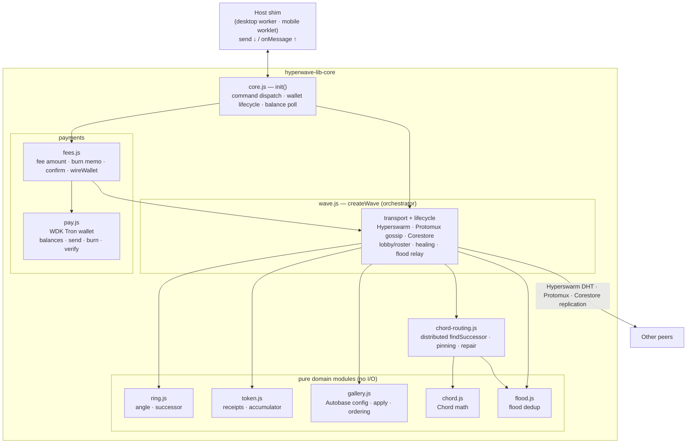

# hyperwave-lib-core

The reusable **HyperWave** engine: a permissionless P2P "Mexican wave" (Hyperswarm discovery →
Chord ring → racing token → Autobase selfie gallery) plus a self-custodial WDK wallet (Tron Nile
testnet), packaged host-agnostic. One engine, two hosts: the desktop Electron worker
(`apps/desktop/workers/hyperwave.js`) and a react-native-bare-kit worklet
(`worklet/app.js`) both boot it through the same entry, `init()`.

> **Runs under [Bare](https://github.com/holepunchto/bare), not Node.** It depends on
> `bare-path`/`bare-fs` and the Holepunch P2P stack. Tests run with `bare test.js`. Node is only
> the outer Electron main process — it never loads this package directly.

## What it does

- **Discovery & ring** — peers join a match-specific Hyperswarm topic; each Noise public key maps
  deterministically to a fixed angle on the DHT ring (`ring.js`). No server, no registration.
- **Topology** — the ring drives connections via **Chord over Hyperswarm** (`chord.js` +
  `chord-routing.js`): finger pinning, distributed `findSuccessor`, successor repair.
- **Wave lifecycle** — `idle → lobby → racing → idle`. A kick-off announces a wave and opens a
  lobby; peers opt in; a signed **token** races peer-to-peer to each successor, accumulating a
  constant-size receipt chain (`token.js`). Dead successors are skipped (self-healing).
- **Gallery** — a per-wave multi-writer **Autobase** (`gallery.js`); selfies captured during the
  lobby post as the token arrives, gated on a valid receipt + burn attestation.
- **Payments** — WDK self-custodial Tron wallet (`pay.js`): burned participation fees + gallery
  tips, wired in by `fees.js`. WDK is ESM-only, so `pay.js` bridges via dynamic `import()`.

For the wire protocol and state machine see [`docs/protocol.md`](../../docs/protocol.md); for the
process/layer structure see [`docs/architecture.md`](../../docs/architecture.md).

## How the pieces fit

`init()` (in `core.js`) is the host-agnostic engine host. It wires the P2P engine (`wave.js`) and
the wallet (`pay.js`, via `fees.js`) together behind one small message surface — `send` out,
`onMessage` in. `wave.js` is the orchestrator: it owns the Hyperswarm/Protomux/Corestore transport
and delegates the domain logic to pure modules.



## Quick start — hosting the engine

A host is a ~20–40-line shim: give `init()` a `storageDir`, an optional `config`, and a `send`
callback; feed it decoded messages via `onMessage`. That is the whole surface.

```js
// A minimal Bare host (the desktop worker is this plus FramedStream over Bare.IPC).
const { init } = require('hyperwave-lib-core');

const core = init({
  storageDir: '/tmp/hyperwave/a', // one dir per peer (the store is wiped on startup)
  config: {
    matchId: 'hyperwave:my-match:v1', // isolate the ring (peers on the same matchId share it)
    bootstrap: '127.0.0.1:49737', // optional host:port → local DHT (instant same-machine discovery)
    wallet: true // default; set false to run wallet-less (receipt-only gallery, no fees/tips)
    // seed: <mnemonic> // optional WALLET seed phrase; omitted → derived + persisted at
    //                  // <storage>/wallet.seed. (The swarm identity has its own <storage>/swarm.seed.)
  },
  send: (msg) => {
    // engine → host: { type: 'state' | 'event' | 'gallery' | 'wallet' | 'burn-result' | ... }
    console.log('OUT', msg.type, msg);
  }
});

// host → engine: drive a wave
core.onMessage({ type: 'set-country', country: 'BR' });
core.onMessage({ type: 'start-wave' }); // burns the kick-off fee, then announces + opens the lobby

// on shutdown
await core.close();
```

`init()` returns `{ wave, onMessage, close }`. `wave` is the lower-level `createWave` object (below)
if a host needs direct access; most hosts only use `onMessage`/`close`.

## The message surface

One JSON message shape, spoken by both the desktop renderer and the RN UI. `core.onMessage(msg)`
takes commands **in**; the `send` callback emits events **out**.

### Commands (host → engine)

| `type`               | Payload                          | Effect                                                        |
| -------------------- | -------------------------------- | ------------------------------------------------------------- |
| `start-wave`         | —                                | Burn the kick-off fee, then announce a wave + open the lobby. |
| `join-wave`          | —                                | Verify the wave is paid, opt in, burn the join fee.           |
| `set-country`        | `{ country }`                    | Set my country code (gossiped; renders as a flag).            |
| `stage-selfie`       | `{ selfie: { image, caption } }` | Stage a lobby-captured selfie; posts when the ball arrives.   |
| `tip`                | `{ to, amount }`                 | Real TRX transfer to a selfie owner's wallet.                 |
| `send-trx`           | `{ to, amount }`                 | Plain TRX transfer to any address.                            |
| `fetch-transactions` | —                                | Pull the wallet's on-chain history (both directions).         |
| `refresh-wallet`     | —                                | Re-check the balance now (emits a fresh `wallet`).            |

### Events (engine → host)

| `type`         | Payload                              | When                                                  |
| -------------- | ------------------------------------ | ----------------------------------------------------- |
| `state`        | `{ me, peers[], successor }`         | Ring membership changed.                              |
| `event`        | `{ event, ... }`                     | Lifecycle/race events (`protocol.md` §5) — see below. |
| `gallery`      | `{ items[] }`                        | Ordered gallery changed.                              |
| `wallet`       | `{ address, trx }` / `{ error }`     | Wallet ready, then every 15s (or init failure).       |
| `burn-result`  | `{ stage, reason, hash, ... }`       | Fee-burn progress (`confirming`/`burned`/`failed`).   |
| `tip-result`   | `{ hash, to, amount }` / `{ error }` | Tip outcome.                                          |
| `send-result`  | `{ hash, to, amount }` / `{ error }` | Plain-send outcome.                                   |
| `transactions` | `{ list[] }`                         | On-chain history, newest first.                       |

`event` carries the wave state machine: `started`, `roster`, `joined`, `join-blocked`, `holding`
(the ball is at me — `canSelfie` says whether I may post), `position` (ball moved — drives the
rolling-ball animation), `forwarded`, `healed`, `stalled`, `completed`, `wave-idle`,
`wave-verified`, `wave-unpaid`, `gallery-error`. Schemas in
[`docs/protocol.md`](../../docs/protocol.md) §5.

## Lower-level API

`index.js` re-exports the building blocks for hosts that want more than `init()` (the headless
harness `bin/wave.run.js` uses these directly):

- **`createWave(opts)`** → the engine object. `opts`: `{ storageDir, onState, onEvent, onGallery,
log, bootstrap, matchId, lobbyMs, swarmSeed }`. `swarmSeed` is an optional hex seed for the swarm
  identity (else persisted at `<storage>/swarm.seed`) — distinct from the wallet seed below. Returns
  `{ me, startWave, join, setCountry, stageSelfie, setWallet, announcePaid, recordBurn,
findSuccessor, close }`. `me` is `{ id, angle, country }`.
- **`parseBootstrap(hostPort)`** → `{ host, port }` for the `bootstrap` option.
- **`loadOrCreateSwarmSeed(storageDir, injectedSeed?, log?)`** → the persisted 32-byte swarm-identity
  seed (creates + writes `<storage>/swarm.seed` on first run; an injected hex seed is used verbatim).
- **`createPayments({ storageDir, seed, log })`** → `Promise` of the wallet (`seed` here is the
  **wallet** mnemonic, a separate seed from the swarm one):
  `{ address, balances(), send(to, trx), burn(trx, memo), verifyBurnTx(hash, expect),
transactions(limit=10), dispose() }`. Async because WDK is ESM-only.
- **`FEE_TRX`, `payFee`, `confirmBurn`, `wireWallet`** — the shared fee-burn flow (`fees.js`).
  `wireWallet(wave, payments)` connects a ready wallet into the engine (address for tips +
  attestations, on-chain verifier for the paid-wave anti-spam gate).

`init()` composes exactly these; read `core.js` for the reference wiring.

## Module map (`lib/`)

| Module             | Role                                                                              | I/O      |
| ------------------ | --------------------------------------------------------------------------------- | -------- |
| `core.js`          | `init()` — host-agnostic engine host: wave + wallet + command dispatch.           | —        |
| `wave.js`          | `createWave` orchestrator — transport, lifecycle, gossip, healing.                | P2P      |
| `ring.js`          | Pure ring geometry — angle from a key, next clockwise successor.                  | pure     |
| `token.js`         | Pure token crypto — Ed25519 receipts + constant-size blake2b accumulator.         | pure     |
| `gallery.js`       | Autobase gallery config + deterministic `apply` + ordering + byte caps.           | pure     |
| `chord.js`         | Pure Chord math — finger table, keyspace intervals, successor.                    | pure     |
| `chord-routing.js` | Control plane — distributed `findSuccessor` RPC, pin placement, successor repair. | P2P      |
| `flood.js`         | Flood dedup for relayed control messages.                                         | pure     |
| `pay.js`           | WDK wallet layer (Tron Nile TRX) — balances/send/burn/verify/transactions.        | on-chain |
| `fees.js`          | Fee amount + burn-memo format + `confirmBurn` + `wireWallet`.                     | —        |

The pure modules (`ring`/`token`/`gallery`/`chord`/`flood`) do no network I/O — they run
identically on every peer, which is what makes the receipt chain and gallery `apply()`
deterministic and unit-testable without a swarm.

Standalone dev CLIs live in **`bin/`** (run under Bare, not part of the library API). They are
also exposed as package `bin` executables, so an install links them onto `PATH`:

| Script         | Installed command | Role                                                      |
| -------------- | ----------------- | --------------------------------------------------------- |
| `wave.run.js`  | `hyperwave-wave`  | Headless wave host — one wave per process.                |
| `dht-local.js` | `hyperwave-dht`   | Local DHT bootstrap node for fast same-machine discovery. |

```bash
bare bin/wave.run.js A /tmp/hw/a   # from a checkout
npx hyperwave-wave A /tmp/hw/a     # once installed (npm links the bin; runs via the shebang)
```

> The executables carry a `#!/usr/bin/env bare` shebang, so **`bare` must be on `PATH`** — it is a
> separate runtime, not an npm dependency. A Node-only environment cannot run them (the same
> constraint applies to the whole package).

## Running & testing

```bash
# From the repo root (npm workspaces — install once at root):
npm test                 # unit suites (brittle/TAP under Bare) — delegates here
npm run test:e2e:local   # 8-peer end-to-end over a local DHT

# From this package:
bare bin/wave.run.js A /tmp/hw/a           # one headless peer (dev CLI)
bare bin/dht-local.js                      # local DHT bootstrap (prints host:port)
bare lib/chord.test.js                     # run a single unit suite

# Two headless peers reaching GALLERY size=2 over a local bootstrap:
HYPERWAVE_MATCH=test-$RANDOM HYPERWAVE_BOOTSTRAP=host:port \
  START=1 AUTOJOIN=1 AUTOSELFIE=1 bare bin/wave.run.js A /tmp/hw/a
```

Unit suites (each `lib/*.test.js`, aggregated by `test.js`): `wave.logic`, `wave.token`,
`wave.gallery`, `wave.autobase` (real Autobase apply + write-gate), `chord` (math + distributed
routing sim), `flood` (partial-topology reach), `gallery.replication` (transitive replication over
a line), `pay` (offline wallet derivation). Add a new suite by requiring it from `test.js`.

## Notes

- **No peer roles.** Every peer runs this exact code. The only asymmetry is per-wave: a wave's
  initiator keeps that wave's gallery Autobase open (archivist for its own wave only).
- **Ephemeral store.** `storageDir/hyperwave` is wiped on startup — galleries are per-wave (keyed
  by the random `waveId`), so nothing meaningful persists across runs. The wallet seed persists.
- **Testnet only.** Native TRX on Tron Nile; no smart contracts. Wallets must be faucet-funded to
  send/burn.
- **Module format is CJS** (`require`/`module.exports`) — idiomatic for Bare and the require/import
  boundary with ESM-only WDK (bridged in `pay.js`). The desktop renderer is ESM; the engine is not.
